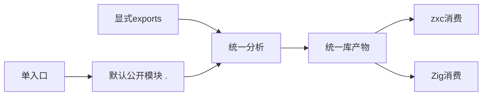
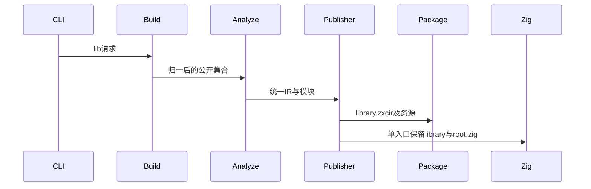

# 单入口归一与 Store 发布前置整理

## Intent：最终目标

所有 CLI lib 构建采用统一库产物，单入口归一为默认公开模块，避免为 Store 初值和状态装配维护两种发布格式。

## Data：可用证据

旧 compile 分支仍调用 library.zig 归档 source/module_0.zx；新 exports 分支写统一 IR。Store 初值留在 RX prepared.store_definitions，compiler.library.Result 和 codec 尚未保存它；既有库运行用例使用手写宿主，不证明完整初始化可随库发布。

## Edges：边界与限制

保留单入口 Zig 的 library 模块名与 root.zig；zxc 消费改为默认公开模块 .。不自动授予 Store 写权限、不以零值冒充初值。Store 初始化元数据与宿主装配仍待后续，不能宣称本轮解决它。

## Answer：实施与成功标准

lib 路径统一在源码读取前调度；无 exports 时把请求入口或 pkg.yaml 的 entry 归一成一个 . 导出。去除旧源码归档发布器及其专用调用分支，复用统一校验、编码、资源复制和暂存发布。实际分别从单 ZX/RX 入口构建，再进行 zxc/Zig 消费。

## 自我复核

不能为了兼容旧源码布局继续发布两套实现。兼容的是既有Zig入口名称；产物格式应统一。Store必须在后续保存初始化语义并维持权限规则，不能在此添加临时宿主或业务特例。

## 消费暴露的契约遗漏

单RX入口产物最初能发布，但`import type { Input }`失败。统一库设计明确可调用模块最少公开Input/Output；此前link只复制program.exports，RX推导的签名没有登记进去。现在在通用联结层为全部可调用模块补齐这两个签名类型，已有同名类型必须与函数签名一致，否则拒绝；纯类型模块不添加虚构函数签名。这是统一公共契约，不根据RX扩展名或示例内容分支。

entry清单同时扩展为允许包内.zx或.rx文件，保持原有relativePath检查。首轮失败已复现，后续消费结果单独记录。

## Store 后续实施边界

当前`cli/rx/state.zig`从`prepared.store_definitions`获取每个Object的initial Program，再交给Zig后端生成初始化模块与应用内存宿主；统一库Result/codec仅保存函数及Store访问槽，没有这组初值。后续需要在类型联结前登记初值，在产物中保存可验证的初始化引用，消费时与Store身份使用同一实例重绑定，再按真实可达能力装配宿主。不能根据类型补零、重新读取生产端源码、自动扩大调用者Store权限或引入磁盘持久化。

单入口归一先移除了维护两种库格式的必要性；此记录明确没有将Store闭环算作已完成。

## 验证结果

根构建14/14通过。单ZX从pkg.yaml及直接源文件分别发布；默认包导入的zxc消费输出42，原有Zig library模块入口构建3/3并输出42。单RX发布后，消费者从默认包导入Input并执行，enabled=true/false分别输出42/0，证明推导签名已进入公共类型表。

已有发布专项的原6项仍全部通过（独立ZX/Zig消费、纯类型、失败保留）。测试会话并行新增的菱形枚举包用例在显式solver下遇到现有证明器不支持枚举输入的边界，导致本次扩展后专项整体10/12步骤；不能报告全项通过。该问题不应通过关闭证明绕过，后续补枚举的有限取值域建模。未修改任何测试、未运行全量回归。

后续已补齐枚举有限域证明，扩展后的发布专项12/12通过；详见[枚举证明实施记录](../枚举证明实施记录.md)。该结果没有消除上文Store初始化的缺口。
