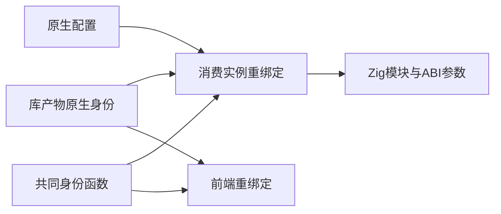
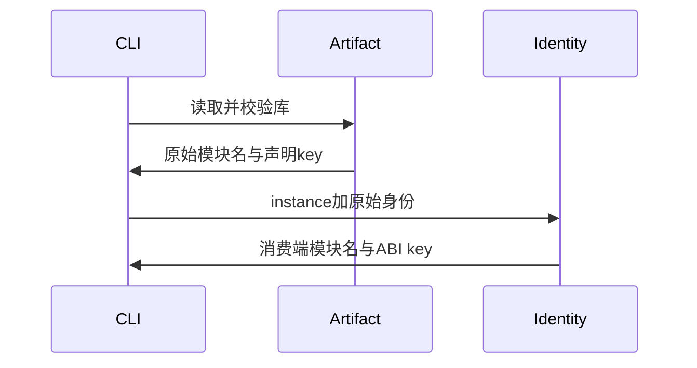

# 预编译库原生绑定

## Intent：最终目标

使 CLI 配置的原生模块名、声明身份和 ABI 别名与前端导入预编译库的重绑定一致。

## Data：可用证据

project/scopes 使用源码包哈希；compiled/load 使用 library instance 哈希。原始声明 key 可能包含生产端路径，不能在消费端根据路径重新计算。

## Edges：边界与限制

源码包维持既有规则；预编译包从已校验产物读取身份。标准库共享身份。仅验证构建，不新增测试或运行全量测试。完整发布仍待实现。

## Answer：交付与成功标准

复用前端身份函数，CLI 读取产物绑定原生配置；构建通过后记录验证与未覆盖范围。

## 实施与自我复核

新增 compiled_native 负责消费侧绑定；从经过路径边界校验、摘要及 IR 校验的库产物读取声明 key。原生模块名和依赖目标使用前端公开的同一身份函数。ABI 默认别名来自产物，显式别名支持原始 specifier 或 key；冲突和未知身份明确拒绝。返回的字符串由调用方 allocator 持有，释放解码结果不会悬空。

源码包仍走既有绑定；没有原生配置的预编译包不在配置阶段解码。当前原生配置包需要在配置阶段解码，后续分析仍有自己的产物装载；该额外编译期开销尚未消除。声明文件在配置包含 native_interfaces 时仍会读取；仅有 native_modules 的产物消费则由产物提供 ABI 身份。

本轮未证明原生宿主的真实 CLI 执行、多个实例组合、搬迁再发布或全部发布资源闭包。不能把构建成功当作这些语义通过；下一步优先复用已有原生库产物和宿主作实际消费核验。

## 验证结果

最终源码 `zig build --summary all` 14/14 步骤通过；三个正式源码文件 `zig fmt --check` 通过；`git diff --check` 通过。没有新增测试、运行全量测试或调用浏览器。原生 CLI 实际执行仍待下一步核验。
