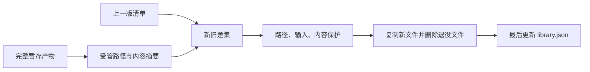
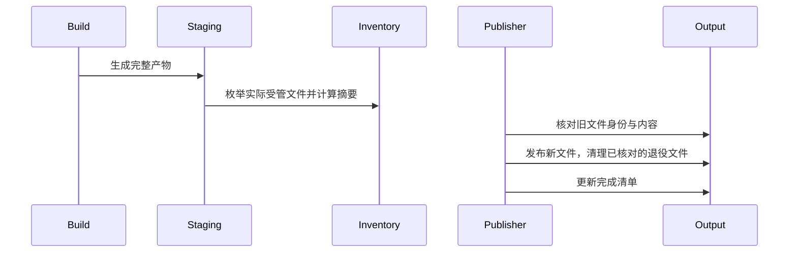

# 库发布受管文件清理

## Intent：最终目标

库重建删除不再生成的旧公开入口、内部模块和 ABI 视图，同时保留输出目录中不属于编译器的文件。

## Data：可用证据

修改前 library_resources 只处理 bundled_files 中的 native 资源，旧 public/modules/abi_views 文件没有内容摘要和完整清理清单。发布已经先写独立暂存目录，检查输入稳定性，再复制和最后更新 library.json。

## Edges：边界与限制

增加可选 managed_files 全量受管文件摘要，保持 format_version=2 的加法兼容。旧清单没有生成文件摘要时，不猜测其归属，继续只按已有 native 清单清理；从新清单发布后的后续构建才能完整清理。路径必须属于编译器输出命名空间并保持在输出目录中；符号链接、输入重叠和内容被改动时拒绝删除。不清空目录，不删除未登记文件。沿用现有发布边界，不宣称整目录原子替换。

## Answer：实现与成功标准

从独立暂存目录记录实际生成文件及 SHA-256，确定性排序。发布前使用新旧清单差集与现有物理路径、输入及内容检查确定删除集合。验证减少公开导出后旧入口消失、保留输出中的自有说明文件，并运行已有发布专项。不新增测试、不运行全量测试。

## 自我复核

不能把旧清单缺少摘要解释为允许删除；也不能按目录后缀猜测文件归属。文件摘要检查与发布仍有并发窗口，不能替代整目录事务。

## 实际执行结果

根构建 14/14 通过；使用真实 Z3 执行已有 test-library-publish 专项，22/22 构建步骤通过，覆盖发布消费、单入口、原生重发布、Store、RX 调用及权限边界、失败保持和依赖闭包。实际运行 `zxc build 源码/pkg.yaml --mode lib --out 产物 --watch --cache-stats` 并使用真实 Z3：首次生成 3 个单元；删除 `./toggle` 导出后生成 0、复用 2，旧公开入口已消失，输出目录中未登记的说明文件保持原样。将实现改为未定义名称后构建失败，整个输出目录的逐文件 SHA-256 与失败前完全相同；恢复源码后 watch 成功重建，再显式停止监听。

另一次实际构建手工修改即将退役的公开入口并重命名导出，返回 LibraryResourceModified，所有输出文件保持不变。验证后已恢复示例源码与产物。实际证据见 [执行结果](发布清单/执行结果.json) 与 [修改保护结果](发布清单/修改保护结果.json)。

受管清单不包含 library.json 本身，避免自引用摘要。仓库格式化后同步保存产物清单摘要；首次清单与运行时记录保持历史值，用于说明当时的实际结果。
