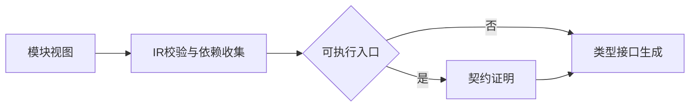
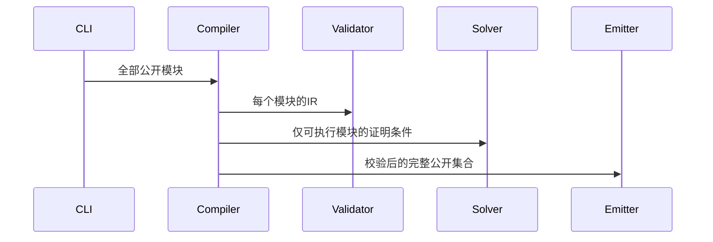

# 纯类型发布证明修复

## Intent：最终目标

纯类型公开模块完成结构与接口校验，不能被误当作可执行入口；所有可执行公开模块继续完成契约证明。

## Data：可用证据

测试会话的真实 Z3 发布专项在四个可执行模块证明通过后，纯类型模块因显式 solver 或共享函数表中的契约进入执行证明而失败。详见统一库发布与独立消费验证.md。

## Edges：边界与限制

不删除导出、不清空共享函数表、不关闭求解器。不更改测试，由已有专项验证。

## Answer：实现与标准

checkProgram 仍先检查 IR 和收集依赖，仅在 program.type_only 为 false 时执行入口证明。实际公开函数仍逐个验证；纯类型模块仅参与结构校验与生成。

## 自我复核

跳过的是不存在的入口执行证明，不能跳过可调用模块及IR结构校验。使用真实求解器专项验证，禁止通过改变用例公共面绕过问题。

## 验证结果

使用测试会话提供的既有专项与真实 Z3，修复后 `test-library-publish` 11/11 构建步骤通过，Node共6项通过。覆盖搬迁产物并删除原源码后由ZX和Zig独立消费；缺失公开源码、无效公开源码、错误契约均拒绝发布且原目录所有文件字节保持；只有纯类型公开模块时，即使显式配置不存在的solver也成功，证明没有调用执行求解器。

修复前同一专项在纯类型模块处复现失败。正式生产修改只有checkProgram的一处条件；未修改测试会话的测试、夹具或构建注册，未运行全量测试。
