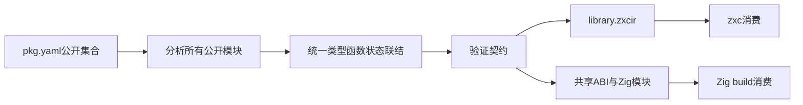
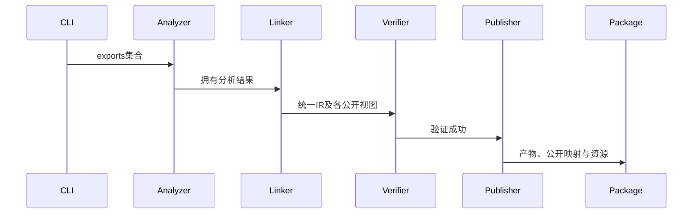

# 统一库发布入口

## Intent：最终目标

由 pkg.yaml 的公开模块集合驱动 CLI lib 构建，发布同一个编译产物及可被 Zig build 导入的多个公开模块，支持依赖中已经编译的统一库。

## Data：可用证据

已有 analyze/link、emitLibrary、writePublic、资源搬迁及预编译原生绑定；CLI 仍在旧单文件路径明确拒绝 exports。原生命令行消费已实际执行 alpha/beta 四次成功。

## Edges：边界与限制

保留旧单入口契约；新增包级 lib 路径。必须验证契约后生成，保留产物中的契约以供消费者重新验证。复用资源和构建模板，不复制 ZX 源码作为新公共接口。不运行全量测试、不新增测试用例。

## Answer：交付格式与成功标准

发布 library.zxcir、pkg.yaml、build.zig、公共模块、私有模块及 ABI/原生资源；实际由 CLI 构建公开模块包，再由 zxc/Zig 消费，并记录未覆盖部分。

## 实施结果

CLI 在源码清单有 exports 时采用集合发布，pkg.yaml 和包内 RX/ZX 文件都可以作为命令入口。所有公开视图经 compiler.emitLibraryVerified 校验，再生成同一 IR 的 Zig 公共/内部模块。构建模板按 exports 原名注册 Zig 模块；例如 ./increment 对应 dependency.module("./increment")，默认公开模块为 .。

发布器输出 library.zxcir 与编译目标清单，不复制原 RX/ZX 实现或原生声明作为消费接口。原生资源沿用既有搬迁器，ABI 别名记录真实身份以便再次绑定。library.json 使用版本2；资源回收读取器继续支持旧版本1。普通和 watch 库构建共用暂存发布检查，目录整体并非原子替换。

## 实际验证

- 最终核心代码根构建通过14/14；帮助文案更新后的构建另行记录。
- 算术包从 pkg.yaml 发布；zxc 消费输入3/8输出40/90；Zig 路径依赖构建3/3通过并执行输出40。
- 原生库被源码包导入后再发布；把完整包复制到新的消费目录，zxc构建后输出First→Second、Second→First；Zig路径依赖构建3/3通过并输出Second First。
- RX/ZX混合包分别从pkg.yaml和main.rx发布成功；第二次生成0、复用4。
- 算术包重复发布成功，生成0、复用3；版本2资源清单可以重新读取。

消费演示首轮Zig签名遗漏arena参数，且新示例包指纹不符合Zig名称规则；修正示例后通过，未修改生产契约。结果和发布文件摘要见统一发布结果.json。没有新增测试文件、执行全量测试或调用浏览器。

## 自我复核与后续

真实消费证明了发布路径可用，并覆盖已编译原生依赖的再次发布与搬迁。尚不能据此声称全部统一库功能完成：旧entry发布路径仍需归一，直接编译包build/verify尚未接入，Store初始化及共享状态的完整发布消费未验证，库级watch尚未实际运行，旧生成文件的移除也需完善。公开类型和函数来自同一IR，未新增RX运行层或业务用例特例。

帮助文案更新后的最终根构建同样14/14通过；本次diff检查通过。
