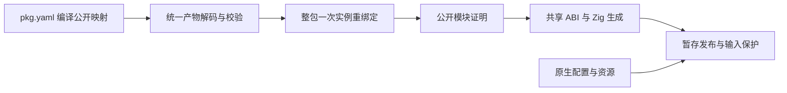
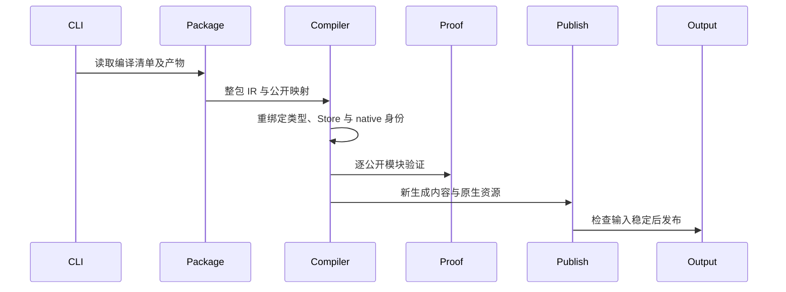

# 编译包直接验证与重建

## Intent：最终目标

pkg.yaml 指向统一 library 产物时，verify 能验证其公开接口与可执行模块，build --mode lib 能在无需原始源码的情况下重新生成可搬迁的发布包。

## Data：可用证据

现有 CLI library.analyze 直接拒绝 config.library。源码发布、证明、共享 ABI、原生资源打包和输出保护已经存在。compiled.load 能一次重绑定整包类型、函数、Store 和原生身份，codec 负责结构及版本校验。

## Edges：边界与限制

只选择清单公开映射，不将隐藏的 codec 导出重新公开。不伪造源码或按每个导出复制整包 IR。不跳过验证；缺失原生资源、无效产物、证明失败仍失败并保留已有输出。重建依旧使用发布暂存目录和输入变化检测。原来的单入口 Zig library 模块名需要保留。未要求新增测试，不执行全量测试。

## Answer：实现与成功标准

compiler 增加整包实例重绑定与公开导出选择；CLI 负责读取真实产物和记录输入，复用原生配置。直接验证与重新发布算术、Store、原生包，并执行消费者检查结果。记录实际命令、边界和自我复核。





## 自我复核

能够解码并不等于可以验证所有程序；证明器仍按实际支持的语义工作。能够生成 IR 也不证明原生资源可搬迁，必须执行真实消费。

## 实施结果

compiler.library.load 整包执行一次 compiled.load，再按 manifest 的 path/module 映射生成公开接口。函数图、类型表及初始化引用共享同一重映射。CLI 不制造源码记录；编译包的证明证据保留实际 IR，sources 为空。

构建可读取原有 library.json 以保留旧单入口 library/root.zig 布局；verify 不依赖此生成布局元数据。产物读取经过现有包物理边界与安装完整性检查，并记录在构建输入集合中。

真实 Z3 5.1.0 对已编译验证包的两个可执行公开模块均返回验证成功；第三个纯类型导出通过接口校验。直接重建后的产物搬迁到消费/packages 后实际执行：

| 消费路径                       | 结果           |
| ------------------------------ | -------------- |
| ZX 调用带契约的公开 identity   | 73 → 73        |
| ZX 调用旧单入口公开模块        | 41 → 42        |
| RX 调用原生 enum 模块          | First → Second |
| RX 调用重建后的 Store 包两次   | 3 → 11 → 19    |
| Zig 路径依赖 module("library") | 输出 42        |

重复重建相同 Store 产物成功，缓存 generated=0、reused=15。原生包的资源路径与 ABI 经重绑定后仍可执行。详见编译包重建目录中的构建验证结果、消费执行结果与 Zig消费结果 JSON。

根构建 14/14 通过。使用真实 Z3 运行既有 test-library-publish 专项，18/18 构建步骤通过，包含独立 ZX/Zig 消费、单入口兼容、原生资源、Store 初始化、失败保留输出及闭包安装。测试由其他会话维护，本轮没有新增或修改测试，也没有执行全量测试。

## 使用方式

```sh
zxc verify published/pkg.yaml --solver /path/to/z3

zxc build published/pkg.yaml --mode lib --out rebuilt
```

验证按编译清单实际声明的公开映射执行；缺失公开模块、非法产物及证明失败不会转为成功。Store 与原生等尚未被证明器支持的语义，显式 verify 仍会如实报告能力边界。默认构建保留既有契约验证规则，不将没有原始源码视为免检理由。

## 自我复核结论

只读复核未发现本轮所有权转移、Store/native 身份或公开面扩大问题。旧单入口兼容读取只影响生成布局，不参与 verifier。当前输出发布仍不是整目录原子替换；旧生成文件清理和库级 watch 的完整验收继续处理。
