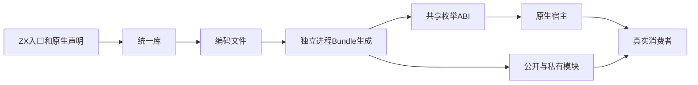
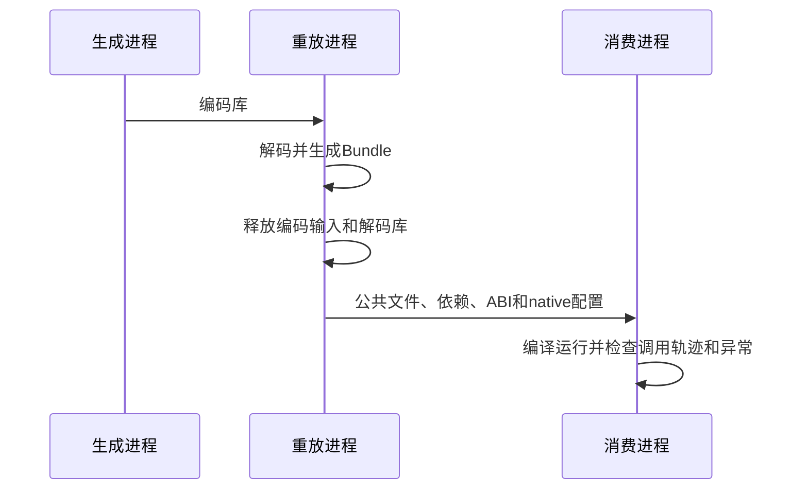

# 统一库原生模块消费验证

## Intent：最终目标

阶段三百五十三：补齐统一库Bundle中原生模块跨进程消费，验证多公开入口共享枚举ABI、调用顺序及异常传播。

## Data：可用证据

阶段351已覆盖纯ZX和RX混合库。现有native_runtime覆盖单程序及artifact重联结，但未覆盖library.codec和emitLibrary组合。

## Edges：边界与限制

使用真实原生声明分析、统一联结、编码、独立解码和emitLibrary。释放编码字节和解码库后保存Bundle。正反公开入口顺序都运行。只修改测试，原生宿主作为测试依赖提供。

## Answer：交付格式与成功标准

扩展现有Bundle构建链路，生成native配置证据并据此传递Zig依赖。消费者实际执行三个公开入口、两个枚举值和两处异常；全部通过后提交push。

## 自我复核

不能只检查生成文本含native名称；必须编译并调用宿主。三个公开入口不应形成三套枚举身份，宿主调用计数不能被重复宿主模块分割。测试成功不能证明所有原生ABI种类或打包发布已经覆盖。

## 验证结果

新增native.zig从真实声明和两个ZX入口联结三个公开名，支持正反序。复用编码进程及独立解码工具；后者现在在释放解码库之后保存native.json。消费驱动从真实native配置导入宿主，依照modules.json传递原生依赖。

三个消费者测试覆盖两个枚举值、主入口/公开helper/重复入口共享ABI与宿主状态、helper第一调用失败、入口第二调用失败和重复入口错误传播。正反序共执行6次新增测试。共享工作区Bundle专项22/22步骤、28次Zig消费者执行及6Node驱动通过。

隔离工作区生产代码保持d8182221，叠加阶段351至本轮测试，完整库运行专项46/46步骤通过：72次Zig消费者执行、14Node驱动。既有直接生成、编码重放、纯ZX和RX混合路径全部包含。TypeScript类型检查、Prettier及手写Zig格式检查通过。

首轮失败原因是测试驱动只识别生成模块，没有识别依赖表中的原生模块；修正为从native.json识别原生依赖后成功。未发现生产实现缺陷，未向实现聊天发送消息。原生声明、宿主和消费者是测试固定输入，调用结果由真实编译执行产生，没有生产特例。

未执行完整根回归，未覆盖多个原生模块、原生Store宿主或最终包发布。本部分不增加JSONL及Test262审阅计数。完整日志保存在本地草稿目录，生成依赖表、native配置和文件SHA256证据随文档保存。
