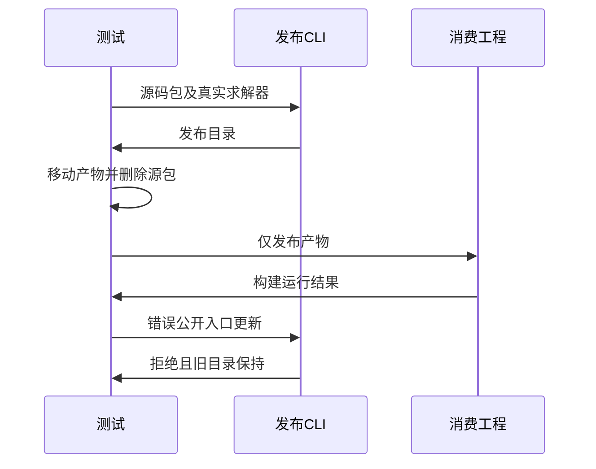

# 统一库发布与独立消费验证

## Intent：最终目标

阶段三百五十八：验证源码清单的统一库发布可独立消费，覆盖真实ZX与RX公开入口、同源别名、纯类型模块，以及失败时保留旧产物。

## Data：可用证据

当前CLI新增library/build.zig与publish.zig，实现通过exports分析、证明、emitLibrary与staging发布library.zxcir、pkg.yaml、library.json、build.zig及Zig公共模块。入口仍处于并行开发，最终结果按实际构建CLI及提交状态记录。

## Edges：边界与限制

使用真实Z3，不伪造证明结果。成功发布后移走产物并删除原源码，再独立构建ZX消费者和Zig依赖工程。测试不修改生产。不以单个文件存在代替完整可消费性。

## Answer：交付格式与成功标准

发布清单公开模块与产物元数据一致；ZX与Zig两条消费链真实执行成功；缺失/无效/反例公开入口发布失败且原目录字节不变。通过后提交push测试。

## 自我复核

源码仅用于发布前；消费阶段不能偷偷复用原源文件、原构建模块或测试生成器。失败保留必须逐文件比较，而非只检查library.zxcir。发布清单没有实现的资源能力不纳入成功声明。

## 首轮确认的生产缺陷

实现已提交5bb05233。真实publish测试的五个公开入口中，ZX identity、同源alias、RX workflow、bool toggle依次完成Z3证明；最后纯类型./types被送入可执行函数证明，报verification requires an executable pure function without Store capabilities，整包发布失败。runtime和failure测试均在基线合法发布处失败，尚未进入消费或失败保留验证。

根因位置为verified_compile.emitLibrary逐个library.module调用checkProgram，而checkProgram的requiresVerification被显式solver或共享函数表中的契约触发；纯类型模块应完成IR/接口校验但不调用执行证明。不能移除纯类型公开入口或关闭全部证明来让测试通过。已向实现聊天发送该缺陷与专项命令。

## 修复与最终验证

已将纯类型公开入口误入执行证明的问题通知实现聊天，生产修复由其提交14451524：保留IR校验，仅对非type_only程序执行证明。本测试会话未修改生产源码。修复后生产工作区干净，最终测试CLI编译步骤命中该修复的构建缓存。

`ZXC_TEST_SOLVER=<Z3 5.1.0> zig build test-library-publish --summary all` 11/11步骤通过。Node报告6项，其中包含1个父测试；实际是2个独立运行场景和3个失败更新子场景。

混合包成功发布5个公开名：默认ZX identity、同源alias、RX workflow、bool toggle及纯类型Payload。实际读取发布manifest和library.json，验证目标变成模块选择、源entry/workspace/dependencies不残留、公共文件路径存在且发布目录不含ZX/RX源码。随后复制到新消费者包目录，删除原源码和原发布目录，CLI以真实求解器重新验证并构建，8组应用输入全部得到独立预期结果。

Zig消费者使用发布物自带build.zig，直接按五个公开名取module，不手写替代生产依赖图。3项Zig测试实际执行通过：ZX/RX/同源别名、多签名bool入口、纯类型接口无execute入口。

另一个纯类型包使用不存在的solver路径仍发布成功，未导出的错误源码未被读取。失败更新依次加入缺失文件、语法错误文件和具有真实反例的契约文件，全部拒绝且逐文件base64快照完全一致。总计3次成功发布、3次预期拒绝发布。

TypeScript类型检查、Prettier、Zig格式与手写源码diff检查通过。源码和结构化结果随草稿保存，完整日志本地保存。没有执行完整根回归；跨包闭包、原生资源、Store初始化和watch仍需独立覆盖。本轮不增加JSONL与Test262审阅计数。
