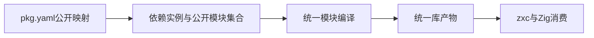
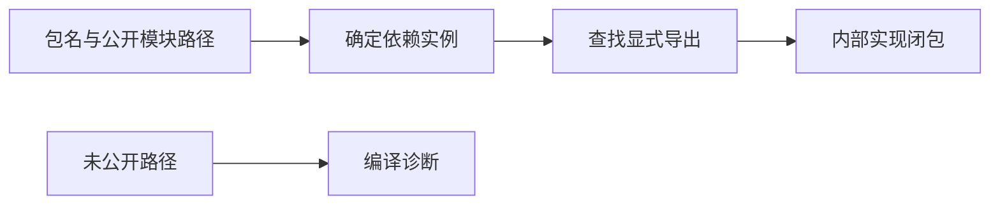

# 统一库实施计划

## Intent：最终目标

落实 [统一库设计](统一库设计.md)，使 lib 以公开模块集合为边界，RX 编排与 ZX 逻辑作为内部实现共同参与编译。完整完成条件仍包含统一产物、真实 zxc/Zig 消费、状态身份、搬迁和再次发布。

## Data：当前证据

当前包清单只有 entry，package/project 将依赖归一为单个文件，库发布又固定指向 source/module_0.zx。现有包作用域、路径安全、依赖图与函数联结可以保留，但不能继续把单文件作为全部公共面。

## Edges：边界与限制

分阶段改造，不把第一步的清单与解析支持宣称为统一 lib 完成。保留既有 entry 的外部契约，但与新的 exports 不允许同时声明，避免两个公共面。exports 的实现路径是内部元数据，不是公开模块类别，不按 RX/ZX 设置导出类型。

不新增测试用例，不运行全量测试；复用实际包构建和消费核验。未实现的统一发布路径不能静默丢失导出或写出指向不存在文件的清单。

## Answer：实施顺序

1. 建立 pkg.yaml 的显式公开模块映射，以及包解析中的完整公开名称集合。仅公开声明的模块，拒绝私有子路径、重复路径、越界目标和含糊配置。
2. 以导出集合驱动模块编译与公共类型/能力收集，统一联结 RX 编排、ZX 逻辑；避免分别生成两个库再拼接。
3. 从统一结果生成 zxc 可链接产物与 Zig namespace，撤除 module_0.zx 公共入口假设。
4. 验证双消费、状态与名义类型身份、按需联结、搬迁及再次发布；补齐公开参考。

第一阶段清单使用显式路径映射：

```yaml
name: arithmetic
version: 1.0.0
exports:
    ./increment: src/increment.zx
    ./multiply: src/multiply.zx
```

消费者引用 arithmetic/increment 或 arithmetic/multiply。键是公开模块路径，值是包内实现引用；没有声明 `.` 时，包不提供默认导出。文件后缀不进入公开模块标识。此语法先解决库的公开边界，不代表后续统一模块生成已经完成。





## 自我复核

新增 exports 不能仅作为解析后未使用的元数据。必须进入实际依赖解析和消费，同时明确多根构建、统一编译产物及跨实现层联结仍是后续工作。不能让旧单入口发布流程忽略新导出表。

## 第一阶段执行结果

正式实现新增 exports 映射解析与序列化，校验公开路径与包内实现路径，拒绝空导出表和 entry/exports 同时声明。依赖及包自身引用均按公开映射登记；同一依赖实例内不同导出仍使用既有物理路径与包作用域检查。

库的公开路径采用 `.` 或 `./name`，支持多层显式名称，不支持通配符。`.` 对应包默认公开模块；其余对应包名后缀。未声明默认导出时不生成隐式入口，也不扫描整个目录自动公开文件。

根 `zig build --summary all` 为 14/14 步骤通过。复用已有 increment/multiply 逻辑组成 [公开模块示例](统一库/公开模块示例/pkg.yaml)，依赖包仅声明两个 exports，不声明 entry。消费者实际构建、运行，输入 3/8 分别输出 40/90。[执行记录](统一库/公开模块结果.json)包含实际输入输出及清单解析结果。

第一阶段不代表库发布完成。当前单文件 lib 发布函数对带 exports 的库明确返回 PublicModuleLibraryBuildNotIntegrated，防止复制原始导出路径后产出损坏的包。下一步必须实现公开模块集合驱动的统一编译与发布，不能删除此保护并仅发布第一个模块。

当前具体计算依然由既有前端完成，跨 RX 编排与 ZX 逻辑的完整统一模块联结尚未完成。没有新增测试用例或运行全量测试，未进行 UI 验证。

## 第二阶段：统一模块联结

库编译首先需要能同时持有多个公开模块的统一类型、函数及能力图。新增 compiler.library 的纯编译期联结入口，接收已完成前端分析的模块，不接收 RX/ZX 库类别。内部复用类型身份合并、IR 节点重映射和原生接口联结，完成后再生成代码；不合并已经生成的独立库。

联结结果拥有全部数据，保留公开模块名称、公开类型和函数索引。公开模块可以共享同一类型身份和 Store Object；相同状态身份的不同字段类型必须拒绝。多个模块使用共同的函数表和原生依赖表，之后按具体公开模块提取可调用视图。

复用现有 RX 编排与 ZX 逻辑示例，先分析、统一联结，释放原分析结果，再生成和消费实际代码。当前阶段仍不替代包级发布协议与完整 zxc 产物装载。

### 第二阶段执行结果

正式新增 compiler.library.link 与拥有 arena 的 Result。联结器在生成代码前统一类型、名义类型来源、函数索引、原生接口和 Store 类型约束；公开模块通过同一结果的 module(index) 获取 IR 视图。没有将独立 Zig 库拼接，也没有新增运行库。

[模块联结演示](统一库/模块联结演示/generate.zig)使用此前的 RX Task/Switch 编排与 read.zx 逻辑作为两个公开模块，先联结再释放两份原分析结果。联结后得到 2 个公开模块、14 个类型、3 个函数。随后才生成普通 Zig 模块，共用同一 ABI 文件。

Zig 消费程序把由 choose.Input 解析出的同一个对象直接传给 choose 与 read，实际编译和运行通过：enabled=true、value=42 时输出 selected=42/original=42；enabled=false 时输出 selected=0/original=42。这同时核验了公共输入类型可直接互用、旧分析释放后的产物存活和实际执行结果。见 [模块联结结果](统一库/模块联结结果.json)。

演示生成器构建 4/4 步骤通过；根构建 14/14 步骤通过。本轮未新增测试用例、未运行全量测试。Store 初值闭包、发行编码、消费装载、多根包构建及完整发布仍未完成；本轮没有验证一般原生接口组合或所有状态冲突情形。

复现时先在统一库/模块联结演示运行 zig build，再从仓库根调用其 zig-out/bin/library-modules，依次传入 RX证明与硬件入口/示例/main.rx、同目录 read.zx 与输出目录。消费构建的完整 Zig 参数保存在结果 JSON 中。
