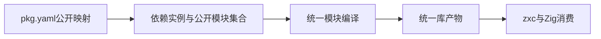
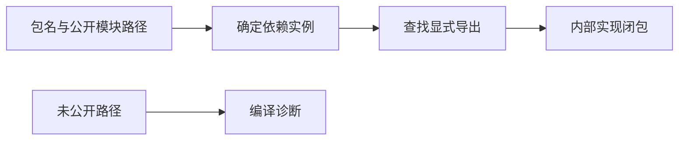
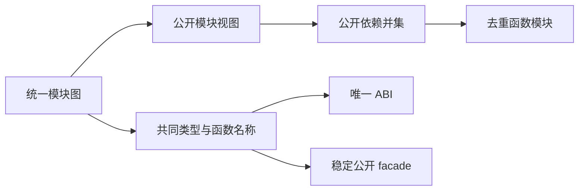
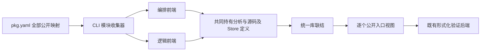

# 统一库实施计划

## Intent：最终目标

落实 [统一库设计](统一库设计.md)，使 lib 以公开模块集合为边界，RX 编排与 ZX 逻辑作为内部实现共同参与编译。完整完成条件仍包含统一产物、真实 zxc/Zig 消费、状态身份、搬迁和再次发布。

## Data：当前证据

当前包清单只有 entry，package/project 将依赖归一为单个文件，库发布又固定指向 source/module_0.zx。现有包作用域、路径安全、依赖图与函数联结可以保留，但不能继续把单文件作为全部公共面。

## Edges：边界与限制

分阶段改造，不把第一步的清单与解析支持宣称为统一 lib 完成。保留既有 entry 的外部契约，但与新的 exports 不允许同时声明，避免两个公共面。exports 的实现路径是内部元数据，不是公开模块类别，不按 RX/ZX 设置导出类型。

不新增测试用例，不运行全量测试；复用实际包构建和消费核验。未实现的统一发布路径不能静默丢失导出或写出指向不存在文件的清单。

## Answer：实施顺序

1. 建立 pkg.yaml 的显式公开模块映射，以及包解析中的完整公开名称集合。仅公开声明的模块，拒绝私有子路径、重复路径、越界目标和含糊配置。
2. 以导出集合驱动模块编译与公共类型/能力收集，统一联结 RX 编排、ZX 逻辑；避免分别生成两个库再拼接。
3. 从统一结果生成 zxc 可链接产物与 Zig namespace，撤除 module_0.zx 公共入口假设。
4. 验证双消费、状态与名义类型身份、按需联结、搬迁及再次发布；补齐公开参考。

第一阶段清单使用显式路径映射：

```yaml
name: arithmetic
version: 1.0.0
exports:
    ./increment: src/increment.zx
    ./multiply: src/multiply.zx
```

消费者引用 arithmetic/increment 或 arithmetic/multiply。键是公开模块路径，值是包内实现引用；没有声明 `.` 时，包不提供默认导出。文件后缀不进入公开模块标识。此语法先解决库的公开边界，不代表后续统一模块生成已经完成。





## 自我复核

新增 exports 不能仅作为解析后未使用的元数据。必须进入实际依赖解析和消费，同时明确多根构建、统一编译产物及跨实现层联结仍是后续工作。不能让旧单入口发布流程忽略新导出表。

## 第一阶段执行结果

正式实现新增 exports 映射解析与序列化，校验公开路径与包内实现路径，拒绝空导出表和 entry/exports 同时声明。依赖及包自身引用均按公开映射登记；同一依赖实例内不同导出仍使用既有物理路径与包作用域检查。

库的公开路径采用 `.` 或 `./name`，支持多层显式名称，不支持通配符。`.` 对应包默认公开模块；其余对应包名后缀。未声明默认导出时不生成隐式入口，也不扫描整个目录自动公开文件。

根 `zig build --summary all` 为 14/14 步骤通过。复用已有 increment/multiply 逻辑组成 [公开模块示例](统一库/公开模块示例/pkg.yaml)，依赖包仅声明两个 exports，不声明 entry。消费者实际构建、运行，输入 3/8 分别输出 40/90。[执行记录](统一库/公开模块结果.json)包含实际输入输出及清单解析结果。

第一阶段不代表库发布完成。当前单文件 lib 发布函数对带 exports 的库明确返回 PublicModuleLibraryBuildNotIntegrated，防止复制原始导出路径后产出损坏的包。下一步必须实现公开模块集合驱动的统一编译与发布，不能删除此保护并仅发布第一个模块。

当前具体计算依然由既有前端完成，跨 RX 编排与 ZX 逻辑的完整统一模块联结尚未完成。没有新增测试用例或运行全量测试，未进行 UI 验证。

## 第二阶段：统一模块联结

库编译首先需要能同时持有多个公开模块的统一类型、函数及能力图。新增 compiler.library 的纯编译期联结入口，接收已完成前端分析的模块，不接收 RX/ZX 库类别。内部复用类型身份合并、IR 节点重映射和原生接口联结，完成后再生成代码；不合并已经生成的独立库。

联结结果拥有全部数据，保留公开模块名称、公开类型和函数索引。公开模块可以共享同一类型身份和 Store Object；相同状态身份的不同字段类型必须拒绝。多个模块使用共同的函数表和原生依赖表，之后按具体公开模块提取可调用视图。

复用现有 RX 编排与 ZX 逻辑示例，先分析、统一联结，释放原分析结果，再生成和消费实际代码。当前阶段仍不替代包级发布协议与完整 zxc 产物装载。

### 第二阶段执行结果

正式新增 compiler.library.link 与拥有 arena 的 Result。联结器在生成代码前统一类型、名义类型来源、函数索引、原生接口和 Store 类型约束；公开模块通过同一结果的 module(index) 获取 IR 视图。没有将独立 Zig 库拼接，也没有新增运行库。

[模块联结演示](统一库/模块联结演示/generate.zig)使用此前的 RX Task/Switch 编排与 read.zx 逻辑作为两个公开模块，先联结再释放两份原分析结果。联结后得到 2 个公开模块、14 个类型、3 个函数。随后才生成普通 Zig 模块，共用同一 ABI 文件。

Zig 消费程序把由 choose.Input 解析出的同一个对象直接传给 choose 与 read，实际编译和运行通过：enabled=true、value=42 时输出 selected=42/original=42；enabled=false 时输出 selected=0/original=42。这同时核验了公共输入类型可直接互用、旧分析释放后的产物存活和实际执行结果。见 [模块联结结果](统一库/模块联结结果.json)。

演示生成器构建 4/4 步骤通过；根构建 14/14 步骤通过。本轮未新增测试用例、未运行全量测试。Store 初值闭包、发行编码、消费装载、多根包构建及完整发布仍未完成；本轮没有验证一般原生接口组合或所有状态冲突情形。

复现时先在统一库/模块联结演示运行 zig build，再从仓库根调用其 zig-out/bin/library-modules，依次传入 RX证明与硬件入口/示例/main.rx、同目录 read.zx 与输出目录。消费构建的完整 Zig 参数保存在结果 JSON 中。

## 第三阶段：模块产物编码与装载

统一模块图使用独立的 zxc.library.v1 格式保存，包含 IR 版本、公开模块表、共同 IR 图和名义类型身份。内容摘要校验字节完整性，不沿用语义缓存的编译器/上下文摘要协议。

编码前与解码后均校验 IR、公开函数/类型引用、名义类型元数据和 Store 身份类型一致性。解码结果拥有自己的 arena，不能借用原始文件缓冲区。格式和 IR 版本不兼容时明确拒绝。

将已有模块联结演示拆为产物写入进程与产物消费生成进程：后者只读取产物文件，不重新读取 RX/ZX 源码，然后编译运行 Zig 消费程序。发行包的配置、静态原生资源与 Store 初值闭包仍需后续并入完整发布流程。

### 第三阶段执行结果

新增 compiler.library.codec.encode/decode 与独立的模块图校验。产物为 `zxc.library.v1` 标记、SHA-256 内容摘要和 JSON 载荷；载荷包含 IR 版本、完整模块图、公开模块及名义类型。摘要用于检查内容完整性，类型与引用仍由校验器重新检查。

编码与解码均拒绝无效公共模块、越界函数/类型引用、不匹配的 Input/Output 别名、缺失或冲突的名义类型元数据，以及同一 Store 身份的类型冲突。解码要求版本相容，复制字符串到自身 arena，原文件缓冲区可立即释放。该格式没有语义缓存的上下文摘要，不承诺跨 IR 版本兼容。

既有联结演示现在拆分为 library-modules 写入程序与 library-emit 装载生成程序。写入程序退出后，装载程序只读取 [library.zxcir](统一库/模块装载生成/library.zxcir)，在释放读入字节后生成代码；不重新读取原 RX/ZX 文件。当前示例产物 2781 字节、2 个公开模块、14 个类型、3 个函数。

后续 Zig 编译与运行成功，输入 enabled=true/value=42 输出 selected=42/original=42；enabled=false 输出 selected=0/original=42。见 [模块装载结果](统一库/模块装载结果.json)。根构建 14/14、演示工具构建 6/6 步骤通过，未新增测试用例或运行全量测试。

生成与装载命令从仓库根运行：

```sh
docs/2026-10-05/统一库/模块联结演示/zig-out/bin/library-modules docs/2026-10-05/RX证明与硬件入口/示例/main.rx docs/2026-10-05/RX证明与硬件入口/示例/read.zx docs/2026-10-05/统一库/模块装载生成

docs/2026-10-05/统一库/模块联结演示/zig-out/bin/library-emit docs/2026-10-05/统一库/模块装载生成/library.zxcir docs/2026-10-05/统一库/模块装载生成
```

先在模块联结演示目录执行 zig build；原生消费的完整编译参数在结果 JSON 中。公开名称保留为元数据，演示的输出文件使用独立生成的编号路径，不把产物中的公开名称直接当成写入路径。

当前交付仍是编译图的编码与装载，不是完成的发行包。包实例身份重定位、Store 初值闭包、静态原生资源、包级构建以及正常 import 消费还未接通；这些工作不因本轮往返成功而取消。

## 第四阶段：包级 Zig 生成

从统一联结结果计算一次类型与函数名称，遍历全部公开模块收集可达函数并集，再生成一份 ABI、多个公开 facade 和去重后的内部函数模块。公开名称与输出文件名分离，使用公开名称的 SHA-256 生成稳定文件名；新增公开入口不会改变其他入口的文件名。

复用既有函数生成与缓存。生成结果拥有全部文本和依赖元数据，原始联结结果释放后仍可写盘。原生资源与 Store 初值装配属于后续发布流程，不能从源码生成成功推断发布完成。




### 第四阶段执行结果

新增 compiler.zig.emitLibrary/emitLibraryCached，整个库只计算一次类型与函数名称；公开模块分别收集依赖，内部函数以并集生成。函数生成、冲突检查、类型名称收集和原生元数据复制与已有单模块后端共用实现。公开 facade 文件名由完整公开名称的 SHA-256 产生，公开名称不直接充当文件路径。

现有 library-emit 演示改为调用包级生成 API，在独立 page_allocator 中解码库图，完成生成后先释放库图，再写出生成结果。实际得到 2 个公开模块、1 个内部模块和 1 份 ABI。Zig 消费编译成功，两组既有输入分别输出 selected=42/original=42、selected=0/original=42。完整命令与结果见 [包级生成结果](统一库/包级生成结果.json)。源码草稿位于 [包级生成草稿](统一库/包级生成草稿)。

演示工具构建 6/6 步骤通过；根构建 14/14 步骤通过。没有新增测试用例、运行全量测试或浏览器 UI 检查。未单独验证本轮缓存命中率，缓存复用属于接口实现，不据此声称所有增量场景已验证。

自我复核：本阶段实现了生成边界，尚未接通 CLI 的 exports 驱动发布与正常 import 装载。原生元数据当前保留统一图的全部声明，未按公开可达性裁剪；Store 初始化、包实例重定位和完整发行资源仍需后续实现。没有删除单入口发布保护。

## 第五阶段：发布构建模板的公开模块表

发布的 build.zig 必须按公开模块表逐项注册 Zig Module。全部公开模块与内部模块引用同一个 ABI Module；系统库和搜索路径挂到每个可独立消费的公开模块。保留单入口写入接口，其实现转为包含一个 library/root.zig 的公开模块表，避免维护两套构建模板。

先通过现有库产物验证实际 Zig 包依赖消费，再继续接入多根前端分析、资源发布与 import 装载。此阶段不删除未集成发布路径的保护，也不声称已能从 pkg.yaml 直接完成统一发布。

### 第五阶段执行结果

正式发布模板改为 public_modules 表，每个公开模块通过 b.addModule 注册，各自设置依赖、系统库和库搜索路径，所有模块共用一个 ABI Module。library_config.writePublic 提供多公开模块写入；既有 write 转换为单个 library/root.zig 项，复用同一实现。

使用第四阶段真实生成的源码及依赖元数据组装演示库的构建配置，构建模板来自正式 library_build.zig；演示配置尚非 CLI 多根发布生成。[包级消费](统一库/包级消费/build.zig)通过 b.dependency 获取库，用 module("choose") 与 module("read") 取得两个公开模块，构建 3/3 步骤通过。两组既有输入输出仍为 42/42 和 0/42，见 [发布模板结果](统一库/发布模板结果.json)。

另用 zxc build 对既有公开模块消费者 main.zx 执行单入口 lib 发布，命令成功；生成模板含单个 public_modules 项，其 zig build 为 1/1 步骤通过。该检查证明发布模板加载成功，不代表这个检查执行了该单入口库。临时单入口产物验证后移除，保留复现命令。此前根构建 14/14 步骤通过；没有新增测试用例或运行全量测试。

自我复核：Zig 包消费公共面已经能表达多个模块，但 zxc CLI 的 exports 驱动前端收集与完整发行仍未接通；本阶段不能等价于 Node.js/pnpm 对照规则全部完成。后续发布必须复用该公开模块表，并保存用户导出名称到 Zig 模块名的映射。

## 第六阶段：公开模块集合分析与验证

以 pkg.yaml 的完整 exports 集合驱动 CLI 前端收集。每个实现沿既有项目作用域和源码边界加载，RX 与 ZX 使用各自语法前端，所有分析结果共同存活直到统一联结完成。保留每个模块的源文本和 Store 定义，为后续资源与初始化联结提供数据。

先接入 zxc verify pkg.yaml：形成共同 IR 后，逐个以公开模块视图为验证根，覆盖全部公开入口。共同 IR 的顶层是无执行体的 type-only 容器，不能对其空入口证明后宣称整库已验证。此入口为构建链路复用同一收集器提供可运行基础；build 发布保护在完整发行链路完成前保留。



### 第六阶段执行结果

新增 CLI 的 library/analyze 模块，以全部 exports 驱动既有 RX/ZX 加载、项目边界检查与分析；结果持有各模块源码、分析及 Store 定义，并提供统一 link。持有外层 arena 的地址保持稳定，子分析 arena 的 allocator 不指向已返回栈帧。

zxc verify pkg.yaml 已接入这条收集路径。每个公开可调用模块分别作为证明根；纯类型模块只报告接口校验，没有可执行证明义务。显式 --out 为文件名前缀，后缀采用公开名称摘要，避免公开路径直接成为输出路径或多导出覆盖同一证明。

复用既有 Task/Switch 编排与 read.zx 逻辑，组成 [公开模块验证包](统一库/公开模块验证/pkg.yaml)。实际命令加载并联结两个公开模块，Z3 5.1.0 分别给出 unsat，两份前提查询为 sat，命令退出 0；[执行结果](统一库/公开模块验证结果.json)保留完整命令和输出，生成目录保留独立查询与证据。最终根构建 14/14 步骤通过。未新增测试用例或运行全量测试。

自我复核：该入口证明的是既有后端支持的安全义务及可达契约，并不自动证明任意业务需求。含 Store 能力等现有不支持的证明语义仍会拒绝。多根发布、初始化装配及正常 import 的发行产物装载依然未完成；本阶段交付的是已实际接入 CLI 的公开集合分析与验证能力。

## 第七阶段：发行资源职责分离

将现有原生文件与接口打包从单入口库写入器移至 library/resources。共享步骤只负责资源重定位与资源元数据，不决定 entry、exports、dependencies 或 workspace 的发布策略。旧发布调用方继续显式设置旧单入口契约；后续统一发布调用方保留包实例与公开导出，避免复制时静默清空依赖。

ABI 生成同时接受单入口与统一库的生成结果，复用相同原生别名冲突检查与 canonical ABI view 逻辑。验证使用既有含原生依赖的库发布与消费，不新增测试用例。

后续产物消费的数据边界已核对：Package 解析必须保留包实例、公开模块选择和实际 codec 路径，不能把多个导出都退化为同一个 entry 字符串。frontend 接受只依赖 core IR 的已编译输入视图，由 CLI 解码并转换；frontend 不反向依赖 compiler.library。同包统一类型与函数表只重映射一次，各公开模块引用映射后的函数和公开类型。默认函数导入检查 callable，类型导入检查该模块的公开类型表；不得把编译库伪装成 native 接口。

该接入还需同步处理 ParseCache、lint、语义缓存依赖与诊断定位。已编译输入不伪造空源码，缓存恢复不能让旧函数体覆盖当前发行产物。内容摘要只用于完整性和失效，实例身份仍由依赖图决定。

### 第七阶段执行结果

原生资源步骤已抽至 library/resources.zig，返回重定位后的配置、文件清单、依赖信息与外部 include 要求。该步骤不清空包依赖或改写公共入口；旧单入口调用方继续显式执行原有策略。abi.create 与新增 createLibrary 共用同一渲染实现，使用同一套原生别名和 ABI view 检查。

复用既有 URLSearchParams 使用示例，通过正式 CLI 发布带原生标准库依赖的库，成功打包 34 个资源文件。既有 Zig 消费者构建 3/3 步骤通过（缓存命中），实际运行输出保留重复参数、正确执行追加/设置/指定值删除与排序。完整命令及输出见 [资源复用结果](统一库/资源复用结果.json)。临时发布目录随后移除，避免提交标准库副本。

根构建 14/14 步骤通过，未新增测试用例或运行全量测试。自我复核：本轮验证了原有原生库发布路径仍能正常消费；尚未通过 CLI 多公开模块发布执行 createLibrary，因此不把共享接口的存在当作多模块原生发行已完成。完整产物装载仍按上述数据边界继续接入。
