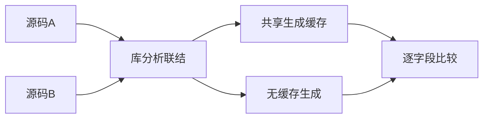
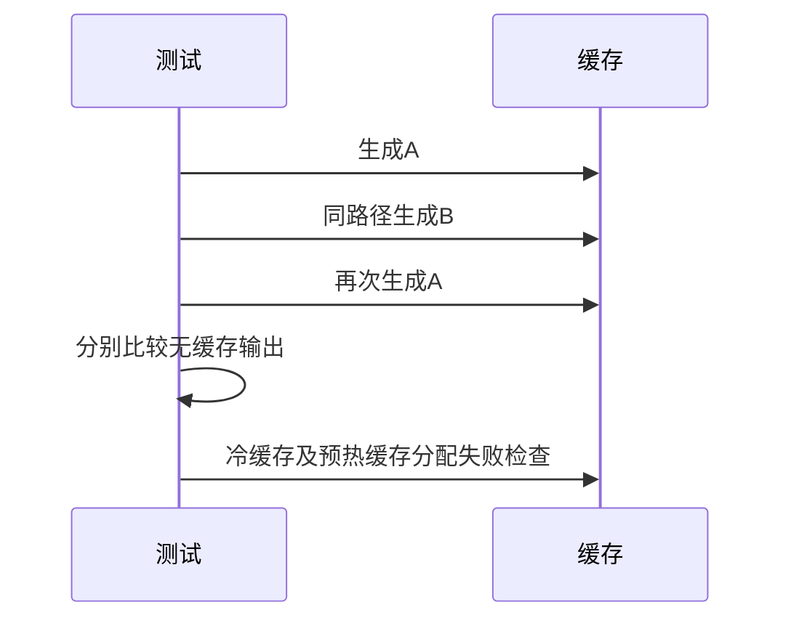

# 统一库生成缓存失效验证

## Intent：最终目标

阶段三百五十二：验证统一库生成缓存遇到源码改变和内存分配失败时仍保持输出正确和资源可释放。

## Data：可用证据

当前提交82d34f4d已覆盖同一库重复生成，尚未覆盖同路径源码A→B→A的缓存失效与缓存分配路径逐点失败。

## Edges：边界与限制

只修改测试；分别检查冷缓存和预热缓存的生成分配失败。共享工作区存在生产实现中的修改，必要时沿用已附加的隔离工作区验证已提交基线。不把API内容比较冒充消费者执行或完整回归。

## Answer：交付格式与成功标准

独立缓存测试文件，比较缓存输出与每个源码版本的无缓存输出，确认两个版本确实生成不同内容；逐点注入分配失败并由测试分配器检查清理。通过后提交push。

## 自我复核

使用真实分析和联结输入，不手改IR或缓存键。A与B必须先证明输出有差异，避免测试空转；失败清理与失败后的重试恢复是不同契约，本轮只覆盖前者。

## 验证结果

共享工作区与基于d8182221的隔离工作区均执行 `zig build test-library-link --summary all`，各12/12步骤、24/24测试通过，其中新增缓存专项3项。隔离工作区沿用阶段351的测试覆盖，再叠加本轮构建注册及缓存测试；生产代码保持已提交基线。手写Zig格式检查通过。

源码A与B的公开生成代码确实不同，A→B→A每轮均比较完整公开模块、内部模块和types文本。冷缓存检查缓存和输出共同分配器的逐点失败，预热检查输出复制的逐点失败。未发现生产缺陷，因此未向实现聊天发送消息。

本轮不增加JSONL及Test262审阅统计，未执行完整根回归，也未覆盖持久缓存或失败后重试恢复。没有修改生产实现。测试草稿及结构化结果位于统一库缓存测试草稿目录。
