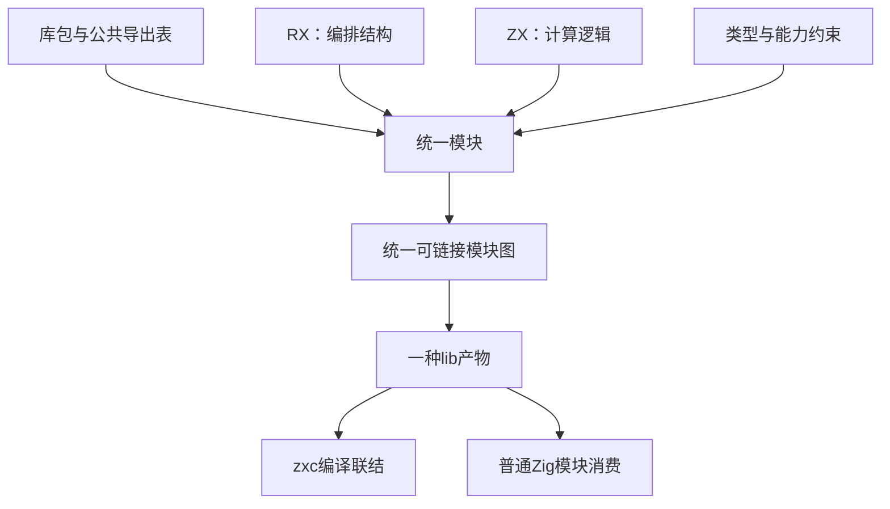

# 统一库设计

## Intent：最终目标

zxc 的 lib 是一组可复用模块的交付单元。一个模块具有统一的公开接口，其内部由 RX 描述编排结构、ZX 实现计算逻辑；编译后对消费者只呈现模块，不呈现“RX 库”“ZX 库”或两类调用对象。

可以类比 Vue 组件中模板与逻辑的关系：它们是同一个模块的不同实现层，不是两种组件。这里的 RX 编排数据流和控制流，不是 UI 模板；ZX 表达计算，不因此引入 JavaScript、DOM、组件运行时或隐式实例状态。

**设计起点是模块接口与库边界，不是选择哪个扩展名作为 lib 入口。** 编译器在内部识别文件语法，但库的定义、导出、发布与消费不由 RX、ZX 分类。

## Data：可用证据

### 用户确定的语义

1. zxc 生成的 lib 不区分 RX、ZX，没有单独的 RX 库。
2. 不能将目标缩减成“现有库构建再支持 RX 入口”。
3. RX 与 ZX 的关系类似同一组件的模板与逻辑。
4. lib 要能供其他 zxc 程序消费，也能直接作为 Zig 模块使用。
5. 所有实现遵守 zero runtime 和静态编译，不新增专用运行库或动态装载层。
6. 导入、导出与库使用机制参考 Node.js；依赖安装、共享存储和 monorepo/workspace 机制参考 pnpm。以下对应规则是设计约束，不能仅以相似的 import 拼写替代实际语义。

### 官方参考依据

- [Node.js Packages](https://nodejs.org/api/packages.html)：包名解析、`exports` 的根入口和子路径、公开边界、包自身引用，以及 `imports` 的包内映射。
- [pnpm Workspace](https://pnpm.io/workspaces)：`workspace:` 限定本地工作区依赖，发布时转换为可分发的依赖描述。
- [pnpm 的依赖目录结构](https://pnpm.io/symlinked-node-modules-structure)：内容共享与依赖图分离，通过包实例组织依赖关系。

参考核对日期：2026-10-05。zxc 采用下文明确的映射，不因此承诺兼容 JavaScript、npm 包二进制或 Node.js 的全部加载行为。

### 设计建立时的实现基线（b6bd8ea9）

| 当前实现                      | 已有能力                                | 与本设计的差距                                                    |
| ----------------------------- | --------------------------------------- | ----------------------------------------------------------------- |
| `pkg.yaml` 的 `entry`         | 指定一个源码文件                        | 缺少独立的包级公开模块及类型导出表                                |
| 包解析的 `{specifier, entry}` | 定位已声明依赖实例                      | 解析终点仍是源码文件，不是库的公开接口                            |
| `cli/library.zig`             | 生成 Zig 模块、清单、原生资源           | 固定把发布包指向 `source/module_0.zx`                             |
| `cli/library_sources.zig`     | 归档 ZX 源码并重写 import               | 把 ZX 源文件集合当作 zxc 消费契约                                 |
| 统一 IR 与模块 artifact       | 类型、函数、依赖、名义身份及 Store 槽位 | 可复用为内部构件，但尚未形成包级多导出边界                        |
| `root.zig` / `build.zig`      | 普通 Zig 模块消费                       | 当前主要对应单个 Input / Output / execute，未形成完整公共模块集合 |

因此，仅去掉 rx/compile.zig 的 lib 拒绝条件不能实现本设计。现有双语言消费记录证明的是此前产物，不证明统一模块库机制已经完成。

## Edges：边界与限制

### 1. 区分库、模块与实现文件

| 概念     | 作用                                             | 不应承担的职责                           |
| -------- | ------------------------------------------------ | ---------------------------------------- |
| 库包     | 命名、版本、依赖、公开模块与类型集合             | 根据源码语法划分库类别                   |
| 模块     | 一份可调用的 Input / Output 契约、所需能力和实现 | 暴露私有文件布局或要求消费者选择执行方式 |
| RX       | 模块内部的调用编排、分支、并行及数据连接         | 成为另一种库产物或动态解释脚本           |
| ZX       | 模块内部的计算、转换与局部逻辑                   | 持有隐式全局状态或建立另一套包协议       |
| 类型声明 | 公开数据契约和内部类型约束                       | 依赖某个实现文件后缀才能获得身份         |

模块不是“一份 RX 文件加一份同名 ZX 文件”的机械配对。一个编排可以引用多个逻辑函数，也可以组合其他模块；纯计算模块没有编排需要时无需制造空 RX 文件。是否存在某一实现层，不改变模块的公开身份。

本设计不新增强制单文件组件格式，不依赖同名文件自动配对，也不把 RX 与 ZX 合并为一种文本语法。具体源文件组织沿用显式引用，编译器负责形成统一模块图。

### 2. 公开接口先于实现

库以显式导出表决定哪些模块和类型可被外部使用。导出项只描述公开名称、类型契约、必要能力与实现引用；不包含 `rx` / `zx` 库种类。

一个公开可调用模块最少具备：

- 库内公开名称与稳定的模块身份；
- Input 和 Output 类型，以及公开的名义类型身份；
- 显式状态访问或其他能力需求；
- 编译后实现及其依赖引用。

公开类型也可以单独导出。模块内部的 helper、编排文件和计算文件默认是私有实现；文件存在于发布包中不等于自动公开。外部导入不能穿透到未导出的内部路径。

依赖库身份来自包解析结果、版本实例与公开导出，不能只按显示名称或开发机器绝对路径合并。相同依赖实例中的同一模块应共享类型与状态身份；不同包实例不能因同名而合并。

### 3. 一个公共面，两种静态消费方式

zxc 消费时，包解析首先选定依赖实例，再从公共导出表解析模块和类型，最后联结普通 IR。调用点无需知道编排层和逻辑层分别有哪些文件。

Zig 消费时，由同一导出表生成静态 namespace：每个公开模块提供对应的 Input、Output 与调用接口。沿用 Zig 的模块依赖与目标平台设置，不另外创建一个“RX 运行环境”。

概念上的公共面可以是：

```text
order 库
  create_order 模块：CreateOrderInput → CreateOrderOutput
  cancel_order 模块：CancelOrderInput → CancelOrderOutput
  Order 类型
```

create_order 内部可以通过 RX 编排多个 ZX 逻辑函数；cancel_order 可以只有简单计算。二者在导出表中都是模块，消费者使用同一套类型检查与静态调用规则。

包清单使用 `exports` 表达这份公共面。默认导入、类型导入和既有命名值导入仍由语言规则约束；包导出表决定可访问哪个模块，模块自身决定能导入哪些符号。不得将“包有多个公开模块”误解为自动放开 ZX 的任意具名函数导出。

### 3.1 Node.js 包接口的对应规则

以下是 zxc 的设计要求；部分已实现，完整完成情况按末尾验收及实施记录判断。

| 使用场景                       | zxc 对应规则                                                         |
| ------------------------------ | -------------------------------------------------------------------- |
| `import x from "order"`        | 在导入方所属包的依赖作用域中选择 order 实例，再查找其 `exports["."]` |
| `import x from "order/create"` | 选择同一依赖实例，再精确查找 `exports["./create"]`                   |
| `@scope/order/create`          | `@scope/order` 是包名，余下部分是公开子路径，不按第一个斜杠截断包名  |
| 包内通过自身包名导入           | 使用当前包的公开导出表，仍不穿透私有实现                             |
| 包内相对路径导入               | 沿既有语言文件规则解析内部实现，不把相对路径自动登记为公开 API       |
| 未声明的依赖或子路径           | 给出编译诊断；不猜测目录中的文件，不借用邻居包的依赖                 |

`exports` 的键是外部公共名称，值是包内实现定位信息。源码构建可指向实现文件；发行包需将该定位信息转换为统一产物内的模块引用，消费者始终保留相同的包名与公开子路径。内部文件移动、生成文件摘要变化或 RX/ZX 实现层调整不应迫使消费者改写 import。

```yaml
name: order
version: 1.0.0
exports:
    '.': src/default.zx
    './create': src/create.rx
    './types': src/types.zx
```

这是包公共面的设计示例，不表示当前 CLI 已完成该包的发布和消费。没有 `.` 就没有包根入口；不得用第一个导出自动补位。`order/src/private` 不因文件存在而成为合法的包导入。RX/ZX 后缀属于实现引用，不成为导出类别。

已编译发行清单将产物位置与公开选择分开：

```yaml
name: order
version: 1.0.0
library: library.zxcir
exports:
    './create':
        module: create
```

library 指向包内 IR 文件，module 是该产物公开表中的名称；这里的对象值不是 Node.js 条件导出。源码字符串目标和 module 目标不能在同一个清单混用，library 不能同时声明旧 entry。消费方仍使用 order/create。CLI 已能装载此类清单及产物；完整的多公开模块发布、原生绑定和初始化装配尚未全部接通。

Node.js 允许 main 与 exports 共存并有优先级；zxc 当前清单中的旧 `entry` 与新 `exports` 互斥，保留明确诊断。此处参考公共边界，不声称两个字段与 Node.js 完全兼容。Node.js 的 exports 也不是文件系统安全沙箱；zxc 的物理路径越界检查是自身另外承担的约束。

Node.js 的 `#` 包内 imports、导出模式和条件导出作为后续对照项记录，尚未确定的能力不得静默模拟。若引入条件导出，条件只能由明确的编译目标与构建配置静态确定，不能以 RX/ZX 分类，也不能在运行时探测并切换实现。当前显式导出映射之外的语法须按支持范围给出诊断。

### 3.2 pnpm 依赖与 workspace 的对应规则

zxc 的包管理命令内置于 CLI，清单继续使用 `pkg.yaml`，workspace 配置按既定要求集中在该文件中。依赖解析采用 pnpm 的包作用域与实例隔离思路，不要求复制其配置文件名和 Node.js 专用目录结构。

1. **先确定依赖实例，再解析导出。** 裸包名只能来自当前包声明的依赖或包自身引用；不能通过目录提升偶然获得未声明的传递依赖。
2. **workspace 是依赖来源约束。** 显式 `workspace:` 必须命中工作区内满足要求的包，缺失或版本不符时失败，不回退到远程同名包。具体支持的版本表达式需由包管理实现和参考文档逐项确认。
3. **存储共享不合并身份。** 内容寻址存储可复用相同文件，项目链接表达实际依赖图。包实例身份还需保留版本、来源及必要的依赖解析上下文；不能因文件内容或公开名称相同就合并类型与 Store。
4. **锁定解析结果。** 锁文件记录可复现的依赖关系、版本、来源和完整性信息；编译缓存不代替锁文件。搬迁后的消费者不得依赖开发机器的原绝对路径或本地 store 位置。
5. **开发与发布使用同一公共面。** workspace 本地使用和安装发布包时，都通过包名及 exports 解析。发布要将 workspace 引用转换为可分发的依赖描述，并保留外部依赖；仅在确实打包相应闭包并保留身份时，才能改写或消除那条依赖。

需要支持同一应用中不同依赖版本并存，以及同一实例经多个别名被引用时的身份一致性。若后续引入 peer dependency，其实例上下文必须进入解析与锁定模型；目前不把尚未实现的 peer 机制描述为已有能力。

### 3.3 静态编译边界

`std:`、`zig:`、`c:` 继续是各自明确的标准库和原生静态接口通道；无前缀包名走上述包解析。参考 Node.js 的使用体验不会引入 `require()`、JavaScript 执行环境、运行时包搜索或动态解释统一 IR。按需编译与联结在构建期完成。


### 4. 状态属于应用生命周期

lib 本身不启动进程、监听端口、创建隐藏单例，也不在每次 import 或调用时复制 Store。库中声明的状态需求在应用组合阶段静态联结，由应用持有相应共享内存。

同一个依赖实例内引用同一 Store Object 时共享身份。具体字段权限、初始化和调用时绑定由编译器解决；公开接口保留必要的能力信息，不通过动态上下文查找补齐。状态不得自动落盘；生命周期遵循 [Store 设计](Store设计.md)。

这也限定了 Vue 类比的适用范围：借用的是“结构与逻辑共同组成模块”，不自动引入组件实例、响应式状态或生命周期回调。

### 5. 零运行时与分发约束

库的语义实现以统一的可链接模块表示为中心，构建 app 时按实际使用的导出联结，生成普通 Zig 并静态编译。未使用的导出不应强迫消费方链接整个库的实现和原生资源；被选导出的真实依赖必须完整保留。

zxc 与 Zig 的消费文件可以不同，但必须由同一模块与导出信息派生，不能出现两套独立维护的行为实现。发布物中的原始源码可以服务于诊断、调试和审阅，不能要求消费者再次按 RX/ZX 类别选择库或依赖 `module_0.zx` 作为公共入口。

如果发行物承载 IR，需有独立的产物版本、兼容性检查和完整性验证。现有 semantic cache 绑定编译器摘要及上下文，属于缓存实现，不能直接改名为稳定库协议。第一版不承诺跨编译器版本或稳定 C ABI。

原生 Zig/C 依赖及资源继续显式记录。打包依赖闭包时保留原依赖实例与名义身份；不能因复制进同一个目录就把多个包合并成一个命名空间。

## Answer：统一机制与成功标准

### 编译与发布流程

1. 从库包的公开导出表确定需要交付的模块和类型。
2. 分析模块内部的 RX 编排、ZX 逻辑及其他静态依赖，完成跨实现层的类型和能力联结。
3. 形成统一模块图及公共符号表。RX、ZX 的源码角色保留在诊断位置中，不进入库类别。
4. 按公开模块裁剪并保存实现闭包、类型身份、能力与原生依赖。
5. 从同一结果生成 zxc 可链接产物和普通 Zig 模块，沿同一包管理机制发布。
6. 消费方选定导出后继续静态检查、优化、代码生成与链接；不经过库解释器。




### 对现有代码的实施要求

- **包清单与包解析**：增加公开模块和类型的统一表示，消费解析不再止于一个 `.zx` 文件。
- **编译器**：保留各语法解析职责，统一模块身份、公共符号、名义类型、依赖实例和能力联结；不要把 zxc 库伪装为原生外部函数以绕开联结。
- **模块产物**：复用已有类型重映射、artifact 和 linker，增加包公共面与多根依赖闭包；缓存与发行协议分别校验。
- **genz**：根据同一个导出表生成 Zig 模块及公开访问结构，编排在编译期展开或静态生成。
- **CLI 与发布**：lib 以包及其公开面为单位构建，撤除将 `source/module_0.zx` 固定为库公共入口的假设；复用现有原生资源打包与安全发布流程。

现有单默认函数可以在编译器内部归一为一个公开模块，但不能继续决定整个 lib 架构。本次不新增兼容运行层，也不通过两个发布后端维持 RX/ZX 分类。

### 验收条件

| 要求             | 必须取得的证据                                                                      |
| ---------------- | ----------------------------------------------------------------------------------- |
| 模块统一         | 一个库同时包含编排与逻辑实现，公共面没有源码语言分类                                |
| 多模块公开面     | 同库多个公开模块及类型能被独立解析，私有 helper 不可越界导入                        |
| 实现替换不泄露   | 公共签名不变时，内部增减编排层不改变消费协议                                        |
| 真实双消费       | 同一份发布库由 zxc 和 Zig 分别构建、执行并得到一致结果                              |
| 身份保持         | 多导出共享名义类型及状态，不同依赖版本保持隔离                                      |
| 可迁移与再次发布 | 原项目不可访问时消费仍成功；库被其他库复用并发布后语义不变                          |
| 按需联结         | 只消费部分导出时，未使用实现不会成为强制链接依赖                                    |
| 零运行时         | 产物中没有 zxc 专用运行库、解释器、动态注册表或隐藏库状态                           |
| Node.js 式公共面 | 包根、子路径、作用域包名、自引用均按同一 exports 解析；私有路径不会因文件存在而公开 |
| pnpm 式依赖隔离  | 未声明依赖被拒绝；workspace 缺失或版本不符不回退远程；多版本实例与共享文件身份正确  |
| 开发发布一致性   | 本地 workspace 与发布包使用相同 import；锁定与搬迁不依赖开发机器绝对路径            |

## 自我复核与当前状态

此前先把问题表述成“RX 库”，随后又改成“统一 lib 支持 RX 入口”，两种说法都仍以源码文件作为库边界。本设计改为以统一模块的公共接口及实现闭包定义 lib，RX 与 ZX 只在模块内部各司其职。

本次更新设计与相关文档，未修改编译器、包管理器或库生成源码，也未将上述目标描述为已经实现。旧单文件库实现中的类型、静态生成、资源打包和实际消费证据仍有复用价值，但不能替代本设计的验收。

## 实施进度

公开模块映射及包解析第一阶段已接通：pkg.yaml 可显式声明多个 exports，不要求单个 entry；公开模块示例已通过真实构建与运行。该阶段只建立公开边界，未完成统一编译产物与多模块发布，不能据此宣布本设计完成。具体语法、源码和证据见 [统一库实施计划](统一库实施计划.md)。

第二阶段已新增编译期统一模块联结：多个前端分析结果先合并为共同类型与函数图，再生成普通代码；RX 编排和 ZX 逻辑的实际联结消费已运行。当前仍未完成包级发布和产物装载，不将内部联结 API 当作完整 lib 机制。

第三阶段已为统一模块图增加独立版本的编码与装载，并完成分离进程的实际生成及消费。发行包所需的包身份重定位、配置、资源与 Store 初值闭包仍待接入，当前没有把语义缓存格式作为库协议。

第四阶段已增加共同 ABI、多公开 facade 与内部函数依赖并集的包级 Zig 生成。CLI 的完整多根发布与正常 import 装载仍待接通。2026-10-05 新增的 Node.js/pnpm 对照规则是后续实现与验收依据，不表示全部对应能力已完成。
