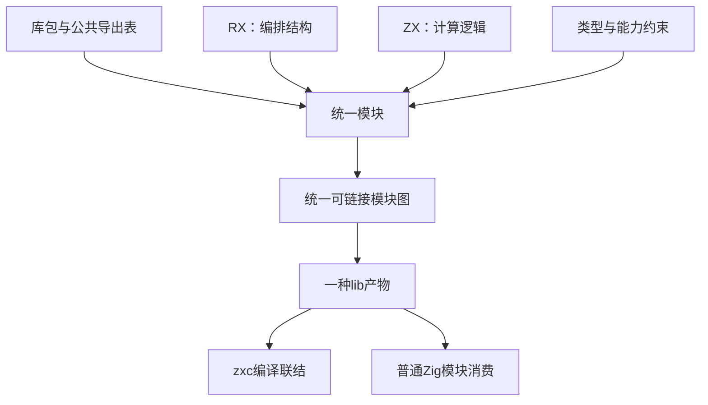

# 统一库设计

## Intent：最终目标

zxc 的 lib 是一组可复用模块的交付单元。一个模块具有统一的公开接口，其内部由 RX 描述编排结构、ZX 实现计算逻辑；编译后对消费者只呈现模块，不呈现“RX 库”“ZX 库”或两类调用对象。

可以类比 Vue 组件中模板与逻辑的关系：它们是同一个模块的不同实现层，不是两种组件。这里的 RX 编排数据流和控制流，不是 UI 模板；ZX 表达计算，不因此引入 JavaScript、DOM、组件运行时或隐式实例状态。

**设计起点是模块接口与库边界，不是选择哪个扩展名作为 lib 入口。** 编译器在内部识别文件语法，但库的定义、导出、发布与消费不由 RX、ZX 分类。

## Data：可用证据

### 用户确定的语义

1. zxc 生成的 lib 不区分 RX、ZX，没有单独的 RX 库。
2. 不能将目标缩减成“现有库构建再支持 RX 入口”。
3. RX 与 ZX 的关系类似同一组件的模板与逻辑。
4. lib 要能供其他 zxc 程序消费，也能直接作为 Zig 模块使用。
5. 所有实现遵守 zero runtime 和静态编译，不新增专用运行库或动态装载层。

### 设计建立时的实现基线（b6bd8ea9）

| 当前实现                      | 已有能力                                | 与本设计的差距                                                    |
| ----------------------------- | --------------------------------------- | ----------------------------------------------------------------- |
| `pkg.yaml` 的 `entry`         | 指定一个源码文件                        | 缺少独立的包级公开模块及类型导出表                                |
| 包解析的 `{specifier, entry}` | 定位已声明依赖实例                      | 解析终点仍是源码文件，不是库的公开接口                            |
| `cli/library.zig`             | 生成 Zig 模块、清单、原生资源           | 固定把发布包指向 `source/module_0.zx`                             |
| `cli/library_sources.zig`     | 归档 ZX 源码并重写 import               | 把 ZX 源文件集合当作 zxc 消费契约                                 |
| 统一 IR 与模块 artifact       | 类型、函数、依赖、名义身份及 Store 槽位 | 可复用为内部构件，但尚未形成包级多导出边界                        |
| `root.zig` / `build.zig`      | 普通 Zig 模块消费                       | 当前主要对应单个 Input / Output / execute，未形成完整公共模块集合 |

因此，仅去掉 rx/compile.zig 的 lib 拒绝条件不能实现本设计。现有双语言消费记录证明的是此前产物，不证明统一模块库机制已经完成。

## Edges：边界与限制

### 1. 区分库、模块与实现文件

| 概念     | 作用                                             | 不应承担的职责                           |
| -------- | ------------------------------------------------ | ---------------------------------------- |
| 库包     | 命名、版本、依赖、公开模块与类型集合             | 根据源码语法划分库类别                   |
| 模块     | 一份可调用的 Input / Output 契约、所需能力和实现 | 暴露私有文件布局或要求消费者选择执行方式 |
| RX       | 模块内部的调用编排、分支、并行及数据连接         | 成为另一种库产物或动态解释脚本           |
| ZX       | 模块内部的计算、转换与局部逻辑                   | 持有隐式全局状态或建立另一套包协议       |
| 类型声明 | 公开数据契约和内部类型约束                       | 依赖某个实现文件后缀才能获得身份         |

模块不是“一份 RX 文件加一份同名 ZX 文件”的机械配对。一个编排可以引用多个逻辑函数，也可以组合其他模块；纯计算模块没有编排需要时无需制造空 RX 文件。是否存在某一实现层，不改变模块的公开身份。

本设计不新增强制单文件组件格式，不依赖同名文件自动配对，也不把 RX 与 ZX 合并为一种文本语法。具体源文件组织沿用显式引用，编译器负责形成统一模块图。

### 2. 公开接口先于实现

库以显式导出表决定哪些模块和类型可被外部使用。导出项只描述公开名称、类型契约、必要能力与实现引用；不包含 `rx` / `zx` 库种类。

一个公开可调用模块最少具备：

- 库内公开名称与稳定的模块身份；
- Input 和 Output 类型，以及公开的名义类型身份；
- 显式状态访问或其他能力需求；
- 编译后实现及其依赖引用。

公开类型也可以单独导出。模块内部的 helper、编排文件和计算文件默认是私有实现；文件存在于发布包中不等于自动公开。外部导入不能穿透到未导出的内部路径。

依赖库身份来自包解析结果、版本实例与公开导出，不能只按显示名称或开发机器绝对路径合并。相同依赖实例中的同一模块应共享类型与状态身份；不同包实例不能因同名而合并。

### 3. 一个公共面，两种静态消费方式

zxc 消费时，包解析首先选定依赖实例，再从公共导出表解析模块和类型，最后联结普通 IR。调用点无需知道编排层和逻辑层分别有哪些文件。

Zig 消费时，由同一导出表生成静态 namespace：每个公开模块提供对应的 Input、Output 与调用接口。沿用 Zig 的模块依赖与目标平台设置，不另外创建一个“RX 运行环境”。

概念上的公共面可以是：

```text
order 库
  create_order 模块：CreateOrderInput → CreateOrderOutput
  cancel_order 模块：CancelOrderInput → CancelOrderOutput
  Order 类型
```

create_order 内部可以通过 RX 编排多个 ZX 逻辑函数；cancel_order 可以只有简单计算。二者在导出表中都是模块，消费者使用同一套类型检查与静态调用规则。

这里没有规定新的 YAML 字段拼写或新增 import 语法。实现时需把现有包清单、默认导入与命名导入归一到这份公共面，而不是先新增一套入口配置掩盖语义缺口。

### 4. 状态属于应用生命周期

lib 本身不启动进程、监听端口、创建隐藏单例，也不在每次 import 或调用时复制 Store。库中声明的状态需求在应用组合阶段静态联结，由应用持有相应共享内存。

同一个依赖实例内引用同一 Store Object 时共享身份。具体字段权限、初始化和调用时绑定由编译器解决；公开接口保留必要的能力信息，不通过动态上下文查找补齐。状态不得自动落盘；生命周期遵循 [Store 设计](Store设计.md)。

这也限定了 Vue 类比的适用范围：借用的是“结构与逻辑共同组成模块”，不自动引入组件实例、响应式状态或生命周期回调。

### 5. 零运行时与分发约束

库的语义实现以统一的可链接模块表示为中心，构建 app 时按实际使用的导出联结，生成普通 Zig 并静态编译。未使用的导出不应强迫消费方链接整个库的实现和原生资源；被选导出的真实依赖必须完整保留。

zxc 与 Zig 的消费文件可以不同，但必须由同一模块与导出信息派生，不能出现两套独立维护的行为实现。发布物中的原始源码可以服务于诊断、调试和审阅，不能要求消费者再次按 RX/ZX 类别选择库或依赖 `module_0.zx` 作为公共入口。

如果发行物承载 IR，需有独立的产物版本、兼容性检查和完整性验证。现有 semantic cache 绑定编译器摘要及上下文，属于缓存实现，不能直接改名为稳定库协议。第一版不承诺跨编译器版本或稳定 C ABI。

原生 Zig/C 依赖及资源继续显式记录。打包依赖闭包时保留原依赖实例与名义身份；不能因复制进同一个目录就把多个包合并成一个命名空间。

## Answer：统一机制与成功标准

### 编译与发布流程

1. 从库包的公开导出表确定需要交付的模块和类型。
2. 分析模块内部的 RX 编排、ZX 逻辑及其他静态依赖，完成跨实现层的类型和能力联结。
3. 形成统一模块图及公共符号表。RX、ZX 的源码角色保留在诊断位置中，不进入库类别。
4. 按公开模块裁剪并保存实现闭包、类型身份、能力与原生依赖。
5. 从同一结果生成 zxc 可链接产物和普通 Zig 模块，沿同一包管理机制发布。
6. 消费方选定导出后继续静态检查、优化、代码生成与链接；不经过库解释器。




### 对现有代码的实施要求

- **包清单与包解析**：增加公开模块和类型的统一表示，消费解析不再止于一个 `.zx` 文件。
- **编译器**：保留各语法解析职责，统一模块身份、公共符号、名义类型、依赖实例和能力联结；不要把 zxc 库伪装为原生外部函数以绕开联结。
- **模块产物**：复用已有类型重映射、artifact 和 linker，增加包公共面与多根依赖闭包；缓存与发行协议分别校验。
- **genz**：根据同一个导出表生成 Zig 模块及公开访问结构，编排在编译期展开或静态生成。
- **CLI 与发布**：lib 以包及其公开面为单位构建，撤除将 `source/module_0.zx` 固定为库公共入口的假设；复用现有原生资源打包与安全发布流程。

现有单默认函数可以在编译器内部归一为一个公开模块，但不能继续决定整个 lib 架构。本次不新增兼容运行层，也不通过两个发布后端维持 RX/ZX 分类。

### 验收条件

| 要求             | 必须取得的证据                                               |
| ---------------- | ------------------------------------------------------------ |
| 模块统一         | 一个库同时包含编排与逻辑实现，公共面没有源码语言分类         |
| 多模块公开面     | 同库多个公开模块及类型能被独立解析，私有 helper 不可越界导入 |
| 实现替换不泄露   | 公共签名不变时，内部增减编排层不改变消费协议                 |
| 真实双消费       | 同一份发布库由 zxc 和 Zig 分别构建、执行并得到一致结果       |
| 身份保持         | 多导出共享名义类型及状态，不同依赖版本保持隔离               |
| 可迁移与再次发布 | 原项目不可访问时消费仍成功；库被其他库复用并发布后语义不变   |
| 按需联结         | 只消费部分导出时，未使用实现不会成为强制链接依赖             |
| 零运行时         | 产物中没有 zxc 专用运行库、解释器、动态注册表或隐藏库状态    |

## 自我复核与当前状态

此前先把问题表述成“RX 库”，随后又改成“统一 lib 支持 RX 入口”，两种说法都仍以源码文件作为库边界。本设计改为以统一模块的公共接口及实现闭包定义 lib，RX 与 ZX 只在模块内部各司其职。

本次更新设计与相关文档，未修改编译器、包管理器或库生成源码，也未将上述目标描述为已经实现。旧单文件库实现中的类型、静态生成、资源打包和实际消费证据仍有复用价值，但不能替代本设计的验收。

## 实施进度

公开模块映射及包解析第一阶段已接通：pkg.yaml 可显式声明多个 exports，不要求单个 entry；公开模块示例已通过真实构建与运行。该阶段只建立公开边界，未完成统一编译产物与多模块发布，不能据此宣布本设计完成。具体语法、源码和证据见 [统一库实施计划](统一库实施计划.md)。
