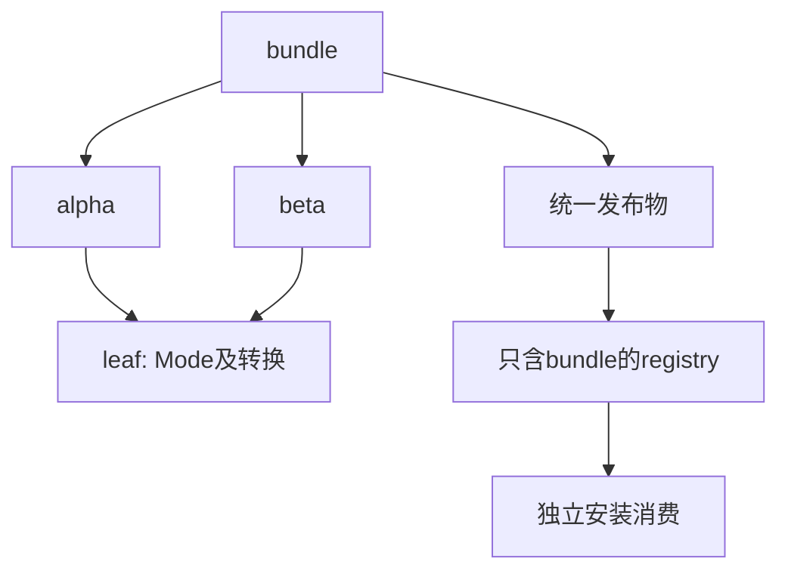
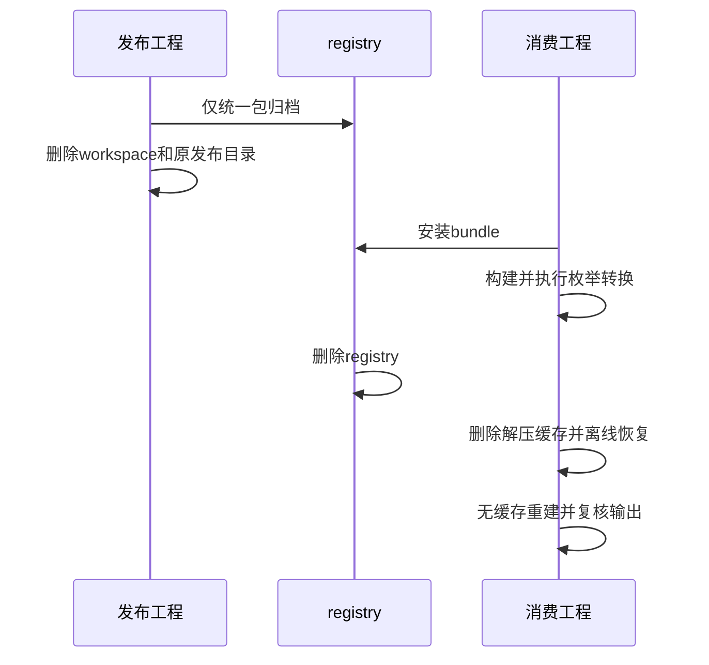

# 统一库跨包闭包与安装验证

## Intent：最终目标

阶段三百五十九：证明源码包及其传递依赖已被统一发布物完整承载，清除发布manifest的dependencies后仍可独立安装、离线恢复和运行。

## Data：可用证据

阶段358仅测试单包内部闭包。当前publish会将dependencies/dev_dependencies/workspace清空，需要验证真实跨包函数与名义枚举来源没有随配置一起丢失。复用成熟tar打包及本地registry工具。

## Edges：边界与限制

构造bundle→alpha/beta→leaf菱形依赖；leaf定义名义枚举和循环转换，避免全identity函数让调用丢失也看似正确。删除整个原workspace及原发布目录，registry仅提供bundle归档。只修改测试。

## Answer：交付格式与成功标准

本地registry安装仅产生consumer+bundle锁图；ZX应用结果反映跨包转换，Zig依赖使用发布build.zig运行；删除registry和已解压缓存后可frozen offline恢复，锁文件不变、重建执行相同结果。完成提交push。

## 自我复核

不能把运行阶段仍能访问源码依赖的工程当作独立发布成功。锁图必须没有alpha/beta/leaf；源和发布目录真实删除，归档清单也无源码依赖。输出转换使用独立循环序列预期。

## 证明范围说明

首次复用了阶段358强制传入solver的publish helper，枚举输入被现有验证器以“verification currently supports boolean and fixed-width integer inputs with static objects or tuples”拒绝。该行为符合现有证明范围，不属于新的发布缺陷。

本例源码没有契约，改为CLI常规发布与构建，不附加solver；保留完整枚举与跨包调用的运行断言。没有删掉名义类型或把输入改成更容易证明的布尔/整数。阶段358的真实契约证明门禁和反例拒绝测试不变；本轮不声称枚举输入已经获得形式化证明支持。

## 验证结果

新增closure_test及分层fixtures：4个原始包形成菱形依赖，leaf的枚举有First/Second/Third，转换循环到下一值；主入口经过两个调用转换两次，echo经过一次，RX workflow调用主入口。原workspace被完整删除后，输出仍按独立循环序列预期执行。

发布manifest无dependencies和workspace。本地registry只有bundle归档，安装锁图严格为bundle、consumer两个包，没有alpha/beta/leaf。首次无缓存构建后3个枚举输入全部成功；独立Zig工程使用发布build.zig并共享PublishedMode，1项测试中的9次公开调用结果正确。

删除registry、消费者安装元数据和已解压包缓存，同时删除应用可执行文件；随后offline+frozen-lockfile安装成功，锁文件字节不变，再次无缓存重建与3个输入执行成功。总计本场景2次安装（含离线恢复）、2次应用构建、6次应用执行和1项Zig消费测试。

最终test-library-publish 12/12步骤通过，Node报告7项（含1个父测试），也再次覆盖阶段358的混合发布、纯类型发布和3个失败保留场景。TypeScript、Prettier及Zig格式检查通过。未发现新的生产缺陷，因此未向实现聊天发送消息。

未执行完整根回归；本轮不证明枚举输入的形式化验证、多版本依赖冲突或原生资源闭包。源码和结构化结果随文档保存，完整运行日志本地保留。JSONL和Test262审阅计数不变。

版本记录：任务开始HEAD为adf79e4b，提交测试前已推进到8c9046bb；本专项结果用于上述公开清单闭包链路，不代替新增单入口归一化行为的独立测试。
