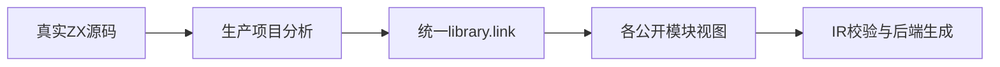
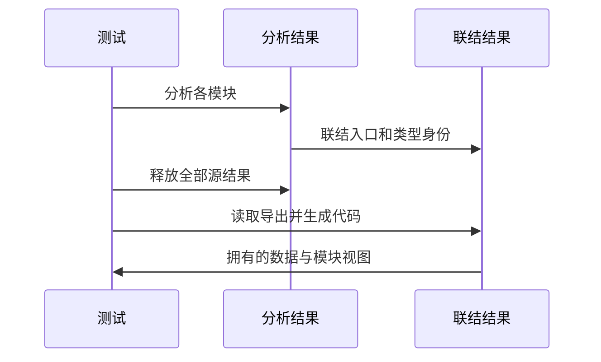

# 统一模块联结接口验证

## Intent：最终目标

阶段三百四十四：为9cdd393b新增compiler.library接口补正式验证，检查公开模块选择、结构/名义类型身份、输入生命周期及分配失败。

## Data：可用证据

link接收真实AnalysisResult数组并返回拥有arena的统一program、exports及nominal_types；module按索引选择入口。实现示例已有RX与ZX生成消费，但尚无独立测试覆盖拒绝边界及资源生命周期。

## Edges：边界与限制

先测试纯联结API，不将生成成功等同真实机器码执行；使用compiler.project.analyze创建实际结果，不手造正常IR。源分析结果释放后再检查类型、入口及后端生成。只修改packages/test。

## Answer：交付格式与成功标准

交付分组Zig测试、专项入口、执行日志与草稿。成功结果通过IR校验和后端生成；名义身份按来源判断；拒绝用例精确检查错误类型；故障注入必须无泄漏。

## 自我复核

结构一致与名义一致必须分别检查；两个同名枚举不能仅因成员相同就合并。纯API测试不证明最终发布、搬迁及真实应用执行完成。

## 验证结果

新增tests/library/fixture.zig、identity_test.zig、resources_test.zig，注册test-library-link并接入packages/test总入口。专项6/6步骤、10/10测试通过，zig fmt及diff检查通过。

五项身份测试覆盖可调用/纯类型公开视图与顺序及越界索引、同源名义身份、异源同形枚举隔离、结构Record合并、同来源枚举成员冲突。可调用和纯类型视图分别通过validateIr。

五项资源/门禁测试覆盖释放原分析结果及覆盖公开名称缓冲后继续读取和emitModules、成功联结及重复公开名拒绝的全Zig分配失败注入、空输入/空名称/NUL/非法UTF8名称、真实前端诊断结果拒绝。后端生成使用借用联结结果的AnalysisResult包装，不伪造正常IR；生成入口与ABI非空，但尚未编译这些新生成结果执行。

没有修改生产实现，没有发现需通知实现聊天的缺陷；未重跑完整根回归。JSONL73834、Test262已审阅2182保持不变。测试副本、联结生产源码哈希和最终日志位于统一联结接口草稿。

仍需继续覆盖：两个不同可调用入口生成后的实际执行、嵌套依赖函数ID重映射、RX/ZX混合结果、Store共享身份及冲突、原生接口去重/冲突，以及最终包级发布和搬迁。不能由本轮身份及资源专项推断这些场景已完成。
