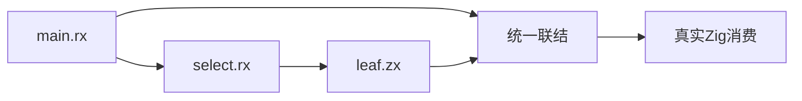
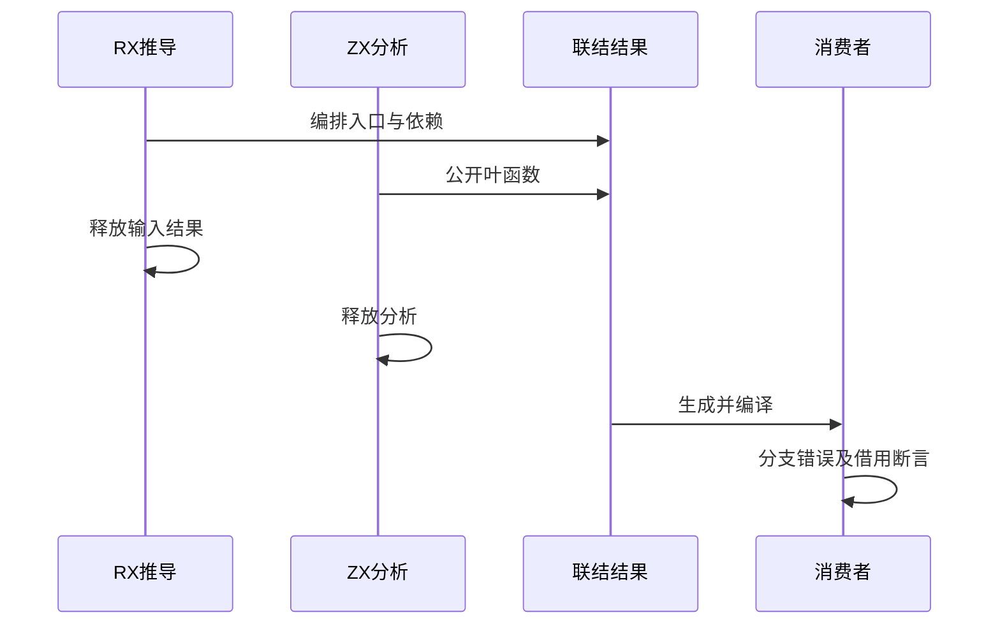

# 统一联结 RX 与 ZX 混合运行验证

## Intent：最终目标

阶段三百四十六：验证真实RX主模块经RX子模块条件选择再调用ZX，与同一个ZX函数共同公开后的运行行为、错误传播和输入借用。

## Data：可用证据

已有统一ZX多入口运行测试可复用生成与依赖图消费；已有RX conditional测试明确合法分支应跳过另一侧空数组。使用真实parseXml与project.infer，再与ZX分析结果共同link。

## Edges：边界与限制

先释放XML、RX推导、ZX分析结果再生成。正反序公开alpha(RX)、beta(ZX)、repeat(RX别名)。不生成Store宿主，不声称发布或codec完成。

## Answer：交付格式与成功标准

新增混合推导夹具与Zig消费者，复用实际模块闭包编译。验证两侧合法选择、未选侧跳过、选中空侧IndexOutOfBounds、ZX直接入口、别名和输入不变；正反序均执行。

## 自我复核

不能用手写IR代替RX推导；未选侧空数组是短路控制，选中空侧必须失败。生成阶段成功不替代这两类实际运行断言。

## 验证结果

新增main.rx与select.rx：主入口调用RX子模块，子模块在调用leaf.zx前用条件表达式读取输入数组。新增mixed.zig调用真实XML解析、RX项目推导和ZX项目分析，将RX契约包装为AnalysisResult与ZX共同联结。XML、推导结果与ZX分析都用page_allocator并在返回library前释放，生成复用上一阶段的严格同名产物一致性检查。

新增mixed_test.zig七个消费者测试，在正反序各执行一次，共14次Zig测试执行、40次execute调用和2个Node驱动通过。覆盖两侧未选空数组短路、选中空数组错误、两侧运行值、公开ZX入口不同输入形状、同源RX别名、输入数组不变、错误后同arena继续使用。

越界来自RX调用参数表达式求值，不是leaf函数内部。初次测试名称错误归因为ZX边界，已改成index error并重新跑最终混合专项：7/7步骤成功。改动生成器后的完整library-runtime也通过12/12步骤，原ZX8次消费者测试及新增RX14次均通过，4个Node驱动成功。测试代码逻辑未因名称纠正而改变。

Zig格式和diff检查通过。本轮未改变Node驱动；其上阶段类型/格式检查仍对应相同内容。没有生产实现变更或需通知缺陷，未运行完整根回归。源码副本、两组生成结果、依赖图、哈希及日志保存在统一混合运行草稿。

JSONL73834和Test262已审阅2182不变。仍需继续验证统一Store状态身份、原生接口、codec及包发布，本批不替代这些能力的完成证据。
