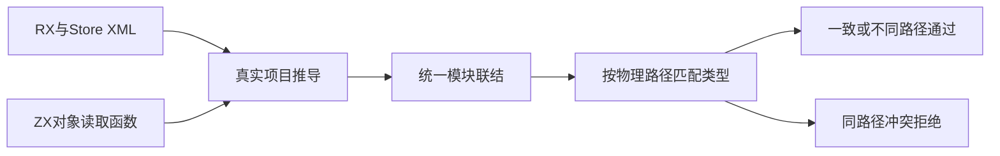
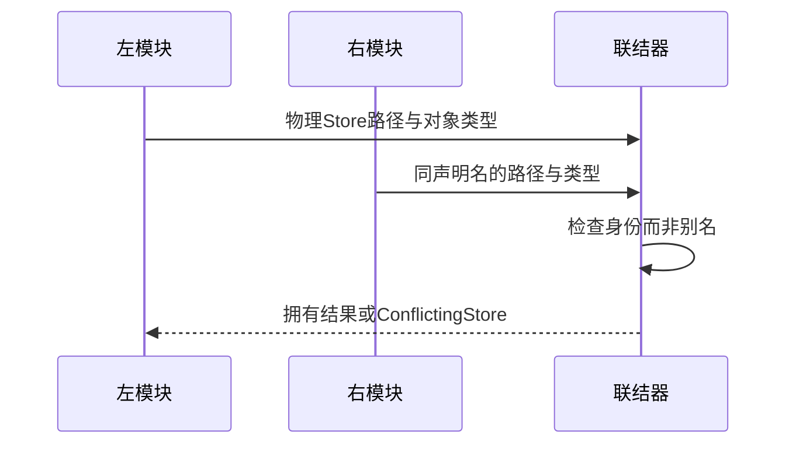

# 统一联结 Store 身份验证

## Intent：最终目标

阶段三百四十七：验证多个真实RX公开模块联结时，Store物理路径身份、类型共享和冲突拒绝不因模块别名或顺序改变。

## Data：可用证据

library.link跨函数按Store slot.path检查type_id一致性。RX推导从真实Store XML建立对象类型与物理身份；Store声明name不是物理身份。本批使用相同声明名、不同源路径和u64/u32字段建立对照。

## Edges：边界与限制

仅验证联结与门禁，不把类型相同等同运行状态已共享；应用级State真实生成仍需独立运行测试。使用XML解析及RX/ZX推导而非手改Store IR。生产代码不修改。

## Answer：交付格式与成功标准

交付独立Store测试、真实推导夹具、构建入口和日志。检验同路径同类型、异路径同类型、同路径异类型正反序拒绝、异路径异类型通过，以及成功/冲突时联结分配失败清理。

## 自我复核

结构类型可以共享而状态路径必须不同；断言不能把type_id共享误当状态混淆。当前只证明联结约束，不推断并发或长期宿主行为。

## 验证结果

新增tests/library/store_fixture.zig及store_test.zig，fixture使用真实XML、Store定义及读取对象字段的ZX，分别完成两次RX项目推导后联结；在返回统一结果前释放推导，随后验证module视图及IR。声明名固定same_name，物理state.store.rx或other.store.rx和字段u64/u32分别变化。

新增六个测试全部通过：同路径同类型共享TypeId；不同路径同结构可共享TypeId但完整Store path不同；不同路径允许不同结构；同路径类型冲突在两种公开顺序均返回ConflictingStore；成功和冲突联结均通过逐点Zig分配失败检查。故障分配器只传给联结，RX夹具推导不属于本轮注入范围。

test-library-link整体8/8步骤、16/16测试通过，包含原10项与新增6项。zig fmt与diff检查通过。首轮fixture ZX没有语义块间空行，被RX推导的spacing门禁拒绝；修正夹具格式后通过，保留初轮日志，没有将该测试错误当生产缺陷。

本轮无生产源码变更，没有需通知实现聊天的缺陷；没有生成应用State或执行这些Store模块，不宣称运行状态共享已完成。JSONL73834、Test262审阅2182不变，未跑完整根回归。代码副本、哈希及日志位于统一Store身份草稿。

当前HEAD489a0d2d新增统一产物codec，下一步应补encode/decode的生命周期、校验拒绝和实际消费，并继续Store宿主与原生接口运行验证。
