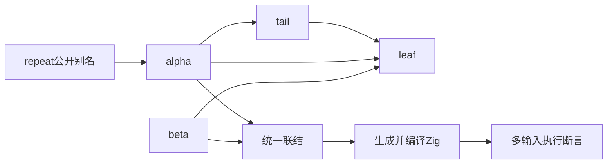
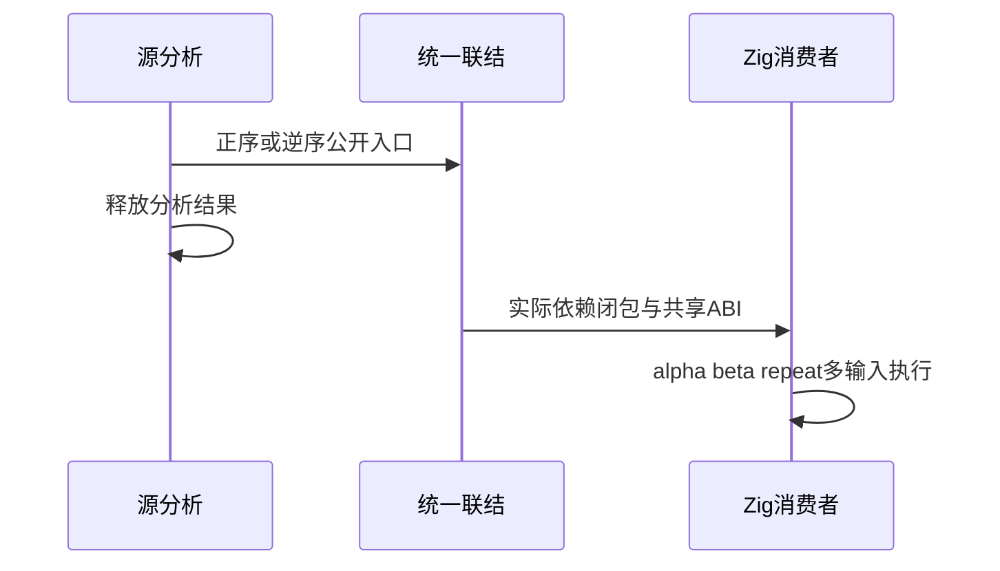

# 统一联结多入口运行验证

## Intent：最终目标

阶段三百四十五：补齐统一联结生成代码的真实编译运行，重点验证多入口、嵌套依赖、同源别名和输入顺序改变后的函数引用。

## Data：可用证据

上一阶段10项API测试通过，但未编译生成产物。使用两个实际ZX入口共享leaf，alpha额外经tail调用；公开alpha、beta和alpha的repeat别名。两种输入顺序生成相同公开名称集合。

## Edges：边界与限制

只测试已实现的统一link与emitModules，不依赖实现聊天正在编写的codec发布。释放原分析结果后才生成。运行断言使用输入代数结果，不以生成源码文本匹配替代执行。

## Answer：交付格式与成功标准

在packages/test/tests/library/runtime建立源码、生成器和Zig消费者，注册独立专项。实际依赖图驱动编译，每入口多输入断言、同源别名及交错调用一致。保留两种顺序生成证据和日志。

## 自我复核

只运行默认第一个入口不足以证明索引重映射。两种顺序必须按名称选择全部入口，且期望结果独立于编译器IR。它仍不证明包级统一发布、RX或Store语义。

## 验证结果

新增正式runtime/fixtures四个ZX源文件、generate/save生成器、run_test.ts及consume_test.zig；build/library_runtime.zig注册test-library-runtime并接入总入口。生成器分别按alpha/beta/repeat及逆序联结，原分析使用page_allocator并在生成前deinit，避免用仍存活的分析arena掩盖借用问题。

leaf(x)=x+2，tail(x)=leaf(x)*2，alpha(x)=tail(leaf(x))+5=2x+13，beta(x)=leaf(x)*3+7=3x+13，repeat公开同源alpha。三个公开入口分别执行0、1、7、42、65535、1000000；另执行0、7、1000、7、0的组合及交错调用，检查beta(alpha(x))=6x+52与repeat(beta(alpha(x)))=12x+117。

实际依赖闭包读取modules.json后传给Zig编译器，每组4/4消费者测试通过，正反序共8次Zig测试执行及2个Node驱动通过，专项7/7步骤成功。每组33次execute调用，两组共66次。相同文件名产物必须内容一致，不静默覆盖，生成证据及两组完整源码已归档。

TypeScript类型检查、Node驱动Prettier、Zig格式及diff检查通过。没有生产缺陷、没有发送实现聊天消息，未运行完整根回归。JSONL73834和上游审阅2182保持不变。

本轮验证嵌套ZX依赖、多入口、别名及公开顺序不影响行为；仍未测试RX混合、Store、原生接口及正在实现的统一codec/发布路径。
