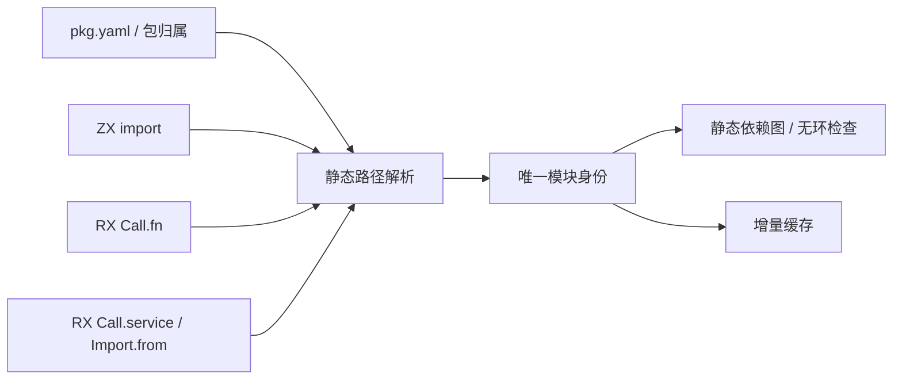

# RX 与 ZX 统一路径引用设计

## Intent：最终目标

RX 的 Call.fn、Call.service 与 ZX 的 import 采用一致的路径约定：ZX import 必须省略 .zx 后缀，RX 路径遵循其既有后缀约定，内置 @/ 指向当前包根目录，支持在 pkg.yaml 中声明自定义 path alias。深层模块不必使用长串 ../，解析仍在编译期完成，生成结果不增加运行时查找或加载层。

## Data：可用证据与当前状态

ZX 当前项目解析器已有 @/ 包根路径；package_scopes 存在时使用导入方所属包的根目录，否则使用项目 root_dir。CLI 没有项目配置时 root_dir 为当前工作目录。

RX Call.fn 和 Call.service 已分别支持省略 .zx、.rx。ZX import 的省略 .zx 改动已写入共用 resolvePath；CLI 源码收集与项目语义分析均调用这一解析链。根据用户 2026-10-06 的明确要求，显式 .zx 必须拒绝，原兼容方案撤回。以下逐字节对照是此前迁移的历史证据；强制省略规则需单独验证。ReleaseSafe dist 构建通过；表达式前端 43 个 ZX 文件的 import 省略后缀后，RX 入口成功生成 Zig，与省略前的输出逐字节一致。此核对覆盖该入口的函数、类型和枚举依赖，不代表自定义 alias 已实现。

现有 pkg.yaml Manifest 尚无自定义 path alias 字段。RX 的现有路径解析仍以 owner 目录为起点，尚未统一接入包根与别名配置。因此下文自定义 paths 与 RX @/ 是待实现的正式目标，不作为已发布能力描述。

## Edges：边界与限制

- @ 是保留的内置 alias，始终表示导入方所属包的根目录，不能覆盖成 src 或工作区根目录。
- 工作区中每个包使用自己的 pkg.yaml 和 paths；根工作区不隐式向子包注入 alias。跨包消费仍走已声明的包依赖及公开接口。
- 自定义 alias 采用 @name 形式，按完整首段匹配，例如 @shared/ 不匹配 @shared_extra/。同一个包只允许一份同名映射。
- paths 值是相对于当前包根目录的目录路径；不能使用绝对路径、越出包根或再次引用 alias。不支持别名链、通配符、候选路径数组和隐式目录入口。
- 自定义 alias 不得与已声明的 scoped package 命名空间冲突；遇到冲突报配置错误，不静默遮蔽包依赖。
- 解析 alias 后统一进行路径规范化、模块后缀处理、包边界及物理身份检查。不同写法指向同一文件时，必须具有同一模块身份、同一缓存节点和同一依赖图节点。
- 所有静态引用边，包括未使用 import、RX Import.from 和嵌套分支中的 Call，均使用同一解析结果参与无环检查，不允许用 alias 绕过限制。
- std:、zig:、c: 和裸包名保留已有语义，不参与文件后缀补齐。显式非 ZX 文件后缀不作为 ZX import 目标。
- 配置变化必须进入构建与 watch 输入；alias 改指向后重新解析受影响依赖，不能复用旧目标的语义或生成缓存。
- 包归属、alias 配置和规范化结果由静态模块层提供；不能只在 CLI 加字符串替换，导致库 API、lint、check-rx、build、发布消费使用不同规则。

## Answer：交付格式与成功标准

配置采用简单的单目标映射：

```yaml
name: shop
version: 0.1.0
paths:
    '@shared': src/shared
    '@services': src/services
    '@logic': src/logic
```

ZX 文件导入：

```typescript
import calculateQuote from '@/src/logic/calculate_quote'
import normalize from '@shared/normalize'
import type { Money } from '@shared/types'
```

RX 路径引用，属性名为 service：

```xml
<Module>
  <Call fn="@logic/calculate_quote" in={$in} out="ctx.quote" />

  <Call service="@services/create_order" in={ctx.quote} out="ctx.order" />

  <Return value={ctx.order} />
</Module>
```

解析顺序：识别引用类别，确定导入方所属包，展开内置 @/ 或已声明的自定义 alias，补齐目标语言后缀，规范化并检查边界，得到唯一模块身份，再进行静态依赖装载与无环检查。

| 引用形式                         | 目标                               |
| -------------------------------- | ---------------------------------- |
| ZX import ./money                | 导入方目录中的 money.zx            |
| ZX import @/src/money            | 当前包根下的 src/money.zx          |
| RX Call.fn @logic/quote          | paths.@logic 目录中的 quote.zx     |
| RX Call.service @services/orders | paths.@services 目录中的 orders.rx |
| 显式 ./money.zx                  | 编译诊断，必须改为 ./money         |
| 未声明 @unknown/item             | 模块或依赖解析错误，不猜测目录     |




验收包括：ZX 默认函数、类型和枚举导入；RX fn/service 及嵌套引用；@/ 与自定义 alias；省略后缀的解析与显式后缀的拒绝；别名冲突、未知别名、跨包越界、别名形成的环；独立包与 workspace 中的包根；配置变更后的增量重建。现阶段不把方案中的验收项写成已通过，也不新增测试用例或运行全量测试；继续复用已有材料进行定向核对。

## 自我复核

2026-10-06 强制省略修正：共用 resolvePath 拒绝带扩展名的 ZX 文件导入，随后统一补 `.zx` 定位源文件。迁移 packages 下 204 个文件中的 501 处引用，包括正式源码、既有验证材料与文档示例；文件实际名称、manifest 入口、CLI 输入与原生模块前缀不变。清单和核对输出存于 [导入后缀迁移](../2026-10-06/导入后缀迁移/修改清单.json)。ReleaseSafe dist 构建通过；新版 CLI 成功生成表达式 RX 入口，生成 Zig 与本次规则修改前逐字节一致；直接重放 Git 中原有 scan.zx 的旧导入文本时，明确报 must omit the .zx extension。未新增测试用例，未运行全量测试。历史 docs 中的源码快照保留历史语法，不能据此推断旧写法仍受支持。

import 分组、顺序与空行由 lint 的内置固定规则负责，不允许配置或覆盖，具体见[导入排序规则设计](导入排序规则设计.md)。排序消费统一路径类别与 alias 配置；paths 只配置路径映射，不配置顺序。排序不重新定义路径身份，也不重排 RX Call 的执行顺序。

@/ 应指向包根而非习惯性的 src，这是默认 alias 最容易产生歧义的地方。自定义 paths 只负责路径缩写，不创建新的模块实体、不改变 lib 的公开接口边界，也不提供动态加载能力。实现时必须在共同解析层收口，并明确区分已经验证的 ZX 后缀支持与尚待接入的自定义 alias、RX 包根路径。
