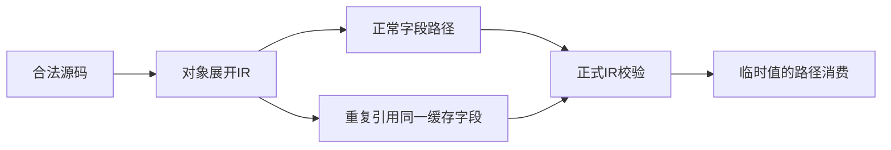
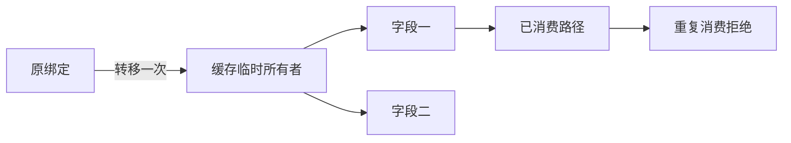

# 缓存所有权实施计划

## Intent：最终目标

让 IR 校验中的对象求值缓存保留唯一消费语义，防止共享缓存表达式把一个独占字段复制成两个独占所有者。合法对象展开仍应只求值一次，并允许分别转移不同字段。

## Data：可用证据

源码前端为 spread 和显式字段访问生成不同引用表达式，重复使用原所有者会被拒绝。当前检查器的 memo 只保存 State，读取缓存值时不更新其消费状态；人工 IR 是否能够利用这个缺口，需要先用正式 validateIr 入口确认。

## Edges：边界与限制

修复仅作用于编译期所有权，不增加运行时设施，不依赖字段名或特定应用。不能简单把第一次读取缓存根标为 moved，否则合法 spread 的第二个不同字段也会被拒绝。所有权位置必须区分缓存中的临时值与已经转移的原绑定，并覆盖嵌套作用域及借用。

## Answer：交付与成功标准

先记录正式编译器 API 对原始及共享字段 IR 的判断，再实现符合位置语义的校验。交付代码草稿、实现、运行证据与引用文档；使用普通宿主观测，不新建测试套件，不执行全量测试或浏览器。完成后独立提交推送。

## 自我复核

源码拒绝不等于归档 IR 安全。必须分别验证合法展开与共享缓存字段，不能只验证新增诊断，也不能将局部观测升级为全语言形式化证明。

## 确认结果与实现

普通宿主调用 parse、analyze、validateIr，再将展开结果的两个同类型列表字段改为引用同一个投影。修复前原始与修改后的 IR 都被接受；修复后原始仍被接受，重复引用字段的 IR 被拒绝。证据分别保存为修复前观测.json与修复后观测.json。

memo 现在保存位置编号，不再保存可反复领取的 State。每个 object 表达式的每个 evaluation slot 拥有独立临时根；同一 ExprId 在嵌套作用域重新绑定时也不会共用该根。退出作用域只恢复 ExprId 到位置的映射，外层临时值已经发生的消费与借用状态保持不变。

位置布局构造拆入 ownership/places/layout.zig，状态转换仍由 places.zig 负责。布局只预建出现过的静态投影路径，动态索引沿用整个容器规则。变量根和缓存根共同参与现有完整状态快照、分支合并及借用冻结，不增加另一套状态机。

库链接入口在 library/link.zig 调用同一 validateIr，因此本修复也作用于该入口接受的程序。此次证据直接覆盖校验入口，不将其表述为所有归档格式均已穷尽验证。

## 完成证据

发行构建 dist 为 13/13 步成功。实际应用中，普通展开得到 first=[1,2]、second=[3,4]；双列表归约得到 primary=[2,3]、secondary=[2,3,3,4]；兄弟字段借用与 reverse 得到 first=[3,1]、second=[2,4]。这些应用均由修复后的 CLI 无缓存重新构建再运行。

宿主进一步将整个缓存列表值同时用作两个输出字段，正式校验同样拒绝；原始合法 IR 继续接受。静态复核覆盖临时根的作用域区分、路径预建、外层状态在内层消费后的保留，以及分支快照范围。没有运行全量测试或浏览器，没有修改测试目录。
