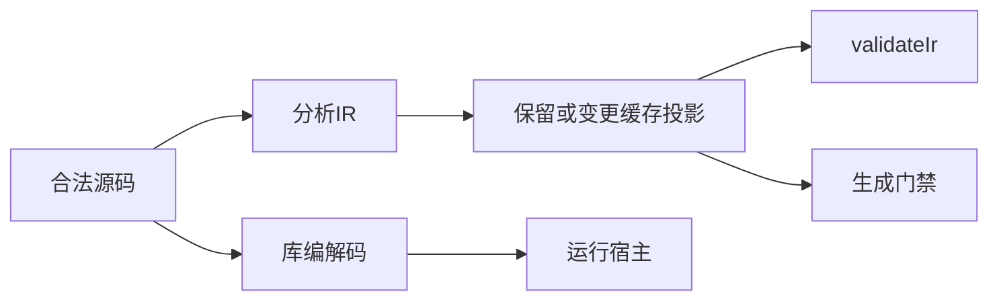
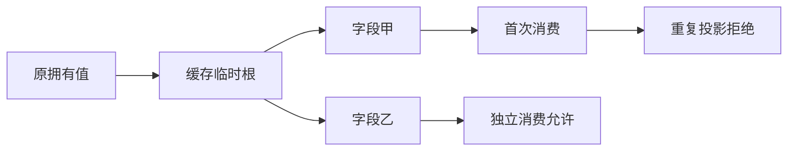

# 缓存消费验证计划

## Intent：最终目标

验证对象求值缓存的临时所有者遵守唯一消费；防止同一缓存路径经重复 ExprId 或不同投影表达式交付两份 owned 输出，同时保留合法字段展开、标量复制和借用共享。

## Data：可用证据

前阶段 HEAD 6d3fbb22，实施会话提供的缓存所有权复现和正在修改的 ownership/check、places/layout。使用正式 parse/analyze/validateIr/zig.emit API，不直接调用私有检查器。正常运行沿用已有源码与库编解码双链路。

## Edges：边界与限制

人工 IR 变更保留类型形状与字段索引，仅改变缓存字段来源。owned 值重复消费应拒绝，标量及 borrowed 引用允许共享。不修改生产代码，发现新问题发送实现会话。记录修复中工作区与最终版本，避免把临时结果解释成完整安全证明。

## Answer：交付与成功标准

新 test-cached-ownership 覆盖合法/非法 IR、codegen 拒绝和 OOM；正常展开在源码与库链路运行，验证输入保持、输出内容和独占/借用关系。Debug、ReleaseSafe 与相关旧回归通过后提交推送。

