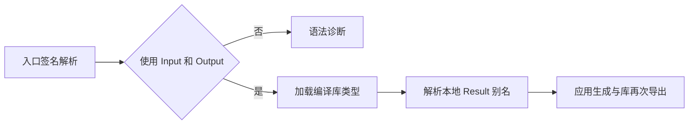

# 编译库类型别名反馈核对

## Intent：最终目标

核对 URL 公开接口验证期间报告的编译库类型别名失败，确认根因并保持既有语言契约。

## Data：可用证据

原始复现保存在 `URL公开接口验证/类型别名复现/main.zx`：从编译库导入 Input、Output，声明 `export type Result = Output`，入口返回类型写作 Result。构建报 `main.zx:6:38: syntax: Output`。

生产代码 `packages/compiler/src/zx/frontend/parser_top.zig` 的 header 明确要求入口输入类型名称为 Input，输出类型名称为 Output。错误发生在签名语法解析阶段，尚未执行模块类型导入或别名解析。`analysis/types.zig` 的 named 会查询导入 aliases，initialize 会解析所有本地声明。

同目录 `alias_observation.zx` 保留 Result 别名，仅把入口返回名称恢复为 Output。实际执行：

```sh
zig-out/bin/zxc build docs/2026-10-05/URL公开接口验证/类型别名复现/alias_observation.zx --out /tmp/zxc_alias_observation
/tmp/zxc_alias_observation true
/tmp/zxc_alias_observation false
zig-out/bin/zxc build docs/2026-10-05/URL公开接口验证/类型别名复现/alias_observation.zx --mode lib --out /tmp/zxc_alias_export
```

构建与再次发布成功；应用输出分别为 true、false。再次发布的 root.zig 明确包含 `pub const Result = bool;`，说明编译库的导入类型经本地别名再次导出成功。

## Edges：边界与限制

没有修改原始失败复现，没有扩大函数签名语法，没有新增正式测试或运行全量测试。验证范围为已给出的 bool 库与本地导出别名，不用它代替所有复合类型和跨层依赖的验证。临时发布目录是观测产物，不纳入版本控制。

## Answer：交付与成功标准

结论：该反馈违反现有入口签名契约，未证明导入类型别名解析缺陷，生产代码无需修改。保留失败证据及符合契约的观测源码，避免后续把此问题误计为未修复的编译器错误。




## 自我批判

最初根据错误发生于编译库消费者而推断为导入类型展开缺失，结论过早。定位诊断产生位置后发现是签名名称的语法契约。正确处理是核对并保留现有契约，而不是为了让复现通过而修改语言边界。
