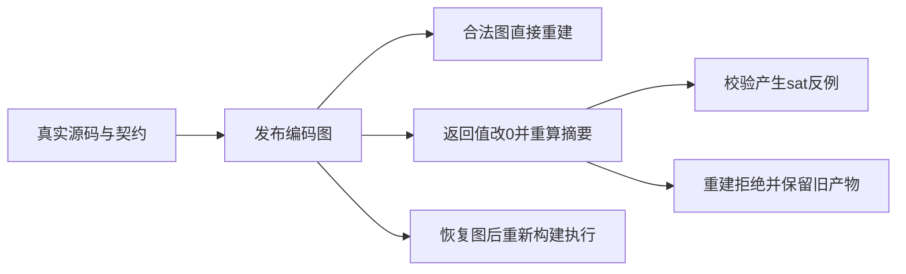
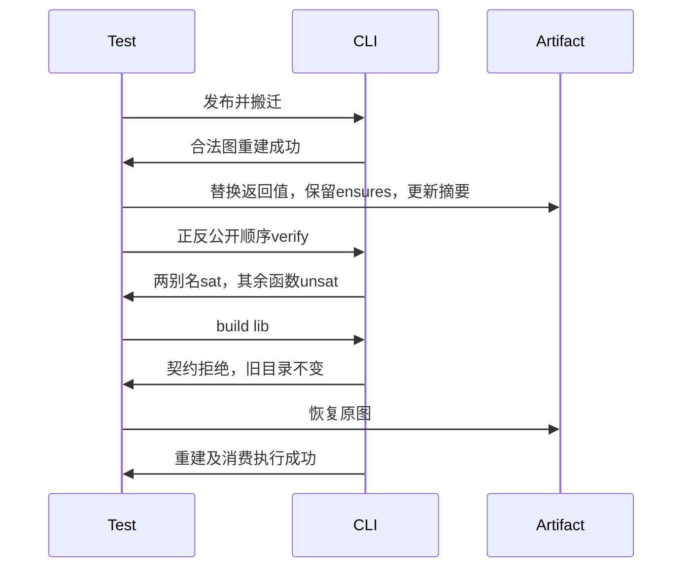

# 编译清单契约重新验证

## Intent：最终目标

阶段三百六十九：证明编译清单校验与重建重新验证函数契约；正确摘要仅证明字节完整性，不能证明函数语义成立。

## Data：可用证据

上一阶段已验证格式完整性、公开模块筛选与直接消费。真实发布的identity函数带ensures(out == in)。现有编码图公开模块记录提供函数索引，函数body提供返回表达式索引，可据此修改语义而不固定IR编号。

## Edges：边界与限制

只编辑测试。对发布产物的临时副本将identity返回表达式改为同类型常量0，保留契约、签名、模块图并重算SHA256。原源码与发布路径均删除。不是通过损坏格式触发无关错误，也不声称摘要是签名。

## Answer：交付与成功标准

原始编译图直接重建成功。修改后，按两种公开导出顺序执行verify，每个identity别名必须生成sat反例，未受影响的bool模块仍为unsat。直接build拒绝且保留已有输出全部字节。恢复原始编码图后可重新构建，并通过实际消费执行证明恢复行为。

## 自我复核

必须核查真实主SMT、求解结果与版本，不把一般非零退出当作契约验证。不得固定函数或表达式编号。公开顺序互换检查错误不能使后续正常模块跳过。旧输出全字节快照与恢复执行分别覆盖失败保护和后续可用性。

## 实施结果

新增test-library-compiled-contract并接入统一发布回归。contract_artifact仅处理本场景语义变更：先验证原始v2摘要，从公开`.`条目读取真实function索引，从单返回语句读取真实表达式索引，确认该表达式引用名为in的符号，并确认存在ensures；只将该表达式替换为同类型integer 0。序列化完整payload后重算摘要，确认与原摘要不同。没有修改契约、返回语句、类型表或导出表。

两种清单顺序分别为value/same/negate/types和其逆序；value、same均引用identity，negate引用未修改的toggle。直接verify均以1退出，但对全部公开模块输出报告；两别名的主SMT均得到sat，negate得到unsat，并记录真实Z3版本，证明错误不能中断其他公开模块的校验。类型接口继续参与集合校验。拒绝原因不是解码、缺模块或缺文件。

同一输入随后直接build lib，均报告verification did not succeed，旧输出目录全文件字节未变。恢复原始编码图后保留逆序清单重建成功；删除该输入目录，再从新产物构建消费应用，对0、1、127、255执行验证，输出值保持原输入且bool正确取反。这覆盖了非零输入，避免错误常量0在恢复检查中蒙混通过。

| 检查                           | 实测结果                              |
| ------------------------------ | ------------------------------------- |
| test-library-compiled-contract | 首次通过，10/10构建步骤，3/3 Node测试 |
| Node计数                       | 1个父测试、2个导出顺序子测试          |
| 正常库发布与重建               | 1次发布、2次直接重建成功              |
| 契约拒绝                       | 2次verify、2次build                   |
| 主SMT证据                      | 4个sat、2个unsat，全部含Z3版本记录    |
| 旧输出保护                     | 每次失败build后全目录快照一致         |
| 恢复消费                       | 1次应用构建、4组输入实际执行成功      |
| @zxc/test typecheck            | 退出码0                               |
| 格式与diff检查                 | 通过                                  |

基线d6303aa7。构建重新编译了CLI，未发现新生产缺陷，未向实现聊天发送消息。本轮未修改生产源码，未执行根目录全量回归；JSONL用例与Test262审阅数量不变。新增实现d6303aa7的旧产物清理规则尚未专项覆盖，不把本轮“失败保持”结论扩展成其全路径通过。测试及输入副本、机器可读结果保存在编译清单契约测试草稿，原始运行日志本地忽略。
