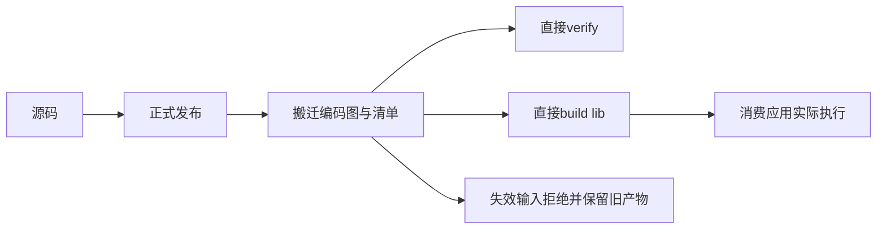
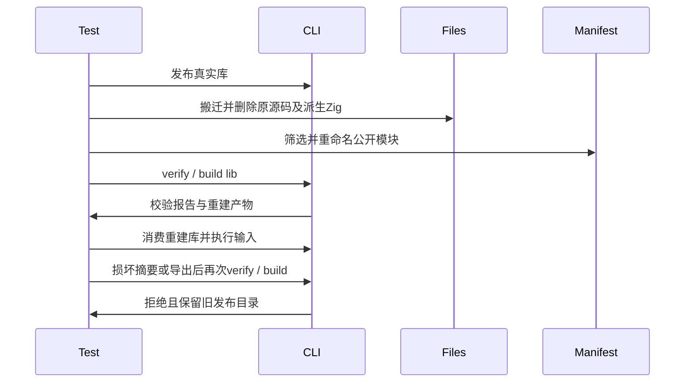

# 编译清单直接校验与重建验证

## Intent：最终目标

阶段三百六十八：验证发布后的编译清单可独立校验和重建，公开导出重命名与筛选保持语义，失效输入不会覆盖已有发布目录。

## Data：可用证据

fbe78546将编译清单接入library analyze、verify与build。现有测试通过源码包装再发布，尚未验证直接使用编译产物的pkg.yaml。复用正式发布fixture与目录快照工具。

## Edges：边界与限制

只新增测试及构建注册，不修改生产代码。搬迁产物后删除源码和原发布位置；删除派生Zig代码，保留编码图和包清单，证明重建输入来自编码图。校验类型接口时使用不存在的solver，避免把空证明集合误认为调用了求解器。未验证所有恶意IR或Store/native组合。

## Answer：交付与成功标准

真实发布、搬迁、重命名及筛选公开导出，直接verify和build成功；从重建产物构建应用并检查多个独立输入。损坏摘要和不存在的公开模块在verify/build均拒绝，所有旧发布文件字节不变。独立类型导出无需可执行求解器即可验证与重建。

## 自我复核

不能仅检查退出码；必须检查公开模块报告与运行值。不同路径的产物身份可变化，不以编码字节全等作为重建标准。拒绝用例必须匹配对应诊断，且逐文件核对旧目录。

## 实施记录

新增test-library-compiled-manifest并接入test-library-publish。普通场景将原始identity映射成value和same两个公开别名，toggle映射为negate，保留types并移除原workflow；目标清单只有编码图，原源码、原发布目录及全部派生Zig都不可回读。校验逐公开名称检查SMT、unsat结果及Z3版本记录。重建后再次移除输入编码目录，只用新发布库构建消费应用，对u8的0、1、127、255与两个bool值进行8组执行比较。

两类失效输入分别是不存在的module引用，以及只翻转摘要中的一个十六进制字符。每类都分别调用verify和build，要求MissingPublicModule或InvalidLibrary，并完整比较旧目录。类型场景以不存在的solver路径发布、直接verify、直接重建、再verify，覆盖两代类型接口。

初次运行未设置ZXC_TEST_SOLVER导致FileNotFound；补齐后测试将前置条件SMT也误计入主证明文件（6对3），改为严格匹配公开名称摘要的主SMT，并读取对应求解结果。随后消费应用构建遗漏--solver也产生FileNotFound，已补齐。以上均为测试驱动或环境配置问题，未作为生产缺陷上报。草稿中曾误用JSON envelope处理摘要，在正式摘要反例执行前按真实三行编码格式修正。

本轮未覆盖重算有效摘要后的错误契约、Store初始化和native资源的直接清单重建；这些仍需独立专项。没有把已发布产物的来源摘要当作语义证明。本轮不修改生产源码，不增加JSONL条目或Test262审阅数量，未执行根目录全量回归。

## 验证结果

| 检查                           | 实测结果                                  |
| ------------------------------ | ----------------------------------------- |
| test-library-compiled-manifest | 10/10构建步骤，4/4 Node测试通过           |
| Node计数                       | 2项顶层测试，其中普通场景含2项拒绝子测试  |
| 真实库发布及直接重建           | 两场景各发布1次、直接重建1次，共4次成功   |
| 直接verify                     | 普通1次、类型两代2次成功；反例2次拒绝     |
| build反例                      | 2次拒绝且全目录字节保持                   |
| SMT证据                        | 3个公开可执行别名各有主SMT、unsat及Z3版本 |
| 消费应用                       | 1次构建、8组输入实际运行成功              |
| @zxc/test typecheck            | 退出码0                                   |
| 格式与diff检查                 | 通过                                      |

使用真实Z3 5.1.0，完成日志记录退出码0。源码与输入副本、机器可读结果保存在编译清单重建测试草稿；运行日志本地忽略。基线c2e40abd，CLI二进制使用当前工作区构建缓存，存在实现聊天的其他未提交生产变更；本轮提交只包含测试和对应文档。结果证明本专项路径，不代表全部Test262或zxc特性已完成。
