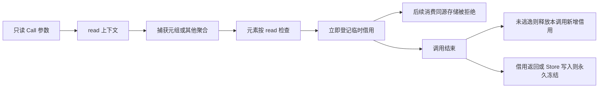
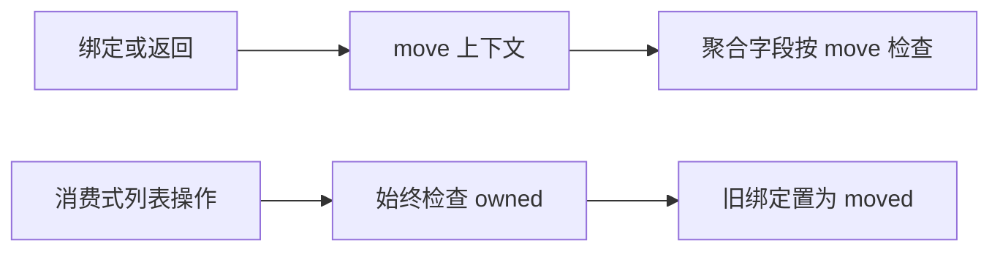

# 聚合借用上下文修复

## Intent：最终目标

修复并行 Task 用元组包装捕获参数时错误消耗外层 owned 值的问题。只读调用可以共享同一列表，不复制数据、不放宽真正的消费式操作。

## Data：可用证据

测试会话提供真实 borrowed.rx：父流程 map 得到 saved，左 Task 直接返回 saved，右 Task 再 map(saved)。当前 tuple 构造对元素无条件使用 move，第一个捕获消耗 saved，第二个 Task 报 previous owner was consumed。直接调用、Store 暂存及对象包装也使用同一 ownership.value，因此修复必须作用于聚合表达式的一般上下文。

## Edges：边界与限制

list、tuple、object 传播调用者的 read/move 模式；read 聚合按求值顺序为引用型元素登记临时借用，阻止后续元素消费相同存储。常量绑定、函数返回等 move 上下文保持原规则。pop、push、splice 等消费式操作仍显式检查目标 owned 并消耗旧绑定；不能因为外层是 read 而放过消费操作。

借用返回值、Store 发布和 Parallel 的 freeze 仍保留原始所有者的借用限制。不改变 ABI、IR 版本或捕获布局，不新增复制或运行库。不新增测试、不执行全量测试。

## Answer：实现与成功标准

ownership/check.zig 中聚合元素、对象求值序列和对象字段使用传入 mode；对象 memo 保留一次求值和原求值顺序。新增 loaned 分析状态，调用退出时只释放本调用新增且未逃逸的借用，保留外层参数求值期间的借用。返回借用或函数具有 writable Store capability 时升级为永久 borrowed；move 上下文读取 loaned 也升级为永久 borrowed，避免创建持久别名后恢复原所有者的消费权限。语句结束释放剩余未逃逸 loan。复用测试会话的真实运行夹具，以及既有所有权、RX 推导与并行运行专项，确认共享只读列表成功、消费后重复使用仍拒绝、失败分配得到清理。





## 自我复核

错误来自 ownership 聚合规则忽略上下文，不来自线程调度或 Task 数据布局。只给 Task 增加例外会留下普通调用和对象包装的同类问题；同时不能把所有递归 move 改成 read，否则会漏掉实际消费。初版仅修改三处聚合传播点，虽然现有专项通过，但只读复核发现参数先引用后消费同一 owned 值的缺口。因此最终实现补充编译期临时借用状态与调用生命周期，不能把初版测试通过视作安全证明。只读复核最终版本未发现新的确定漏洞；这不是形式化证明。当前永久冻结仍按现有粗粒度来源模型保守处理，Store 写入能力会冻结完整参数，尚未支持逐字段逃逸精化。

## 验证记录

- 最终根构建 14/14 步通过。
- 最终版本定向运行 84/84 步、290/290 项通过：RX 推导 138、并行推导 74、所有权摘要 3、并行运行 75。
- 测试会话提供的 task_borrowed 的五项包含空列表、单项、普通数据、u64 边界和逐次分配失败清理；同时检查输入不变及结果不别名。测试文件由测试会话维护，本会话未修改。
- 使用现有所有权目录逐项运行真实 CLI：consumption 248、propagation 156、deep_copy 8，共 412 项均符合原有成功或诊断预期。每项先在临时副本运行 zxc fmt --write，以通过 CLI 的格式门禁，再编译；没有修改原目录或生成新用例。见 [目录核对结果](聚合借用修复/所有权目录核对.json)。
- 复制已有反馈夹具为 [可运行示例](聚合借用修复/示例/main.rx)，真实构建后输入 `[2,3,7]`，得到 `{"left":[3,4,8],"right":[4,5,9]}`。见 [执行结果](聚合借用修复/执行结果.json)。

```sh
zxc build docs/2026-10-05/聚合借用修复/示例/main.rx --out shared_capture
./shared_capture '[2,3,7]'
```

正式源码修改限定于 ownership/check.zig。新增状态与快照仅在编译期存在；数据布局和线程执行不变，没有新增应用运行库或数据复制。该修复不代表 Store 的长期回收问题已经解决。
