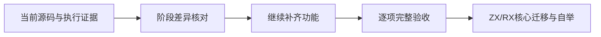
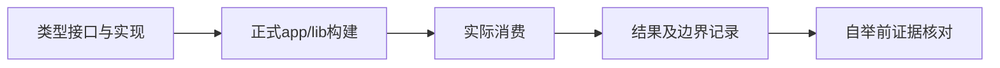

# 自举前进度核对

## Intent：最终目标

在继续实现前修正阶段状态，保持完整自举目标与已有功能缺口，不用局部成功替代全局验收。

## Data：当前证据

本轮基线为 2cb8dc2。此前自举核对记录基于 dcdc202，属于历史基线，不覆盖后来完成的控制流和 Store。当前 prepare.zig 接受 Store、Call、Return、Task、Switch，仍明确拒绝 Parallel 和事件；CLI RX compile 仍拒绝 fmt、verify、fpga 和 lib 模式。

2cb8dc2 已实现 genz 具体 State 生成、compiler 模块与缓存组装、CLI 原生构建和执行。单 Object、双 Object 实际应用均已运行；没有专用 runtime 包。自举核心尚未迁入 ZX/RX。

本轮标准库新增 std:url/search_params 并完成应用与双语言库消费；完整 URL、受控文件/网络/进程 I/O 等功能仍在原始目标中。未复查远端 CI 的当前账户条件，不沿用历史状态断言当前远端成功或失败。

## Edges：边界与限制

不覆盖其他测试会话的总计划，不改写历史核对基线。当前记录只更新直接核验的差异；未读取或执行的项目继续保持未获证状态。动态插件、懒加载和数据库仍按既定决定排除。

## Answer：后续顺序

| 范围                         | 当前阶段                               | 后续要求                                             |
| ---------------------------- | -------------------------------------- | ---------------------------------------------------- |
| Task / Switch                | 已接通推导与生成                       | 后续语义变更维持作用域、分支返回和无环检查           |
| Store                        | 已接通编译期生成与原生 CLI             | 继续跨平台文件语义验证；当前 JSON 无穷值编码明确拒绝 |
| URL 查询参数                 | 已接通 12 个静态列表接口和应用、库消费 | 继续由独立测试会话补充覆盖，不推导完整 URL 已完成    |
| 完整 URL                     | 尚未完成                               | WHATWG 地址状态机、主机与域名处理及文件 URL          |
| Parallel / 事件 / Gateway    | 尚未完成                               | 生成静态流程及协议入口，不恢复专用运行库             |
| RX lib / fmt / verify / fpga | 仍有入口缺口                           | 按各模式契约接入，不能直接撤掉保护后声称可用         |
| 自举                         | 尚未开始核心迁移                       | 前置功能与证据闭合后同步 Zig 基线，再完成阶段编译    |

## 自我复核

历史审计中的未完成项不能永久保留为当前事实；同样，新接口注册或单个样例成功也不能抹去整个功能组的剩余要求。本轮继续选择真实实现与消费链路推进，整体目标保持未完成。
