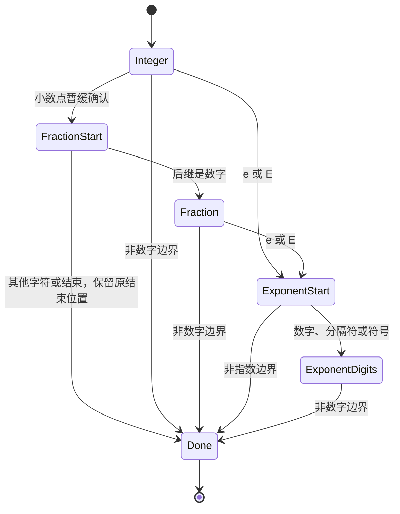

# 自举词法扫描实施

## Intent：最终目标

逐项将编译器核心迁入 ZX/RX，并最终完成 stage 1、stage 2 和再次自身重建。当前建立数字扫描的真实 ZX 实现草稿，用编译器自身的词法规则验证语言表达能力及生成成本；此阶段不替换正式词法器。

## Data：可用证据

当前基线 a197a2e4。原始词法器为 `packages/compiler/src/zx/frontend/lex.zig`，数字规则依次扫描整数、小数及指数，随后检查分隔符与指数末位；模板处理位于相邻 template.zig。完整前端仍依赖可变游标、可变列表及递归，正式核心尚未迁移。指定 zxc_zig 目录与本地 zig 分支已存在，最终归档基线仍需同步。

此前前置工作已提供 UTF-8 字节视图、归约、字段消费、状态列表追加及进程 I/O。当前标准库 `encodeUtf8` 校验 UTF-8 后直接返回字节视图，不复制字符串。ZX 归约仅传累加器和元素，不能套用其他语言带 index/source 的回调签名；类型导入要求纯类型模块。

## Edges：边界与限制

本目录是自举前表达能力验证及迁移草稿，不是已接入的自举编译器。数字扫描不含数值范围、浮点转换、类型判断；这些保持语义分析职责。未迁移标识符、字符串、注释、模板、完整解析、类型与所有权、模块联结、后端生成和 CLI。

不新增正式测试用例、不执行全量测试，不修改另一会话的测试。验证重放仓库已有数字样本，不构造针对预期结果的分支。源码职责拆为字节分类、扫描状态、单步转移、结束诊断和构建入口；状态中的枚举表达扫描阶段。

## Answer：交付与验收

草稿存于 [自举词法扫描](自举词法扫描/)。核心 `number_step.zx` 每次处理一个字节与一位前瞻，不导入旧编译器或原生扫描实现。`scan_number.zx` 是独立可构建的验证入口，接收以数字起始的字符串并返回数字结束偏移和诊断。非法起始字符返回 expected a digit，这是驱动的输入前置条件，不是旧 lexer 的全局诊断。

```sh
zig-out/bin/zxc build docs/2026-10-05/自举词法扫描/scan_number.zx --out /tmp/zxc_bootstrap_number
zig-out/bin/zxc docs/2026-10-05/自举词法扫描/scan_number.zx --out /tmp/zxc_bootstrap_number.zig
```

已成功构建并重放 95 个去重的既有样本，结束偏移与诊断全部一致，见 [执行结果](自举词法扫描/已有数字样本执行结果.json)。无效样本取自 `packages/test/tests/language/lexical/numeric/invalid.jsonl` 的既有 lexical span，预期诊断来自当前正式 CLI 对完整源码的实际执行；合法样本取自 literals_u64.zx、literals_f64.zx、leading_zero.zx 中的原有返回表达式。本次没有运行完整语言测试套件。




## 生成成本核对与下一步

[生成分配核对](自举词法扫描/生成分配核对.json)保存导出命令、生成源码摘要和分配位置。当前 `number_step` 的对象返回、调用参数对象和归约驱动对象仍在 arena 中分配。顶层归约值布局优化不足以消除跨函数及嵌套状态分配；不能把 ZX 源码能编译表述为已经满足零成本自举要求。

验证驱动会遍历完整输入，即使数字已结束；它只用于一次扫描验证。完整词法器应统一按字节推进全部 token，不在每个 token 上对剩余全文执行 reduce，否则会引入二次复杂度。推进正式词法器迁移前，下一步应解决无逃逸标量状态在内部调用中的值传递，或以已有语言语义构造经生成代码验证无逐字节分配的状态机；不能为当前数字样例硬编码后端。

## 自我复核

95 个已有样本的一致结果支持数字状态转移的当前行为，不构成完整词法等价证明。已有无效样本以已知 span 截出 token，因此还没有覆盖完整词法器决定 token 边界的行为。草稿尚未用于正式编译流程，没有将旧实现包装后称作新编译器。本轮最关键的新证据是内部对象调用的逐字节分配仍存在，后续应沿这一具体缺口推进，避免继续堆积会造成编译器内存膨胀的迁移源码。

## 后续进展：内部值返回

本草稿的数字扫描现已改为单字节推进：通过 FractionStart 暂缓确认小数点，不再把源数组包装到每轮状态中。genz 已增加符合条件的纯函数值返回，根调用归约可保留栈上累加器，见 [内部状态值返回实施](内部状态值返回实施.md)。此前生成分配核对保留为历史证据；当前行为与成本见新记录，不沿用旧分配结论。完整词法器仍未接通，自举状态不变。
