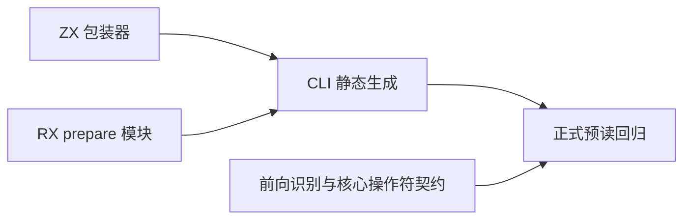
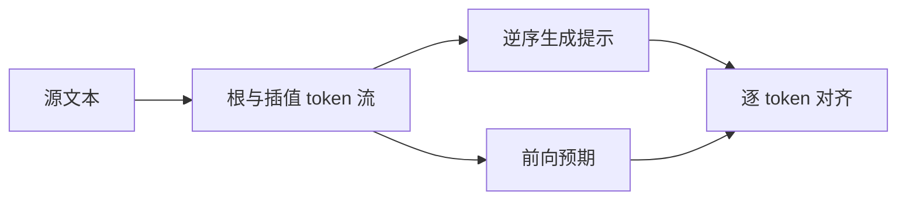

# 表达式预读正式回归

## Intent

将新表达式预读阶段接入持续回归，验证 lambda 起点、泛型方法名和二元运算符提示，以及模板插值中独立 token 流的提示对齐。

## Data

生产 expressions/prepare/scan.zx 从右往左折叠 token；原生 parser_expressions.zig 从当前位置向前读取参数列表。公开输出为 lexical、hints、interpolation_hints。正式模块 parser/prepare.rx 串联词法与预读，当前只有文档验证。

## Edges

提示只表示前瞻分类，不等于整个表达式语法合法。六个片段 x、return、左右括号、逗号、箭头的零至五长度序列穷举只覆盖该有限空间，不声称任意长度。测试预期用前向参数列表识别，与生产逆序状态传播分离；二元操作符使用现有核心 Operator 契约，不另定义语言优先级。

根词法失败时预期没有提示；插值词法错误也只验证相应流。现有正式 lexer 与预处理内部扫描器共享实现，此处不称词法算法独立。生产源码不修改；ZX 包装器与 RX 模块均静态生成普通 Zig。

## Answer

新增 test-expression-preparation 接入全量测试；覆盖有限序列、较长参数列表与混合注释间隔、方法名及相近名称、全部二元操作符、嵌套插值与错误输入。Debug/ReleaseSafe 通过后记录数量及局限并提交。

## 结果与自我复核

Debug 命令 `zig build test-expression-preparation -j2 --summary all` 及增加 `-Doptimize=ReleaseSafe` 的 ReleaseSafe 命令均退出 0，分别 19/19 构建步骤、8/8 测试全部实际执行通过。

每条入口执行四个具名测试：9331 个有限序列（1+6+6²+6³+6⁴+6⁵）、20 个长度/间隔组合、11 个操作符/方法名称/错误样本、4 个带明确插值数量的模板样本，共 9366 次输入检查；两条入口 18732 次。这是循环内检查次数，不增加 Test262 或 JSONL 具名目录计数。

逐 token 比较 lambda、generic、binary.operator、precedence、family，包含 EOF 和非操作符的空分类。前向识别保留原生契约允许的空参数与尾逗号，不引入 TypeScript 类型注解或解构参数等额外能力。插值数量显式断言，避免遗漏整个插值数组却让空循环通过。

没有发现生产差异，没有修改生产源码或发送实现会话消息。源文件指纹在两模式验证后保持一致，仓库格式检查通过。有限序列覆盖不到任意长错序输入；长列表只覆盖指定长度与间隔。该测试证明提示分类与既有契约相符，不能代替尚未完成的整个表达式状态机或完整语言解析回归。
