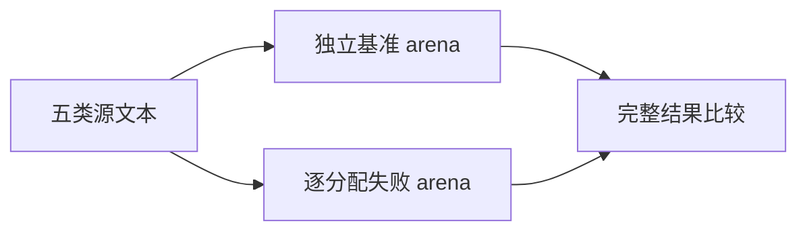
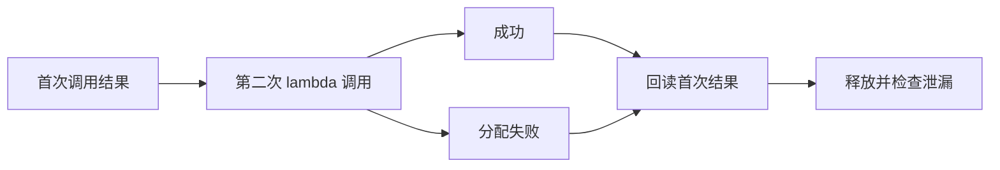

# 表达式预读资源回归

## Intent

验证表达式预读分配失败时的清理，以及后续调用成功或失败后首次结果仍有效，覆盖提示数组、插值提示和随结果保留的词法数据。

## Data

上一阶段正式语义回归已覆盖预读分类。当前 all.zx 返回 lexical 与两级 hints 数组，包含 map/reverse/reduce 等分配路径。现有 allocation_testing 会禁用 resize/remap 并遍历实际分配失败点。

## Edges

独立 arena 正常执行得到基准，再在故障 arena 执行原输入和后续 lambda 输入。后续调用成功或抛出错误时都先对比首次完整结果，随后释放 arena。基准另外断言 root/插值提示数量及词法错误状态，不以同实现自比较证明全部语义。

只修改测试及测试构建；ZX 与 RX 路径复用已有静态生成模块。不添加专用运行库或测试用生产分支，不修改 Test262 审阅计数。

## Answer

新增资源子目标并并入 test-expression-preparation，覆盖空输入、嵌套插值、48 段根提示增长、插值内词法失败、根词法失败五项；两种入口与 Debug/ReleaseSafe 均验证后提交。

## 结果与自我复核

Debug 命令 `zig build test-expression-preparation -j2 --summary all` 以及增加 `-Doptimize=ReleaseSafe` 的 ReleaseSafe 命令，最终均退出 0：25/25 构建步骤、18/18 测试全部实际执行通过。包括两条入口各五项资源测试和四项既有语义测试。

基准数量分别验证空输入一个 EOF 提示、嵌套插值提示长度 4/4/2、增长输入 289 个根提示、非法 @ 插值与合法 lambda 插值的 0/4 提示，以及根非法字节的零提示；词法失败状态与零提示一起校验。后续 lambda 调用成功时要求四个提示且首项 lambda=true，失败时则先核对首次完整结果再传播原错误。

首次两模式运行均因夹具将 0x 当成词法错误而失败，实际 lexer 将其分为 0、x 和 EOF，返回三个提示；既有 numeric/boundaries 用例也将相关错误放在 parse 阶段。改用明确非法的 @ 后才验证到目标词法失败路径。保留四份执行日志的摘要与指纹，不把初次夹具错误报为生产缺陷。

本轮证明生成数据的生命周期、所有实际分配失败点清理及后续调用失败时的结果保留；基准来自同一实现，不能替代前一阶段的语义预期。未修改生产实现，没有发现生产缺陷，也未发送实现会话消息。固定检出全量回归仍在运行，不包含本轮后加的测试目标。
