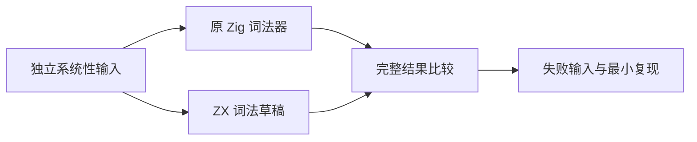
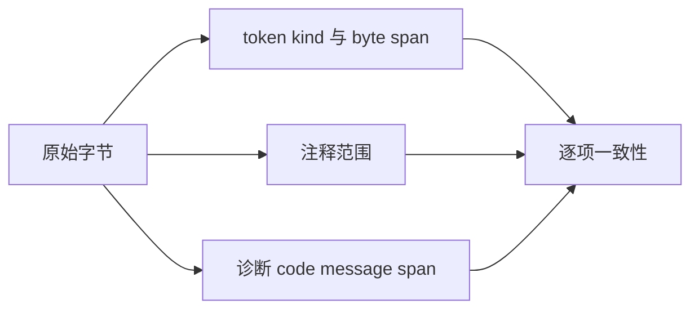

# 词法草稿差分验证计划

## Intent：最终目标

对完整 ZX 词法草稿补充独立系统性输入，验证迁移前后的 token、注释和诊断一致性，发现问题时提供最小输入给实现会话。

## Data：可用证据

生产实现会话在 4f3a8ae3 提交独立草稿及 837 份源码比对。草稿尚未替换正式词法器，已有证据不是全输入等价证明。参考程序直接调用旧 lex.zig，新程序独立编译 lex.zx，不混用扫描实现。

## Edges：边界与限制

测试及资源仅在本目录，避免正式测试包依赖日期草稿。差分通过只证明当前输入集的迁移一致性，不证明两端均符合全部 Test262。已有内存成本问题不靠限制正式能力或修改错误预期掩盖；本轮主要验证行为与字节范围，不重复既有内存报告。

## Answer：交付与成功标准

重新构建两个程序，穷举词法关键字符的短输入、全部单字节和确定的多字节边界，补注释、字符串与模板嵌套边界。每个输入严格比较完整 JSON 结果，错误退出和超时同样算失败，不跳过无效 UTF-8。保存可重现输入、结果摘要及失败差异；真实差异反馈实现会话，修正后复验再提交push。





## 实施与结果

两个程序均从当前源码重新构建，命令退出 0。第一次 9464 个输入全部一致；补齐最长运算符字符的裸输入、标识符邻接和数字邻接组合后，最终 11206 个去重输入全部一致，进程退出 0，约 76 秒完成。超时、异常退出和无效 JSON 均按失败处理，本次没有此类情况。

输入包括长度 0..3 的二十字符穷举、全部单字节、最长运算符关键字符的 1..3 字符组合、UTF-8 边界编码及截断/逐字节扰动、字符串/注释/模板分隔符组合，以及 1/2/3/31/127/254/255/256/257/258 层模板的完整和未闭合版本。以原始字节去重，不按路径标签重复计数。最终按首次归类计为 short 8421、single_byte 236、operator 1742、utf8 396、delimiters 392、depth 19；另一条深度输入已与短输入重合。

资源目录保存 `验证.py`、`输入清单.jsonl`、`验证结果.json`、`源码指纹.json` 和空的 `失败差异.jsonl`。源码指纹记录 lex.zx 的 31 个递归 ZX 依赖；结果记录两个实际执行程序的 SHA-256。二进制只作本地构建产物，不提交。复跑入口：

```sh
python3 docs/2026-10-05/词法草稿差分/验证.py \
  docs/2026-10-05/词法草稿差分/lexer \
  docs/2026-10-05/词法草稿差分/reference
```

两个构建命令沿用《完整词法扫描参考》的真实 CLI 与独立 Zig 宿主，输出改到本验证目录。没有改动扫描草稿或正式生产实现，也没有调用旧词法器作为新扫描路径的一部分。

## 自我复核

这比已有源码重放增加了系统性短输入和错误边界，但不是全域证明，未覆盖所有长标识符、关键词后缀组合或资源规模。两端一致也不能排除共同语义错误；Test262 语义对齐继续独立进行。已知的草稿内存成本问题没有因此解决，仍不能宣称完成正式自举。

本次没有复现缺陷，因此未向实现会话发送无问题消息。11206 是独立草稿差分输入数，不计入 packages/test 目录用例或 Test262 reviewed 统计。
