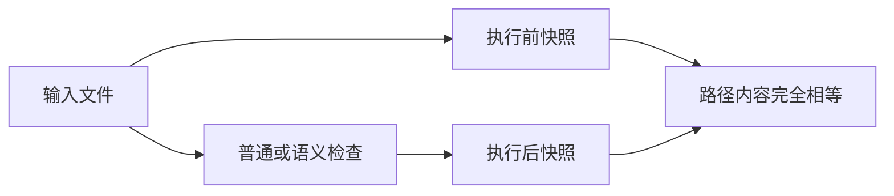

# 语义检查回归计划

## Intent：最终目标

阶段402：建立真实 CLI 单包语义检查回归，覆盖入口可达性、公共导出、RX 专用入口和只读约束。

## Data：可用证据

直接执行当前构建的 zxc；临时项目使用独立源码和清单。参考成熟 configuration formatting 测试组织。生产入口为 cli/lint/semantic.zig。

## Edges：边界与限制

本阶段覆盖 ZX、普通 RX、Gateway、Store 与参数边界；归档消费及工作区后续单独补齐。语义通过不证明运行结果、原生 ABI 或形式化契约。测试不修改生产实现，发现缺陷发给指定实现会话。

## Answer：交付格式与成功标准

新增 test-semantic-lint 构建目标，逐例断言退出码及错误类别。每次命令比较整个临时项目路径和文件内容，验证没有输出或改写。Debug、ReleaseSafe 均通过后提交推送。




## 首次验证与缺陷

15 个 Node 测试：14 通过，显式相对项目清单 1 项异常退出。Debug 栈指向 packages/cli/src/cli/project.zig:43 对 dirname(path) 强制解包。`--project pkg.yaml` 的 basename 路径没有目录，故 panic。已发送实现会话，保留失败断言等待修复。日志见 语义检查回归/首次验证.log。

全包 tsc 当前另有两个既有错误：runtime/http/server.ts:72 Buffer 泛型和 runtime/process_entry/run_test.ts:50 delete 非可选字段。本轮不以专项运行成功声称全包类型检查通过。

## 自我批判

最初参数诊断断言假设帮助包含 Usage 字样，与实际 CLI 契约不符；已改为验证真实帮助中的 lint 命令签名，没有修改生产行为。最初在仓库根运行专项目标失败，实际目标注册于 packages/test，后续命令从该子包执行。当前尚未完成 ReleaseSafe 和提交推送，不能把本阶段记为完成。文件快照可证明本项目未发生文件变更，尚不能单独证明无进程或网络副作用。

## 扩展与修复复验

实现会话提交 de45fb5d，在包加载层将显式清单路径归一到物理包根。本套件保留原始 `--project pkg.yaml`，并加入 `./pkg.yaml`、`nested/../pkg.yaml`、带空格绝对路径，四条通过；没有将失败用例换成绕过崩溃的输入。

正式套件现为 36 项：ZX 项目 13、参数 5、RX 18。RX 覆盖普通模块、含 Store 的 Gateway、空 Gateway、独立 Store、清单入口；Store 类型和格式错误通过四个入口分别检查；缺失服务、重叠路由和服务返回类型错误拒绝。普通 Store lint 通过的初值类型错误必须由语义模式拒绝。

Debug 12/12 构建步骤、36/36 Node 测试通过。专项 TypeScript 检查通过；不更新 JSONL 语义用例计数，不将这组 CLI 测试虚报为新增 Test262 适配。首次失败日志保留作为缺陷证据。

## 运行命令

以下命令在 `packages/test` 执行：

```sh
zig build test-semantic-lint --summary all
zig build test-semantic-lint -Doptimize=ReleaseSafe --summary all
npx tsc --ignoreConfig --noEmit --strict --target ES2024 --module NodeNext --allowImportingTsExtensions --erasableSyntaxOnly --types node tests/semantic_lint/*.ts
```

## 后续覆盖

继续验证 compiled library 消费、归档损坏、归档内显式源码覆盖、workspace 多成员错误汇总及只读检查。网络和进程无副作用需要对应观察，不能仅凭文件快照断言已经覆盖。未运行全仓回归或浏览器。

## 最终验证

ReleaseSafe 同样 12/12 步骤、36/36 测试通过。Debug 与 ReleaseSafe 合计 72 次测试执行，不将它们计为 72 个独立用例。所有新增 TypeScript 文件专项类型检查、Zig 构建文件格式检查及 git diff --check 通过。生产修复属于实现会话的 de45fb5d，本提交仅包含测试、构建入口与验证文档。

首次验证中记录的待完成状态已由本节结果更新；全包 tsc 两项既有错误仍未在本阶段修复，完整 Test262 对齐与全部 zxc 特性覆盖仍在继续。
