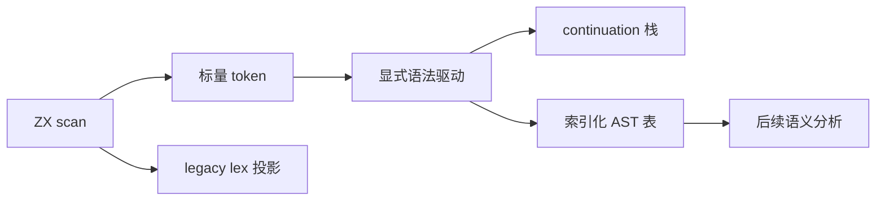

# 语法前端迁移

## Intent

将当前 ZX 完整语法解析迁移为 ZX 实现，保留程序、独立表达式、模板插值入口及首个诊断的位置与消息。以扁平节点表和显式栈替代递归类型与递归调用，为后续语义迁移提供同一份可借用的结构。最终验收是生产编译入口使用 ZX parser；完成词法元数据不等于完成 parser 或整个编译器自举。

## Data

当前生产主词法实现位于 `packages/compiler/src/zx/frontend/lexer`，构建使用 Zig 种子生成 ZX 实现的 Zig 输出。语法仍由 `parser.zig`、`parser_expressions.zig`、`parser_types.zig` 等宿主实现承担。测试会话的 083b5958 记录正式词法入口 11206 组差分零差异、完整前端目录 Debug 与 ReleaseSafe 各 5305 项通过；本实施不重新启动全量测试。

语言禁止模块、类型和调用环，列表只提供 map/filter/reduce；不能机械翻译递归下降。消费式状态不能混入借用 token 的字符串。因此 parser 所需的 kind、word、symbol、span、换行及 `$` 标志必须能够按值传入状态。

## Edges

- 完整语法包括 import、type、enum、函数入口、owned Input、contracts、Store setter、类型参数、表达式、lambda、match、分支及 switch。
- 保留 25 个真正关键字。`in`、`owned`、`Input`、`Output`、`from`、`store`、`requires`、`ensures`、`_` 和六个泛型方法名只是上下文词。不得把 `Store`、`Array` 新增成保留词。
- legacy lex 的 `{kind, span}`、comments、diagnostic 输出保持原状。内部 scan 增加标量元数据，正式宿主适配器消费 scan；独立 lex 入口投影旧接口。
- 类型对象字段允许逗号或换行，值对象只允许逗号；枚举结束不调用普通语句结束检查；空 lambda 参数和尾逗号行为以现有 parser 为准。
- return 跨行仅在后续 const/return/if/switch/store 等现有边界规则下为空返回。不能套用另一门语言的自动分号规则。
- 二元运算保留 Pratt 左结合规则、coalesce/logical 未括号混用限制、条件表达式优先级。match pattern 的 allow_lambda 及括号重新启用规则需要显式 frame 状态。
- 语法嵌套计数与表达式节点 depth 是不同契约；不得用 frame 栈长度直接代替。现有 >=256 的拒绝点与 span 必须分别保留。
- 模板当前仍是整体 token。插值内部流需要单独驱动，不能用外层 token 一步预算承载任意长度插值，也不能把调用旧 parser 的代理称为 ZX 实现。
- 不新增测试用例，不执行全量测试，不使用浏览器。只编译本次实现并重放已有词法材料。

## Answer

交付正式 ZX 词法元数据、显式语法状态、节点表、生产适配器和中文实施证据。分阶段建立生产接口，每个阶段明确实际接入范围；完整自举另以 compiler stage1/2/3 固定点验收。

## 节点与帧设计

独立维护 Names、Types、TypeFields、Declarations、Expressions、ObjectFields、MatchArms、TemplateParts、Statements、Blocks、SwitchCases、Imports、Contracts 与 Program。递归边改成节点索引。直接子节点先由其 owner frame 收集，再追加到对应边表，避免用全局节点起止区间把孙节点误算成直接子节点。

每个 frame 保存有限语法阶段、入口 span、既有语法 depth、待完成子节点及所属块。表达式 frame 另外保存最低优先级、当前左值、逻辑运算族和 lambda 许可。节点完成时计算子表达式 depth 的最大值再加一。

## 驱动终止约束

每个 token 的非消费转换必须完成一个进入时已存在的 continuation，或降低其有限阶段等级；否则消费 token 或产生诊断。需要新增辅助 frame 的调度必须沿无环的固定语法层级下降。先完成这份逐 frame 阶段证明，再实现驱动，禁止凭经验写循环倍数。

当前可用实现是对 frames 生成独立标量 markers，结束借用后再 reduce owned State；额外一次有限调度覆盖空栈根 frame。每个 marker 的 settleFrame 以无环 helper 完成有限阶段转换。marker 耗尽不能伪装成用户语法错误。该实现暂有 O(tokens × depth) 的无效遍历及标量列表分配，后续只能以通用、可证明的 map/reduce 融合消除，不按 parser 文件名特殊优化。

## 第一阶段：标量 token

保留原字符扫描和 keyword 判定，将上下文词补进已有 DFA 的识别集合，但 isKeyword 仍只来自原 25 项表。大小写敏感且完整词匹配，前缀状态不视为完整词。标点种类在原 operatorLength 决定后确定；换行只记录 token 之间的 CR/LF，包括注释中的换行，不把模板 token 内部换行当作其前面的语句边界。首个 token（包括仅有 EOF 的输入）没有前驱，line_break 固定为 false，与现有 Parser.lineBreak 一致。`$` 标志只来自标识符起始字节。

## 自我复核要求

对新增上下文词不能只检查正例：重放所有已有 token，逐字节计算预期词、标点、换行和 `$` 标志。legacy 输出与种子必须全等。生成源码固定点只证明该阶段生成稳定，不能据此声称完整自举完成。后续若驱动证明、模板重入或 AST 适配未完成，应继续标记为待实现。

## 第二阶段：完整类型语法

先迁移 parser_types.zig 的完整职责，提供接受 token 流、起始索引和调用方已有 syntax depth 的内部入口。输出 Type 节点表、字段边表、元组元素边表、根索引、下一 token 索引及首个诊断；名字只保留源 span。

每个容器 frame 只保存标量：种类、泛型名字、当前字段名字及可选标志、直接子边链头和数量。直接子边以反向单链保存，后端按数量从尾向前填充即可恢复源码顺序；节点表的插入顺序不承担父子关系，不包含孙节点误归属问题。

类型驱动的非消费转换是固定 DAG：Name → Suffix → 完成子类型 → 对象分隔 → 字段起始；另有 TupleItem → Primary、字段可选标记 → 冒号检查。每条路径在消费当前 token、完成根类型或诊断处结束。关闭对象、元组或泛型必定消费一个闭合 token，因此单次调用最多移除一个 frame；不需要按栈深度分配 markers，也不引入经验循环预算。此证明仅适用于类型语法，不能套用于二元表达式多次归约。

嵌套检查在每次进入新 Type 的 Primary 前进行，使用调用方 depth + 容器 frame 数；空元组闭合不进入元素 Type，对象字段名称也不进入 Type。后缀包装与字段问号包装不增加 parse depth，与原实现分别对齐。枚举声明产生的 enumeration 节点属于声明解析阶段，不混入 typeNode 文法。

当前实现先提供内部模块并重放既有类型材料；正式 Parser.typeNode 接入要在 AST 适配与诊断对照完成后进行，不以独立模块编译成功代替生产迁移。
