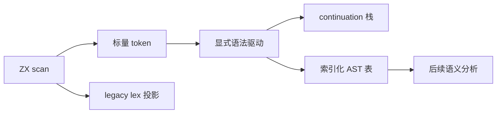
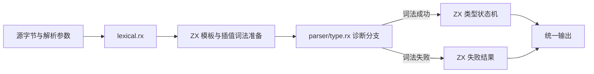
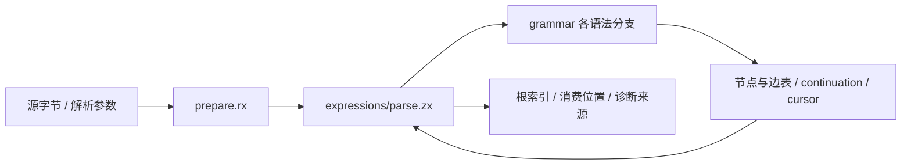
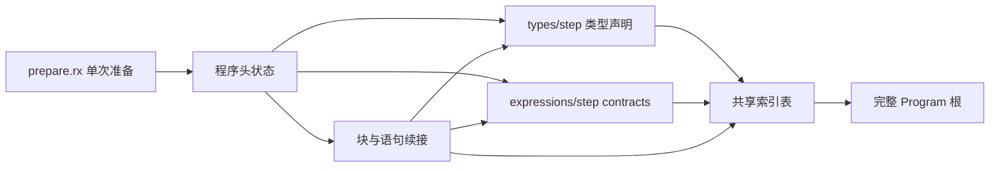

# 语法前端迁移

## Intent

将当前 ZX 完整语法解析迁移为 ZX 实现，保留程序、独立表达式、模板插值入口及首个诊断的位置与消息。以扁平节点表和显式栈替代递归类型与递归调用，为后续语义迁移提供同一份可借用的结构。最终验收是生产编译入口使用 ZX parser；完成词法元数据不等于完成 parser 或整个编译器自举。

## Data

当前生产主词法实现位于 `packages/compiler/src/zx/frontend/lexer`，构建使用 Zig 种子生成 ZX 实现的 Zig 输出。语法仍由 `parser.zig`、`parser_expressions.zig`、`parser_types.zig` 等宿主实现承担。测试会话的 083b5958 记录正式词法入口 11206 组差分零差异、完整前端目录 Debug 与 ReleaseSafe 各 5305 项通过；本实施不重新启动全量测试。

语言禁止模块、类型和调用环，列表只提供 map/filter/reduce；不能机械翻译递归下降。消费式状态不能混入借用 token 的字符串。因此 parser 所需的 kind、word、symbol、span、换行及 `$` 标志必须能够按值传入状态。

## Edges

- 完整语法包括 import、type、enum、函数入口、owned Input、contracts、Store setter、类型参数、表达式、lambda、match、分支及 switch。
- 保留 25 个真正关键字。`in`、`owned`、`Input`、`Output`、`from`、`store`、`requires`、`ensures`、`_` 和六个泛型方法名只是上下文词。不得把 `Store`、`Array` 新增成保留词。
- legacy lex 的 `{kind, span}`、comments、diagnostic 输出保持原状。内部 scan 增加标量元数据，正式宿主适配器消费 scan；独立 lex 入口投影旧接口。
- 类型对象字段允许逗号或换行，值对象只允许逗号；枚举结束不调用普通语句结束检查；空 lambda 参数和尾逗号行为以现有 parser 为准。
- return 跨行仅在后续 const/return/if/switch/store 等现有边界规则下为空返回。不能套用另一门语言的自动分号规则。
- 二元运算保留 Pratt 左结合规则、coalesce/logical 未括号混用限制、条件表达式优先级。match pattern 的 allow_lambda 及括号重新启用规则需要显式 frame 状态。
- 语法嵌套计数与表达式节点 depth 是不同契约；不得用 frame 栈长度直接代替。现有 >=256 的拒绝点与 span 必须分别保留。
- 模板当前仍是整体 token。插值内部流需要单独驱动，不能用外层 token 一步预算承载任意长度插值，也不能把调用旧 parser 的代理称为 ZX 实现。
- 不新增测试用例，不执行全量测试，不使用浏览器。只编译本次实现并重放已有词法材料。

## Answer

交付正式 ZX 词法元数据、显式语法状态、节点表、生产适配器和中文实施证据。分阶段建立生产接口，每个阶段明确实际接入范围；完整自举另以 compiler stage1/2/3 固定点验收。

## 节点与帧设计

独立维护 Names、Types、TypeFields、Declarations、Expressions、ObjectFields、MatchArms、TemplateParts、Statements、Blocks、SwitchCases、Imports、Contracts 与 Program。递归边改成节点索引。直接子节点先由其 owner frame 收集，再追加到对应边表，避免用全局节点起止区间把孙节点误算成直接子节点。

每个 frame 保存有限语法阶段、入口 span、既有语法 depth、待完成子节点及所属块。表达式 frame 另外保存最低优先级、当前左值、逻辑运算族和 lambda 许可。节点完成时计算子表达式 depth 的最大值再加一。

## 驱动终止约束

每个 token 的非消费转换必须完成一个进入时已存在的 continuation，或降低其有限阶段等级；否则消费 token 或产生诊断。需要新增辅助 frame 的调度必须沿无环的固定语法层级下降。先完成这份逐 frame 阶段证明，再实现驱动，禁止凭经验写循环倍数。

当前可用实现是对 frames 生成独立标量 markers，结束借用后再 reduce owned State；额外一次有限调度覆盖空栈根 frame。每个 marker 的 settleFrame 以无环 helper 完成有限阶段转换。marker 耗尽不能伪装成用户语法错误。该实现暂有 O(tokens × depth) 的无效遍历及标量列表分配，后续只能以通用、可证明的 map/reduce 融合消除，不按 parser 文件名特殊优化。

### 表达式驱动的具体约束

完整表达式驱动改为维护当前 stream/index，并拥有只读的 Prepared 数据与标量 continuation 栈。模板仅在实际到达 Expression part 时发布其词法诊断；之后才按父 parser.depth + 1 进入插值表达式，返回时检查该流 EOF 并恢复父 cursor。不得以 base depth 为零提前解析全部插值。

单步合并不消费的小阶段：BeginBinary 进入 primary 并消费其首 token；Postfix 不匹配时直接弹出并恢复一层 continuation；对象 shorthand 的冒号缺省分支直接处理分隔符；类型子状态 Done 后在同一步检查并消费泛型右尖括号。其余步骤必须消费一个 token、推进一个模板 part，或弹出一个 frame，不能只在 phase 间空转。

每个 token 消费步骤最多新增两个 frame（Binary 加 primary 所需 continuation）。模板 parts 先沿 previous 收集到栈，再按源码顺序处理；每个 part 的收集最多压入一个 frame，每个 Expression part 的处理最多再压入一个插值恢复 frame。没有消费的恢复步骤只弹栈、不压栈。因此将所有流的 token 数记为 T、parts 数记为 P，消费及恢复步骤总数不超过 3T + 4P；未访问 token、未访问 part 和 EOF 只增加可用预算。出错步骤由当前未消费 token 或 part 支付一次机会，结束后保持终止状态。

实现前后必须逐项核对这一约束。若新增转换需要零消费压栈，先修正转换或给出新的静态势能证明，不任意提高倍数。预算耗尽而未结束属于内部不变量失败，不能输出部分 AST 或伪装成用户语法错误。预算由已有列表投影成独立标量调度列表，避免借用 token 容器同时把其 owner 放进归约状态；不拼接全部调度列表，各流分别提供三次 step，parts 提供四次 step。该设计仍有标量投影及容器分配成本，需要后续通用 lowering 优化，不声称零开销已达成。

## 第一阶段：标量 token

保留原字符扫描和 keyword 判定，将上下文词补进已有 DFA 的识别集合，但 isKeyword 仍只来自原 25 项表。大小写敏感且完整词匹配，前缀状态不视为完整词。标点种类在原 operatorLength 决定后确定；换行只记录 token 之间的 CR/LF，包括注释中的换行，不把模板 token 内部换行当作其前面的语句边界。首个 token（包括仅有 EOF 的输入）没有前驱，line_break 固定为 false，与现有 Parser.lineBreak 一致。`$` 标志只来自标识符起始字节。

## 自我复核要求

对新增上下文词不能只检查正例：重放所有已有 token，逐字节计算预期词、标点、换行和 `$` 标志。legacy 输出与种子必须全等。生成源码固定点只证明该阶段生成稳定，不能据此声称完整自举完成。后续若驱动证明、模板重入或 AST 适配未完成，应继续标记为待实现。

## 第二阶段：完整类型语法

先迁移 parser_types.zig 的完整职责，提供接受 token 流、起始索引和调用方已有 syntax depth 的内部入口。输出 Type 节点表、字段边表、元组元素边表、根索引、下一 token 索引及首个诊断；名字只保留源 span。

每个容器 frame 只保存标量：种类、泛型名字、当前字段名字及可选标志、直接子边链头和数量。直接子边以反向单链保存，后端按数量从尾向前填充即可恢复源码顺序；节点表的插入顺序不承担父子关系，不包含孙节点误归属问题。

类型驱动的非消费转换是固定 DAG：Name → Suffix → 完成子类型 → 对象分隔 → 字段起始；另有 TupleItem → Primary、字段可选标记 → 冒号检查。每条路径在消费当前 token、完成根类型或诊断处结束。关闭对象、元组或泛型必定消费一个闭合 token，因此单次调用最多移除一个 frame；不需要按栈深度分配 markers，也不引入经验循环预算。此证明仅适用于类型语法，不能套用于二元表达式多次归约。

嵌套检查在每次进入新 Type 的 Primary 前进行，使用调用方 depth + 容器 frame 数；空元组闭合不进入元素 Type，对象字段名称也不进入 Type。后缀包装与字段问号包装不增加 parse depth，与原实现分别对齐。枚举声明产生的 enumeration 节点属于声明解析阶段，不混入 typeNode 文法。

当前实现先提供内部模块并重放既有类型材料；正式 Parser.typeNode 接入要在 AST 适配与诊断对照完成后进行，不以独立模块编译成功代替生产迁移。

## RX + ZX 功能模块架构

用户更新目标后，自举以 RX + ZX 的功能模块架构为前提。RX 负责可执行的阶段编排、输入输出连线与诊断分支；ZX 负责阶段内部的词法状态、语法归约、节点表和计算。不会仅用文档图示代替实际 RX，也不会把每个短 helper 机械包装为 RX。

当前增加 lexical.rx 功能模块和 parser/type.rx 编排入口：源码进入词法准备模块，词法成功时把 token 交给类型状态机，失败时直接构造失败结果。两条分支在实际 RX 中可见，调用图静态且无环。模板的两次字节推进属于同一词法准备职责，仍在其 ZX 实现内完成。

表达式准备增加 parser/prepare.rx：先调用 lexical.rx，再对根流和全部插值流生成等长的语法前瞻。ZX expressions/prepare 负责 lambda 入口、泛型方法资格以及二元运算符、优先级和运算族。前瞻只保存标量，不保存或复制标识符字符串。

lambda 判定通过反向有限状态推进完成。维护右侧是否为箭头、是否为合法参数序列起点、是否为参数后的合法结束或分隔；右括号后紧接箭头为终态，标识符与逗号逐步向左传播。这保留空参数和尾逗号，不在每个左括号重新扫描其余 tokens。实际语法驱动仍负责 allow_lambda、括号重新启用、syntax depth 和 AST depth，前瞻不提前诊断。

准备阶段的成功标准是与当前 parser_expressions.zig 的 isLambda 循环、syntax.Operator 表及六个泛型方法名在既有材料的每个 token 位置一致。准备阶段不替代表达式 parser；独立表达式节点和 continuation 驱动已按下节建立，生产 Parser 接入仍待完成。

后续完整 parser、语义分析和生成阶段按同一模块边界接入 RX 编译流程。生产自举构建入口还需迁到这一流程；当前不以存在 RX 文件替代构建接入验收。

## 第三阶段：表达式 RX 入口与 ZX 语法驱动

`parser/expression.rx` 先调用 prepare.rx，再将准备结果及 start、depth、minimum、allow_lambda 交给 expressions/parse。ZX 状态拥有准备结果、表达式节点与子边表、泛型类型节点、continuation 栈和控制字段。名字与模板文本保存 span，诊断通过所属词法流或类型状态引用，避免从借用输入复制 owned 字符串。

图中回边表示状态数据在有限驱动中推进，不是模块调用环。grammar 的 helper 调用图保持无环；模板插值通过显式 stream/index 切换，不递归调用 expression.rx。

### 单步进展复核

| 分支                                  | 成功推进方式                                                                      |
| ------------------------------------- | --------------------------------------------------------------------------------- |
| BeginBinary、Primary                  | 消费首 token；最多加入 Binary 与 primary continuation 两帧                        |
| FieldName、Lambda 各阶段、GenericCall | 消费成员名、参数、分隔或调用左括号                                                |
| Arguments、MatchStart、MatchCondition | 消费闭合或分隔；需要子表达式时在同一步进入 BeginBinary 并消费首 token             |
| ObjectName、ObjectColon               | 消费字段、冒号或闭合；shorthand 同一步处理对象分隔                                |
| GenericType                           | 复用类型 step 的消费归约；完成类型时同一步消费右尖括号                            |
| Postfix、Returning                    | 消费后缀/二元/条件分隔，或移除已有 continuation；不匹配 postfix 时直接恢复一帧    |
| TemplateGather                        | 沿 previous 推进一个真实 part，加入一个 part frame                                |
| TemplatePart                          | 处理并移除一个 part frame；表达式 part 可替换为插值恢复 frame，最终移除模板 frame |
| 插值返回                              | 检查 EOF、移除恢复 frame，恢复父流 cursor                                         |

消费步骤重新压回已取出的 owner frame，不算新增 frame。模板表达式 part 的恢复 frame 单独计入 part 工作量。由此保留前文 3T + 4P 上界；词法失败直接结束，其他错误由当前 token 或 part 的一次处理机会结束。差分适配器检查最终 phase 为 Done，否则报内部 ExpressionDriverBudgetExhausted，不比较或接受部分 AST。生产消费者接入时也必须保留内部完成检查。

### 当前证据与限制

核对资源位于表达式语法目录：parser_reference.zig 用原 Zig parser 产生基准；expand_ast.py 将新索引表还原为同构 AST；verify_expressions.py 比较节点内容、span、depth、下一 token 索引与首个诊断。只重放既有源码和既有 JSONL 中的 source/source_hex，没有新增测试用例或运行全量测试。

- 43 份正式表达式 ZX 文件从每个 token 位置进入解析，共 15,176 次，零差异，结果见源码AST核对.json。
- 既有表达式与词法材料共 1,153 份输入、33,663 次解析，全部 16 种表达式节点均出现，零差异。
- 起始 depth=254：59 份既有材料、2,705 次解析，包含语法深度边界诊断，零差异。
- 起始 depth=256：5 份既有材料、137 次解析，均按原入口拒绝，零差异。
- minimum=6：30 份既有材料、1,644 次解析，零差异。
- RX 可达模块检查、生成 Zig 和 ReleaseSafe 核对程序构建通过。删除未使用导入后生成 Zig 逐字节不变。

泛型方法候选已由前瞻核对覆盖，但现有这批表达式材料未证明实际 `.queryOne<T>(...)` 等调用的类型子驱动。候选关键词出现不能作为泛型调用覆盖证据。其他缺口包括完整 Program 解析、旧 AST 生产适配、整体语义与生成迁移以及 compiler stage1/2/3 固定点。

### 后续驱动替换

依据用户新增的[顺序遍历与不可变状态迭代设计](../../2026-10-06/顺序遍历与状态迭代设计.md)，后续以正式 loop 操作表达“phase 尚未结束就 step”，移除额外调度列表。必须先实现该语言操作及所有权规则，再迁移消费者；不能在生成器按 parser 路径硬编码 while，也不能把现有标量列表成本称为零成本。当前阶段保留可核对的有限驱动，作为迁移基准。

## 第四阶段：程序头与完整语句

先建立程序头状态：依次读取 import、export type/enum、匿名 default 函数签名与 contracts，到达函数体左括号时交给块解析；纯类型文件在 EOF 完成。程序头只报告 BodyReady，不把尚未解析的函数体视为完整 Program。导入路径保留原始字符串 span，解码在消费该字段时完成，不能把路径字符串拷贝进归约状态。

程序状态拥有同一 ExprState，复用其中的 Prepared、表达式表和类型表。类型声明驱动已有 types/step，contracts 驱动已有 expressions/step；结束后恢复程序 cursor。表达式重启只清空续接与控制字段，保留已有节点表，禁止为每条语句重新词法分析或重定位已生成的整张表。

之后加入块与语句续接：const/destructure、return、if/else、switch/case、Store setter；保留原语法的深度、换行边界和诊断时机。嵌套块与 else-if 使用显式帧，直接子语句/分支使用反链边表。程序头、语句与表达式的调用依赖保持无环，最终由同一 Program 驱动调度子状态。

### 程序头实施切口：导入序列

先实现 `parser/imports/parse.zx`，接受既有标量 token 流与起始位置，返回导入表、名称边表、下一 token 位置和首个诊断。路径保存字符串 token 的 span，后续 AST 适配时复用字符串解码，不在状态中复制路径字符串。导入之间的下一 token 仍属于调用方。

完整覆盖默认名称、命名名称、空命名列表、尾逗号、type-only 约束、from、字符串路径及语句结束检查。检查顺序与旧 parser 一致：先解析路径并检查语句结束，再报告空绑定或默认 type 导入错误。真实 token 驱动 reduce，每个 token 最多结束前一导入并开始下一导入，不创建调度列表或经验步数预算。

本切口成功标准是生成可构建、重放既有导入源码，并核对名称/路径 span、种类、下一位置及诊断；它尚不包含 Program、statement、loop 更新块或生产入口替换。上一阶段表达式驱动已改为 loop，旧 3T + 4P 调度列表仅作历史证明记录，当前实现见 2026-10-06 状态迭代设计。

### 子表达式共享表入口

将表达式状态初始化拆成空表创建与请求启动：`state/initial.zx` 只创建一次空表，`state/start.zx` 接收既有 Prepared、ExprTree 和 TypeState，重置根流 cursor、表达式 continuation 与控制字段。后续 Program/statement 在前一请求结束并处理诊断后调用 start，不重新词法准备，也不合并或重定位节点表。

start 用于根源码上的新子解析请求，不用于暂停中的嵌套表达式；后者保留现有 child/continuation。类型表由调用方传递，泛型类型解析沿用现有按请求重置控制、保留 tree 的机制。验收既包括独立 expression.rx 行为不变，也包括同一 Prepared 上多次请求后旧节点仍可按原索引还原。
