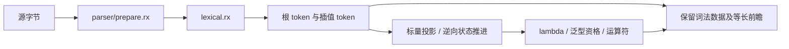

# 语法词法元数据执行记录

## Intent

完成完整语法迁移的 token 输入层：内部结果不携带字符串借用，提供语法所需的词类别、上下文词、标点、换行与 `$` 标志，保持已有词法输出兼容。

## Data

正式 scanner 由 lex.zx 分离为 scan.zx；legacy lex.zx 仅做输出投影。宿主生成入口改为 scan.zx，生产 Zig 适配器直接 switch 枚举，沿用既有 Token/Span 和诊断 API。原 25 项关键字表未变，上下文词仅扩大识别 DFA，不改变 identifier/keyword 分类。

所有新增元数据来自单次扫描已有状态：operatorLength 后确定标点、标识符扫描时更新词状态、空白和注释路径记录 CR/LF、开始标识符时记录 `$`。内部模板扫描不更新外部 token 的换行标志。首 token 的 line_break 为 false，与现有 Parser.lineBreak 一致。

## Edges

完整语法状态机、flat AST、模板插值解析与整个 compiler stage1/2/3 仍未实现。本次固定点只针对 scanner。扩展内部 token 增加固定存储，未复制原文；旧 parser 适配仍复制结果数组，不宣称全管线零拷贝。

遵循当前会话要求，不新增测试用例、不执行全量测试。核对脚本重放此前已经记录的 837 份材料和当前 36 份正式词法 ZX 源码。另一个测试会话此前完成的 5305 项前端目录结果是上个版本证据，不冒充本次修改后的完整回归。

## Answer

- 最终源码 `zig build dist -Doptimize=ReleaseSafe --summary all` 成功，17/17 步骤通过。
- scan.zx 与 legacy lex.zx 均通过源码分析、生成与独立应用编译；正式 36 份 ZX 源码全部通过 fmt --check。
- 元数据重放 873 份材料、34,643 个 token，0 差异。旧 JSON 输出、kind 分类、word、symbol、line_break、dollar 分别核对。原始字节和原有 seed 构成预期来源，未生成新的输入样例。
- 正式 Zig 适配器链接本次种子生成产物后，837 份既有材料与旧词法种子零差异，记录于生产适配核对.json。
- `bootstrap-lexer` 独立构建成功，5/5 步骤通过。种子生成与最终 CLI 再生成逐字节相同，474735 字节，SHA-256 为 `f118af27be3579d3a38542499f385e342f68bd6dcea1f88f9f937bee87e51e07`；生成源码只导入 std。
- keyword 维护脚本重复执行，三份生成文件逐字节不变；源码与生成器摘要记录于阶段核对.json。
- 既有 checkout.rx 通过正式 CLI 的 check-rx --entry。

## 自我复核

实施中先保留 kind 字符串并新增 tag，复核后移除内部重复表示，改为纯枚举 kind，仅在 legacy 边界恢复字符串。首 token 的换行语义也根据原 parser 的 index==0 分支对齐，而不是只根据源头空白推断。

现有消费规则要求先读取枚举和布尔元数据，再移动列表字段；状态重建保持显式字段，避免对象 spread 在覆盖字段求值前消费其旧 owner。没有为某份 parser 源码增加编译器特判。

节点表、完整 frame 阶段图与非消费归约终止证明见实施计划，仍需后续完成；当前没有把 token 层的完成表述为语法解析器已经迁移。

## 表达式前瞻准备

Intent：为非递归表达式状态机提供 lambda 入口判定、泛型方法资格和二元运算符信息，避免逐位置向后重复扫描参数序列。

Data：新增 expressions/prepare 的五个 ZX 模块和 parser/prepare.rx。RX 依次调用 lexical.rx、expressions/prepare/all；所有根 token 与插值 token 都有等长 Hint 数组，词法失败的空 token 流对应空 Hint 数组。lambda 使用反向有限状态扫描，泛型名称依赖已有上下文词枚举，优先级与运算族对应 syntax.Operator 的十四条规则。输入 token 先投影为标量记录，reverse 只修改新列表；词法输入与源字节不被修改。

Edges：Hint 只代表上下文无关的语法候选，不发布诊断，不代替 allow_lambda、字段目标检查、syntax depth 或 AST depth。完整表达式节点表、continuation 状态机和生产入口接入仍未完成。原始函数调用仍保持静态 DAG，不调用宿主 parser。

Answer：parser/prepare.rx 完整入口检查、生成及 ReleaseSafe 核对程序构建成功；六份正式源码格式检查通过，格式化前后的 Zig 产物逐字节一致。6132 份既有材料、301386 个 token 位置与旧 isLambda 循环、Operator 表和泛型方法名字比较全部一致，覆盖 440 个 lambda 候选、十四个运算符及非运算符。根流和全部已准备插值流均比较。没有新增测试用例或运行全量测试。

自我复核：最初重放发现泛型候选数量为零，因此纳入已有 docs/2026-10-04/保留字绑定边界草稿/8.zx，得到两个 delete 候选。其余五种泛型名称仅完成静态规则核对，不能称其已有运行覆盖。模板边界数量由此前独立差分覆盖，本轮插值前瞻参考按已准备的 span 重新调用旧 lexer，不把它作为新的模板边界证明。明细与核对工具保存在表达式语法目录。

