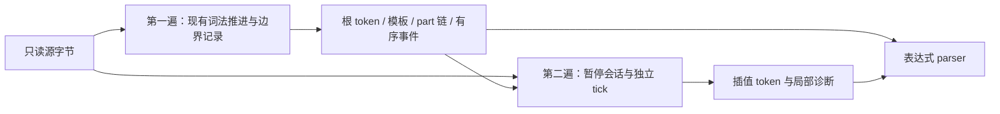

# 模板词法准备迁移

## Intent

为完整 ZX 表达式 parser 准备模板文本 parts 和各插值的独立 token 流，保留原 template.parse 的诊断发布顺序。实现属于编译器前端，生成普通 Zig 并静态链接，不向用户产物添加解释器、专用运行库或动态加载层。

## Data

现有 ZX lexer 已识别完整模板与插值边界，但只返回外层 template token。旧 parser 到达一个模板后，按 parts 顺序先对整个插值 lex，再解析其中表达式；内部嵌套模板的普通插值词法错误继续延迟至访问相应模板时发布。

LexerState、模板控制 frame、单字节 advance 和带两字节延迟窗口的 tick 均已存在。普通列表支持 owned pop，返回剩余列表和 optional 末项；可以转移包含 token 列表的完整暂停会话，不通过借用栈索引取走聚合字段。

## Edges

- 顶层词法失败仍先于任何语法错误；插值词法失败保存在各自记录，不提升为第二遍扫描的全局语法错误。
- 同一个插值必须先完成整个词法扫描，其末尾 lexical error 仍先于前部 syntax error。
- 不按源位置最小值在全部插值诊断中选错误；由最终 parser 的实际进入顺序决定发布。
- 所有 text part 和 token 名称保留原源码 span，包括首尾和相邻插值间的空 text part，不复制原始字节。
- 输入只在两个 source.reduce 中借用，不放入 owned accumulator；不得每个插值从 source 开头重新遍历。
- 第一遍输出顺序边界事件，第二遍只推进 event cursor，不按字节搜索整个事件集合。
- 使用每个会话自己的 tick 窗口，不把外层 `}` 或模板文本当作插值内 lookahead。结束时先设绝对 source_length，再局部 flush/finish。
- 继续遵守最新 AGENTS.md 的 zero runtime、显式内存 Store 和统一模块 lib 边界；本项不修改 Store 或库协议。

## Answer

交付边界表、part 链、各插值独立词法结果和正式 ZX 准备入口。用既有源材料对照旧模板切分与插值 lex；不新增测试用例，不执行全量测试。表达式状态机随后使用这些数据，仍需完成完整 parser 生产接入。

## 数据与事件

Template 保存 span、part head 和直接 part 数量；Part 分 Text 与 Expression，保存原 span、插值索引及 previous 链。模板与插值按关闭顺序编号，因此不需要回写已经插入的开始记录。

边界事件分 TemplateOpen、TemplateClose、InterpolationOpen、InterpolationClose。TemplateClose 携带完成后的模板索引，InterpolationClose 携带完成后的插值索引。插值开始事件的位置为 `${` 之后的首字节；空插值的开始与关闭事件同位，插值首字节为反引号时开始与模板打开同位。由字符文法可知同一字节最多两个事件，第二遍依次处理这两个可能事件后才决定是否把当前字节交给会话。

第二遍遇到嵌套模板时，先完成父词法器在模板之前的延迟窗口，再暂停父会话。直到模板关闭时才向恢复的父会话注入一个完整 template token；模板内部字符只交给其插值会话，不再次交给父词法器。注入后将父窗口清空、offset 置为模板结束位置，随后继续正常 tick。

各会话独立保存 token 列表及对应 template 索引列表。不得用交错全局 token 的连续区间代表某个插值。无模板的 source 保持同一根词法结果；只读边界观察不能改变原 lexer 的诊断。

## 自我复核要求

核对未知转义、空插值、相邻插值、嵌套模板及注释/字符串中的伪边界；保持全部空文本 part。重点检查 prefix flush、绝对 offset 和 EOF 的换行标志。两遍字节推进线性不自动证明列表 lowering 也线性，需查看暂停会话是否通过 pop 输出移动，避免深复制已有 token 列表。
