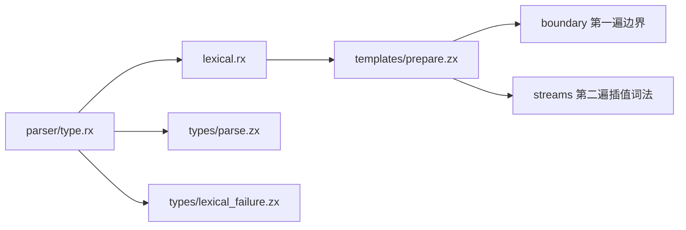
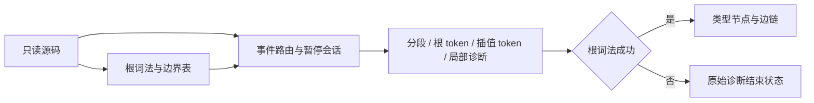

# 模板词法与 RX 功能入口实施记录

## Intent

在完整表达式解析之前建立模板边界、文本分段和独立插值 token 流，并用 RX 展示前端功能阶段与诊断分支。高层编排用 RX，词法推进和类型算法用 ZX，保持统一模块边界。

## Data

正式新增 `frontend/lexical.rx` 和 `frontend/parser/type.rx`。前者调用模板准备阶段；后者调用前者，在根词法成功后执行类型解析，失败则构造带原始诊断的结束状态。所有调用静态解析、生成普通 Zig；没有增加原生 parser 代理或专用运行库。

模板准备分两个顺序 source.reduce。第一遍复用原 lexer.advance，记录模板及插值的开闭边界；第二遍根据有序事件，将源字节交给当前插值的独立词法状态。嵌套模板开始时结束父会话前缀并暂停，关闭后恢复父会话并注入一个完整 template token。每个会话有独立延迟窗口，插值外的字符不会变成其 lookahead。

Template、Part、Interpolation 均保留绝对字节 span，不复制模板文本。parts 使用反向索引链，空文本分段保留。各 token 流的 token_templates 与 tokens 等长，非模板为 0，模板索引从 1 开始；模板和插值按关闭顺序编号。





## Edges

完整生产 parser 仍为 Zig。本次 RX 类型入口是前端功能阶段的可执行入口，尚未替代完整程序解析、语义分析及代码生成；不能称作 compiler stage1/2/3 自举完成。

原始源码只借用两遍，但生成容器的成本另计。检查生成 Zig 后确认：第二遍 reduce 仅对最终插值表贯穿了 ArrayList buffer；活动词法 token 列表、模板索引列表与暂停父栈还存在不可变列表更新的分配和复制。不能把两遍源码扫描等同于整个实现线性，也不能称全部满足零成本。后续必须解决跨会话所有权转移与结果冻结后再做规模核对；不得靠重用仍被已完成插值引用的 buffer 破坏正确性。

不新增测试用例，不运行全量测试。配套 reference.zig 仅用于核对，使用旧 bootstrap lexer 和模板边界函数；verify_templates.py 重放仓库既有源码及已有 lexical/template 数据。它不是生产依赖。

## Answer

- 模板核对：1963 份既有材料，297 个模板，311 个插值；根词法、模板 span、parts 链及引用、插值词法、诊断、注释和词法元数据全部一致。记录见已有材料核对.json。
- RX 类型入口核对：878 份源码，9336 个解析位置；类型树、下一 token 索引和诊断一致，覆盖六类类型节点。复用既有 verify_types.py 和 reference.zig，宿主的 generated 模块换成 RX 产物。记录见 RX类型入口核对.json。
- 新增及改动的 36 份 ZX/RX 文件通过 fmt --check，RX 完整入口通过 check-rx --entry。
- `zig build dist -Doptimize=ReleaseSafe` 成功。最初显式指定的本地 Zig 压缩包被校验和拒绝，没有绕过校验，随后默认构建来源成功。
- 重建前后分别生成 prepare.zx 与 parser/type.rx，两组 Zig 源码逐字节相同。这证明当前模块生成确定性，不代表完整自举固定点。

## 核对重现

模板参考程序需要同一 Zig module 同时公开 bootstrap lexer 与 template 边界函数，避免 Zig 将同一文件归属两个 module。临时模块目录用符号链接指向这两个原始文件，root.zig 只导出 lex 和 template；该桥接仅为核对工具。

```sh
zig build-exe -O ReleaseSafe --dep zx --dep lexer --dep generated \
  -Mroot=docs/2026-10-05/语法前端迁移/模板词法/reference.zig \
  -Mzx=packages/core/src/root.zig --dep zx \
  -Mlexer=/tmp/zxc-template-oracle-module/root.zig \
  -Mgenerated=/tmp/zxc_template_prepare.zig \
  -femit-bin=/tmp/zxc_template_reference

python3 docs/2026-10-05/语法前端迁移/模板词法/verify_templates.py \
  /tmp/zxc_template_reference \
  docs/2026-10-05/语法前端迁移/模板词法/已有材料核对.json \
  /tmp/zxc_parser_scan
```

## 自我复核

语义差分已通过，但生成成本检查揭示了未完成项。保留这一界限，不能用材料数量或 RX 外层存在来宣称自举与性能目标达成。模板诊断仍保存在各自插值内，最终表达式 parser 必须在实际进入对应插值时发布，不能提前选择全局最早位置的错误。

## RX 构建入口反馈修复

类型 parser 回归构建增加 RX 路径后，从 packages/test 启动的生成步骤把 compiler 下入口判为项目外。修复为仅对 RX 生成步骤设置 compiler 包工作目录，保留项目边界检查。`zig build test-type-parser -j2 --summary all` 定向回归 29/29 步骤成功，本次执行 8/8 测试通过，其余复用缓存；没有运行全量测试。
