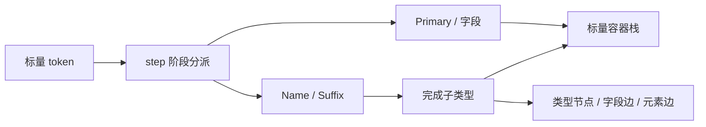
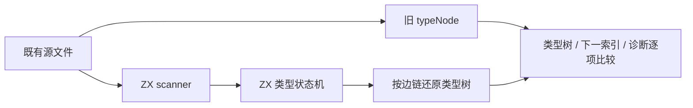

# 类型语法迁移执行记录

## Intent

以 ZX 完整实现现有 parser_types.zig 的职责，为程序和表达式语法迁移提供可逐 token 驱动的无递归类型解析器。先核对独立模块，再接入完整前端，避免以宿主 parser 代理伪装自举。

## Data

正式实现位于 `packages/compiler/src/zx/frontend/parser/types/`，20 个 ZX 模块。ZX 每个函数模块只有一个默认函数，因此节点操作、状态转换与驱动按既有语言模块结构拆分；没有修改语言以容纳递归。

完整语法覆盖 named、object、optional、list、tuple 和单参数 application。对象字段支持问号包装、逗号或换行分隔，元组支持尾逗号，类型后缀按源顺序包装。类型名字及字段名保存源字节 span。

容器 frame 和节点均无递归成员。节点只保存子节点索引；对象与元组的直接子边使用独立反向链表，head 为从 1 开始的边索引，0 表示空链，count 记录直接子项数量。父节点只在孩子完成后追加，因此节点的 child 引用指向此前节点。嵌套容器的边不会被错误纳入父容器的连续范围。

## Edges

生产 Parser.typeNode 仍使用 Zig，完整语法迁移尚未完成。独立 parse.zx 为验证和模块消费提供从整个 token 列表的指定起点解析一个类型的入口；reduce 在根类型完成后仍经过剩余 token，但立即返回已有状态。

完整 parser 必须逐 token 调用 step.zx，并把当前类型表移入 State 后继续追加；不要在每个注解位置重复调用独立 parse.zx，也不要反复扫描 source。初始控制索引必须对应当前 token 的全局索引，不能在跳过前缀后又从 0 计数。这样能够保持全局节点索引，无需重排或重新编号前面的类型表。

不新增测试用例，不运行全量测试。核对使用仓库已经存在的 `.zx` 源文件，选取类型声明 RHS 和冒号后的 token 位置；后者也包含表达式值，因此同时核对非法类型前缀的首个诊断。旧 grade.zx 中的 Array<number> 提供既有 application 样本，没有改写其源内容。

当前回放实际覆盖全部六种类型节点，以及 expected ]、expected an identifier、expected a comma or newline between type fields 三类诊断。它没有穷举语法、嵌套深度边界和每一种诊断；不能将本记录称为完整前端回归。

## Answer

- `zxc .../types/parse.zx --out /tmp/zxc_type_parser.zig --no-cache` 分析与生成成功。
- `zxc build .../types/parse.zx --out /tmp/zxc_type_parser --no-cache` 独立应用构建成功。
- 配套 source.zx 直接组合正式 scanner 和类型解析器，生成模块与旧 typeNode 在同一个 ReleaseSafe 宿主核对程序内运行。
- 844 份既有源码、8677 个解析位置，类型树、下一 token 索引和诊断全部一致；明细及原始源散列见已有源码核对.json。
- 相同正式编译器重复生成 parse.zx 的输出逐字节一致，220453 字节，SHA-256 `ab92fb12d6e051315b2997551fd30615dcdff4f0493e6228b670dcdbb18df0c1`。这是生成确定性证据，不是完整 compiler stage1/2/3。

## 自我复核

原 parser 的 Type parse 深度只在进入新类型时增加；后缀和对象字段问号包装不能增加这一深度。实现使用调用方 depth 加活动容器层数检查 >=256，空元组关闭不进入元素类型。表达式 depth 与枚举声明仍属于其他模块，不借此合并规则。

非消费转换形成固定 DAG：Name → Suffix → 完成子类型 → 对象分隔 → 字段起始；TupleItem → Primary，以及字段问号检查 → 冒号检查。关闭容器总要消费当前闭合 token，因此一次驱动不会弹出任意多层栈，无需按深度生成 markers。这个结论不能用于尚待迁移的表达式归约。

差分最初只覆盖五种节点；检查后发现 package 源码没有 Array<T> 类型实例，因此纳入仓库既有 grade.zx，确认 application 分支，而没有以数量大掩盖缺失节点覆盖。未将尚未接入生产的模块标为完成自举。

只读审查对照旧 parser 与 DSL 组合器，未发现明确语法或停止位置差异。审查强调三个调用契约：完整 token 数组和有效起点、进入 typeNode 之前的 depth、节点索引与两类边链不可混用。后续通过移动既有全局 Tree 来复用节点表，避免合并局部树及其重定位成本；若采用局部树合并，则必须分别重定位节点、字段边和元素边。源码及执行产物摘要保存在源码与产物核对.json。
