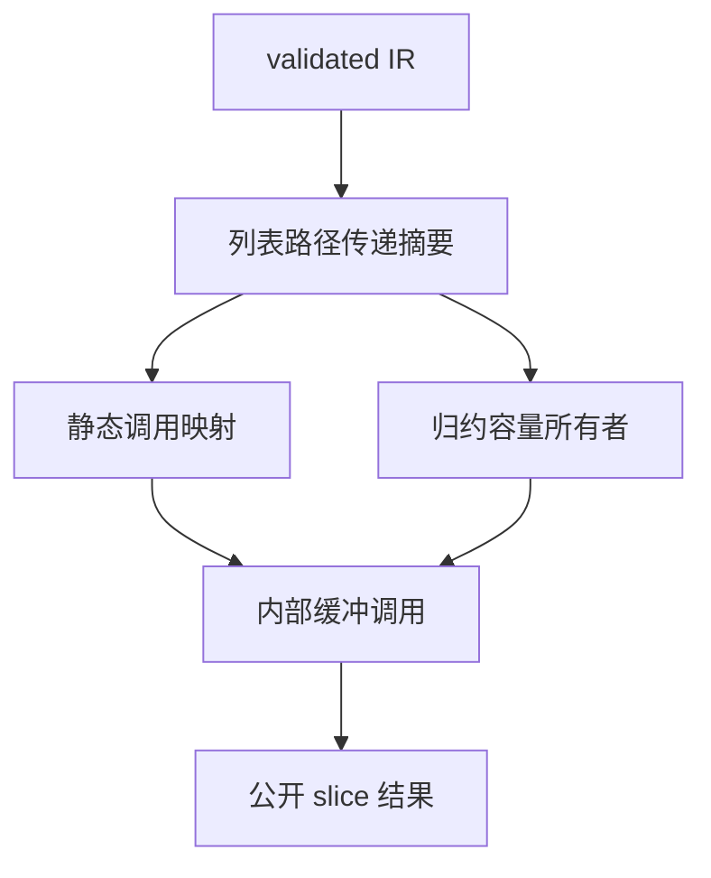
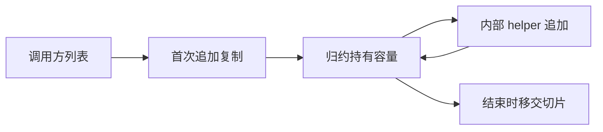

# 跨函数列表追加

## Intent：最终目标

消除 ZX 词法扫描在内部函数之间传递 token 列表时的二次复制，使状态归约中的列表容量能跨调用保留。实现必须适用于普通 ZX 程序，不能依赖词法器名称、字段名或输入样本。

## Data：可用证据

- 73ddf462 已将含引用状态的内部纯函数改为可按值返回。
- 9750 字节源码、2283 个 token 的 arena 仍为 31696780 字节。
- `collections.zig` 的普通 push/concat 每次分配精确长度并复制全部旧槽位。
- `object_reduce/append/analysis.zig` 只识别同一 callback 内的 reference/conditional/object 结果，不识别 call。
- `append_overrides` 以当前函数 ExprId 为键；callee 使用独立表达式空间，当前容量因此无法传递。
- 词法器的 tokens/comments 通过 owned 状态传递，实际追加集中在内部 helper；frames 还使用 pop，不应自动获得同样的追加资格。

## Edges：边界与限制

保留公开 slice ABI。输入可能由另一个 allocator 提供，不得据 owned 标记直接 realloc 外来 slice。不得使用运行期指针注册表、源码名称匹配、固定输入上限或旧词法器代理。用户要求不新增测试用例、不运行全量测试。

静态摘要应按具体输入叶路径和输出叶路径传递，不按同名字段或相同 list 类型合并。只有完整函数调用图可证明同一列表线性传递时，才能共享容量。读取旧快照、输出多处别名、重置/重排、跨原生调用或存储逃逸必须审计并按证据拒绝不安全情况。

## Answer：交付与成功标准

拟采用编译时列表传递摘要与内部缓冲调用变体：reduce 持有 ArrayList，callee 借用静态指定的 builder。第一次追加复制外来输入，此后按几何容量追加；reduce 结束移交切片。正常公共入口及原始 slice 类型保持原契约。

1. 审计 ownership 与摘要所需限制，确定可证明的最小范围。
2. 实现输入路径到输出路径摘要及调用映射。
3. 生成内部缓冲调用，并让归约管理容量生命周期。
4. 更新缓存依赖，构建 CLI 与完整词法草稿，核对既有源码和内存观测。





## 自我审查要求

上面的方案尚未完成安全审计和实现。不能把摘要能追踪来源等同于已经证明没有旧借用；也不能仅靠 arena 内存下降宣称语义正确。只有静态资格、生成生命周期和实际核对均成立时才启用优化。

## 已执行：来源摘要与逐用法筛选草稿

草稿放在本目录，尚未进入 `packages/genz`，也没有启用生成优化：

- `flow.zig`：按输出类型枚举对象/元组中的列表叶路径；按无环函数顺序生成输入到输出摘要；同一输入列表在多个输出叶出现时移除候选。
- `trace.zig`：解析局部 constant、字段、元组投影、对象重建、条件、match、所有 return 与内部调用。push/concat 的第零项必须沿原 receiver 继续追踪；pop、重排、重置及来源不同的返回不产生摘要。追加表达式和调用槽位单独记录。
- `may.zig`：独立追踪可能引用。条件/match 取分支并集；未知调用不能视为无关；内部调用按其真实返回表达式追踪，避免把无关 frames 污染为 tokens。确定来源摘要仅可提前证明“存在”，不能据此证明没有其他引用。包含 optional 输入的调用暂时保守追踪整个 argument。
- `audit.zig`：在摘要之外审查全部表达式。输入必须 owned；拒绝 contracts、parallel、嵌套 transform；拒绝候选列表被读取元素、藏入容器、作为追加参数、重复携带或流入不合格 callee；实际追加和传递调用必须出现在返回链的摘要中。
- `observe.zig`：加载真实 ZX 项目，先验证 IR，再执行草稿分析，输出 JSONL。只观测静态 IR，不替换词法器，不执行被分析的程序。

这里的 `rejection: null` 仅表示通过当前草稿筛选，不能解释为已经证明任意程序都可安全复用缓冲区。调用者仍须保证该槽位在归约迭代之间由同一个 builder 持有；nullable context、首次外来切片复制、finish、异常退出及缓存依赖仍未实现。

复现命令（在仓库根目录执行）：

```sh
python3 docs/2026-10-05/跨函数列表追加/observe.py \
  docs/2026-10-05/完整词法扫描/lex.zx \
  docs/2026-10-05/完整词法扫描 \
  docs/2026-10-05/自举词法扫描
```

该命令构建单独的观测程序，保存输入源码散列与静态摘要；不运行全量测试。没有新增测试用例。

现有词法扫描项目观测结果：26 个内部函数，43 条来源摘要；43 条均通过当前用法筛选。`tick` 得到 `[1,3] → [3]` 与 `[1,14] → [14]` 两条路径，分别通过 `advance` 继续追踪至追加 helper。frames 的 pop 使它不能在整个调用链中形成追加摘要。数值路径来自 IR 的实际字段索引，算法没有使用上述数值或字段名作为识别条件。

### 本轮自我审查

1. 来源一致性和使用安全性是两层检查，不能把前者直接用作代码生成开关。
2. 草稿依赖 validated IR 的调用无环、作用域、严格类型及 owned 消费约束；独立消费未验证 IR 不在适用范围内。
3. 当前遇到任意嵌套 transform 会拒绝整个函数中的候选。这是明确的暂时支持边界；后续应逐路径分析其捕获，不应以删掉检查的方式扩大资格。
4. 当前没有接入优化，原先 9750 字节输入的 31696780 字节 arena 观测仍是最新有效运行期数据，不能以静态摘要数替代新的性能验证。
5. 草稿尚需针对遗漏别名的只读审查。通过审查后才能接入内部调用上下文与归约所有者生命周期。

### 已修正的审查问题

第一版 `audit.count` 复用了 `trace` 的确定来源语义。对于 `condition ? original_list : []`，来源无法合并并不意味着完全没有 original_list 引用。因此已分离 `may.zig`，危险用法筛选改用可能引用分析；确定来源分析仍只服务于线性返回链。

另一个接入前提是完整调用图纯度。草稿现直接调用 genz 已有 `value_call.functions`，仅分析其中允许按值返回的对象函数，复用其传递性 external/store/parallel 检查，不重新实现另一套不完整资格。

生成阶段必须继续保持版本不变量：每次追加的 receiver 对应当前 builder 中的列表版本。相同输入来源本身不足以证明该条件，仍需 validated ownership、返回链、完整 may-use 筛选及正确的调用槽位映射共同成立。

第二次只读审查还发现 optional 引用路径可能被跳过。现候选路径枚举仍仅收集列表，用法检查则将 optional 作为不透明引用叶交给 may 分析；coalesce 左侧的字段路径可穿过 optional，optional 本身不消耗字段索引。上述修正来自静态审查，未编造测试通过记录，也没有将其描述为完整形式化证明。

观测程序 ReleaseSafe 构建为 4/4 步成功。正式 CLI 的生成行为尚未修改，因此这次没有重跑 CLI 分发构建或词法输出差分；后续生成接入后必须重新执行已有源码差分与内存观测。
