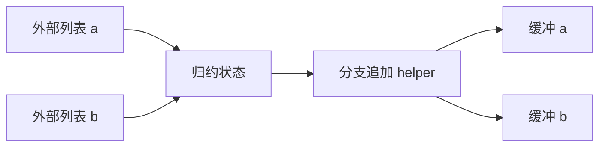
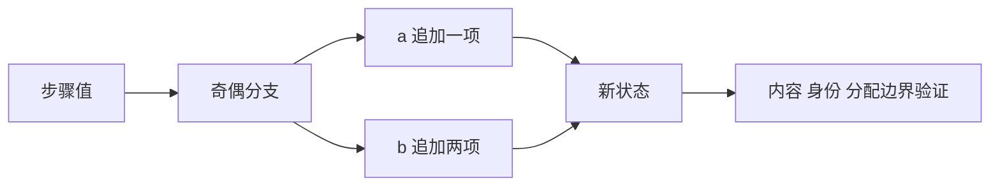

# 双列表交错追加回归

## Intent

验证同一归约状态的两个独立列表通过 helper 交错追加时，缓冲容量和 started 标志不串槽，未发生追加的槽位仍保留原输入。

## Data

3449948a 已启用跨函数缓冲上下文。现有运行覆盖单列表追加和外部存储，双字段仅有静态路径观测。

## Edges

保持两份不同的外部初始列表和独立输入分配器；纯偶数、纯奇数序列分别只启用一个槽位，混合序列启用两槽。只修改测试包，不使用生产算法计算预期。

## Answer

source/library 两路检查空归约、单步、交错与长序列、禁用 resize、输入完整性、未启用槽位身份、OOM。Debug/ReleaseSafe 完成后提交。

## 实施记录

call_dual 使用 owned 输入直接接收 a=[71,83]、b=[97,101,103]，helper 在偶数时只向 a 追加一项，在奇数时只向 b 追加两项。独立宿主模型分别建立两个预期序列，检查全部元素、总 count、输入未变、两输出互不别名，以及没有被追加的槽位仍与原 seed 同址。

新增三个 test × source/library 两路共六项执行检查：短序列 0/1/2/3/37 × 三种模式；8192 步 × 三种模式的线性内存与禁 resize；三种模式的全部实际分配失败检查。输入完整性在 execute 返回错误之前也被核对，不把 OOM 当作跳过断言的理由。

Debug 80/80 构建步骤成功、230/230 测试通过。source/library 两路生成源码均存在实际 function_0_buffered 调用，以及独立 lane_0/lane_1 缓冲字段；源码指纹见双列表源码指纹.json。

## 自我复核

这轮补上两个同类型列表交错传递的执行证据，不只依赖静态摘要。两个列表都满足优化资格，尚未覆盖一个候选被拒绝、另一个仍优化的混合上下文，也不替代模块化缓存失效验证。生产目录本轮保持已提交状态 3449948a；全量 ReleaseSafe 的旧构建图不含此次新增模式。

ReleaseSafe 最终结果：80/80 构建步骤成功，230/230 测试通过。未发现生产缺陷，未发送实现会话消息。
