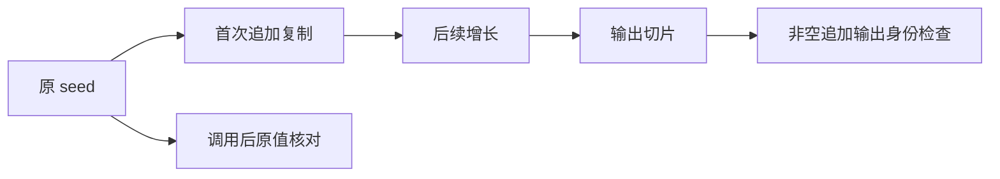

# 外部分配器列表首次复制

## Intent

验证跨函数追加直接接收外部分配器列表时，首次追加复制到输出 arena，不能 resize/free 输入存储；空归约保持原列表身份。

## Data

前一轮 helper 追加先 map 复制 seed，尚未触及外部原始存储。当前 builder.lower 使用首次 appendSlice 复制输入，再开始累积追加。

## Edges

新增 owned Input 入口，宿主独占且可写的 seed/steps 由测试分配器提供；输出 arena 使用独立分配边界。仅修改测试。owned 不等于可用输出分配器释放调用方内存。

## Answer

source/library 两路执行空/单步/长输入、初始空列表、输入不可变、输出独立身份、无 resize 与 OOM 清理。另使用独立 FixedBufferAllocator 支撑输出 arena，保留跨 allocator 边界。

## 实施记录

新增 call_foreign 模式，owned Input 的 seed 直接进入归约状态，不再 map 复制。foreign.zig 使用测试分配器提供独占可写 seed/steps，另建输出 arena；每次执行在返回错误之前也检查 seed 与 steps，故 OOM 不会跳过输入完整性检查。

三个 test 定义通过 source/library 两条路径，共新增六项检查：

1. 0、1、2、37、257、8192 步，空与非空 seed；比较输出全部元素、count、previous，检查零步原切片身份及追加后的独立存储。
2. 独立 512 KiB FixedBufferAllocator 作为输出 arena backing，运行 0、1、2048 步；输入仍由测试分配器提供。
3. 空与非空 seed 的每个实际输出分配点失败注入，验证清理和输入内容。

所有路径禁用 backing resize 并保留线性分配上限；生成源码实际调用 buffered 入口，记录源码/库两路指纹。实现会话已提交 3449948a，正式源码当前无未提交修改，针对该提交进行专项复验。

## 自我复核

测试证明的是可观察的输入完整性、存储身份、结果、输出池隔离与分配上限；固定池不是对 arena 内部每次 resize/free 调用的日志拦截器，不能据此宣称记录了每个底层调用。输入由宿主保持存活直到输出 arena 释放，零步允许结果借用原 seed，符合此次检查的生命周期前提。

这次没有新增 Test262 映射或目录 JSONL 用例，正式 Zig 运行回归增加六项检查。全量 ReleaseSafe 仍在运行，构建图不包含此次新增模式。

最终专项结果：Debug 73/73 步骤成功，新六项检查 6/6 通过，其余使用缓存；ReleaseSafe 73/73 步骤成功、224/224 检查通过。未发现生产缺陷，未向实现会话发送消息。
