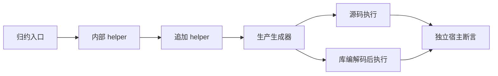
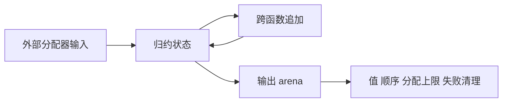

# 跨函数追加运行回归

## Intent

将新跨函数缓冲区复用的验证从静态资格推进到真实执行：追加顺序、旧长度读取、输入不可变、分配增长与失败清理。

## Data

实现会话已接入 buffer_call 并观测词法器内存下降，正式变更尚在共享工作区。现有 object_append 回归已具备源码/库两路、独立宿主预期、长输入与分配失败框架，但回调直接完成追加，尚无跨 helper 的对应覆盖。

## Edges

只扩展 packages/test。复用既有成熟运行器，增加调用层次，不复制生产追加算法。输入分配器与输出 arena 分离；线性空间上限适用于优化资格成立的场景。旧全量 ReleaseSafe 不包含这次新增注册，必须执行专项。

## Answer

增加 helper push、helper concat、两级 helper push 三种模式；每种通过源码和库编解码两条路径，检查 8192 步增长上限、禁 resize、空输入与每个实际分配失败点。Debug/ReleaseSafe 均完成后提交推送；真实实现缺陷反馈指定会话。

## 实施与证据

在既有 object_append 中新增 call_push、call_concat、call_chain 三模式，共 3×2×13=78 项执行检查；沿用原来的序列、长度、值、输入不变与故障清理断言，未改变旧预期。call_concat 使用相同的 concat 预期模型，不以被测生成代码计算结果。

Debug 66/66 构建步骤、218/218 测试通过。三模式 source/library 生成源码均核对到实际 function_*_buffered 调用，两级 helper 还核对到 callee 上下文传递，不仅检查是否存在未使用的定义。生成源码和当前生产修改指纹保存在源码指纹.json。

## 自我复核

本次被测生产实现来自实现会话尚未提交的工作区，不能仅以 HEAD 标识其内容；记录了修改源码与新增 buffer_call 文件的散列。没有提交生产文件。

输入来自独立宿主存储，测试断言输入不变，但归约初始列表先经过 map 复制。因此这轮覆盖内部新缓冲路径的几何增长与清理，尚未单独证明归约直接接管外部分配器列表时的首次复制。双列表交错、拒绝优化后语义保留及模块化缓存路径也需要另行验证，不能用词法器内存下降替代这些检查。

全量 ReleaseSafe 仍在运行且构建图早于本次注册；专项结论不替代全量结论。未发现生产问题，未发送实现会话消息。

ReleaseSafe 本次执行正常退出：66/66 步骤、218/218 测试通过。完成时源码复核发现作者继续修改了五个生成文件，变动路径已写入源码指纹.json。已记录的生成源码是本次实际验证对象；生产源码散列为执行过程中的观察值，不把这次通过声明成最终工作区固定快照通过。正式生产提交后需要对新增目标复验。
