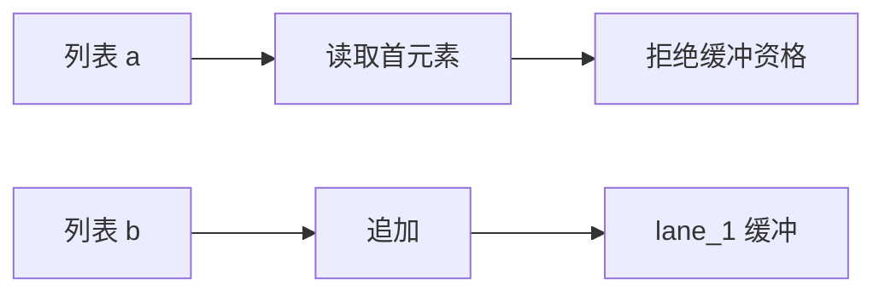
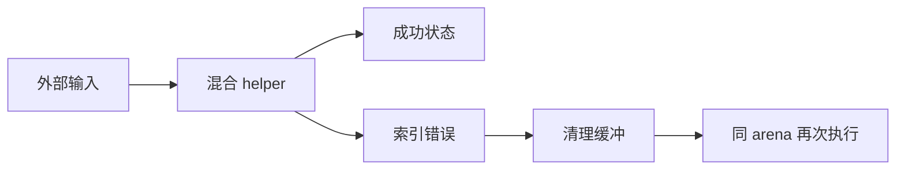

# 混合缓冲资格回归

## Intent

验证同一 helper 的第一个列表因元素读取拒绝优化时，第二个列表仍能通过非零槽位编号使用缓冲上下文；出现索引错误后能正确清理并在同一 arena 再次调用。

## Data

3449948a 支持逐列表路径资格及可空上下文。双列表测试验证两个合格槽位，但尚未覆盖前一个槽位被筛除的结构。

## Edges

输入 a 保持原始存储并逐步读取首项，b 持续追加。只有 b 适用线性分配上限。测试通过实际生成执行而非伪造 IR；实现会话正在迁移前端，记录验证时工作区边界。

## Answer

source/library 两路验证结果、身份、长输入增长、OOM，以及 a 为空时的 IndexOutOfBounds 与同 arena 后续成功。确认生成上下文实际只有 lane_1 而没有 lane_0。

## 实施与结果

新增 call_mixed 模式，helper 的 a 仅传递但会读取 a[0]，因此 a 的 lane_0 因元素读取不合格；b 的 push 通过 lane_1 使用缓冲。四项 test 通过 source/library 两路共新增八项检查。Debug 90/90 构建步骤、238/238 测试通过，生成源码确认实际缓冲调用只含 lane_1，未构造 lane_0。

测试检查 0/1/2/37/8192 步的完整值、a 原存储身份、b 首次复制与输入完整性、禁 resize 和线性内存；分别注入正常执行、索引错误及同 arena 恢复过程的全部实际分配失败点。

第一次夹具在转移 a 后再次读取 a[0]，被生产所有权分析正确拒绝；已调整为先 b 追加、再 a[0] 读取、最后转移 a。这保持有效程序，且索引失败发生在追加之后，能够覆盖局部缓冲已经改变时的异常清理。不能把最初 InvalidAnalysis 当作预期运行时错误通过。

## 自我复核

缓冲实现基于正式 3449948a，但本轮实现会话正在迁移前端，生产 compiler 存在并行改动。记录了实际生成源码指纹，不把此次结果声明为整个仓库最终固定快照通过。该场景只验证两个槽位中的前一个被拒绝，不代表所有深层路径组合均已覆盖；全量 ReleaseSafe 构建图仍早于新模式。

ReleaseSafe 最终 90/90 构建步骤成功、238/238 测试通过。复核生成的 buffered 函数，appendSlice/append 确实位于 IndexOutOfBounds 检查之前。未发现生产缺陷，未发送实现会话消息。
