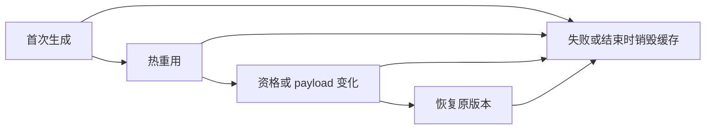

# 缓冲资格缓存的分配失败回归

## Intent

验证缓冲优化资格变化时，模块生成缓存的首次填充、热重用、替换和恢复均能在分配失败后释放已取得的资源。

## Data

已有 buffer_eligibility 覆盖 push/reverse 双向资格变化及 push 的 payload 修改；resources_test 仅覆盖普通数值函数的生成缓存。本轮复用前者的真实三层模块和后者的确定性分配失败注入方法。

## Edges

只修改测试。编译分析和无缓存参考结果在故障注入前完成，故障仅注入模块生成与缓存生命周期。任一分配失败后销毁缓存；不宣称验证失败后的同一缓存继续使用。禁用 resize/remap 以保持逐次分配注入确定性。不改变生产分配策略。

## Answer

新增三个测试，对每种转换执行 original→original→changed→original，并逐次比较完整 bundle（类型、入口、全部模块及 imports）。所有分配失败点由标准检查器枚举，资源泄漏由 testing allocator 检查。运行 Debug 与 ReleaseSafe，完成后记录实际结果并提交推送。

## 执行与自我复核

Debug 与 ReleaseSafe 均退出 0：17/17 构建步骤、18/18 测试通过，其中新增三个分配失败测试。执行命令为 `zig build test-module-generation -j2 --summary all`，ReleaseSafe 增加 `-Doptimize=ReleaseSafe`。源码指纹见同目录的缓存分配源码指纹.json。

没有观察到资源泄漏或错误 bundle，也未发现需要报告实现会话的生产问题。本轮不增加 Test262 已审阅数，不将内部故障注入次数计作独立目录用例；并发实现仍在修改前端，故上述结果不是全仓库固定提交的全量证明。后续若验证同一缓存的失败恢复，需要单独注入失败并在解除故障后重试，不能用这里的销毁后重建代替。
