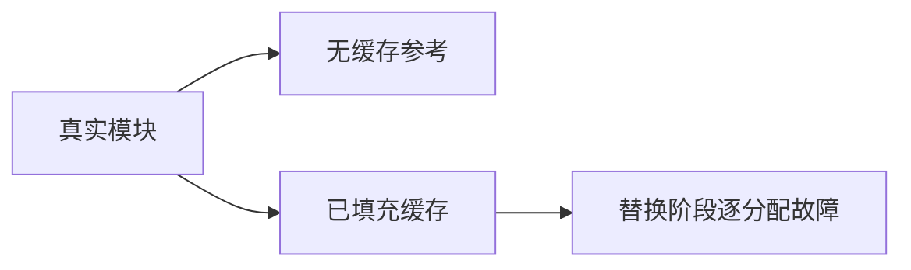
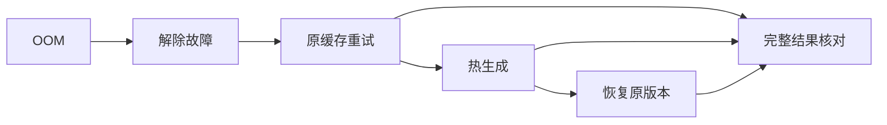

# 同一缓存的失败恢复

## Intent

检验缓冲调用资格变化时，部分更新后发生 OOM 的生成缓存仍能在解除故障后正确重试。

## Data

buffer_resources 已验证失败销毁；buffer_eligibility 已验证正常转换。本轮沿用真实 main→step→leaf 与完整 bundle 比较，参考本地 Request 故障恢复测试操纵 FailingAllocator 的方式。

## Edges

只修改测试；分析及无缓存参考结果不注入故障。每个注入位置均新建并填充缓存，随后在 changed 生成阶段逐分配注入；解除故障后必须使用原缓存。禁用 resize/remap，避免它们改变注入分配序列。只验证内存缓存，不宣称磁盘缓存故障恢复。

## Answer

三项测试分别覆盖失去资格、获得资格、payload 修改。每个 OOM 后执行重试、重复热生成、恢复原版本并对照完整无缓存 bundle；重复热生成不增加 generated。枚举到第一次未触发故障的成功生成为止，同时要求至少观察到一次失败。Debug 与 ReleaseSafe 实测后记录结果。

## 执行与自我复核

Debug 与 ReleaseSafe 均退出 0：19/19 构建步骤、新增 3/3 测试通过，既有 18 项为缓存结果。本目标现有 21 项测试，不能把本轮输出表述为重新执行了 21 项。命令为 `zig build test-module-generation -j2 --summary all`，ReleaseSafe 增加 `-Doptimize=ReleaseSafe`。源码指纹另存同目录。

逐分配故障枚举针对一次资格或 payload 转换的正常分配路径；每次失败后的恢复路径解除故障，不重复对恢复路径进行第二层故障组合枚举。本轮已核对 Zig FailingAllocator 的 resize 与 remap 共用 resize_fail_index，设为零确实禁止二者；未修改生产分配方式。未发现资源泄漏、错误缓存复用或生成结果差异，未向实现会话发送消息。Test262 审阅数不变。
