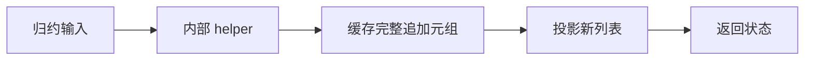
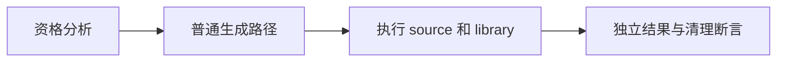

# 缓存追加结果的回退执行

## Intent

验证 helper 先把消费式追加的完整元组保存为局部常量，再取新列表返回时，普通生成路径保持一次追加语义。

## Data

缓冲资格分析只追踪可证明的线性返回链。完整追加元组缓存可能不能建立候选，或因缓存求值约束被拒绝；当前已有直接投影路径的优化回归，缺少显式缓存元组的源码对照。

## Edges

使用真实 ZX 源码，不人为修改 IR。检查的是未优化回退的结果与清理，不声称必须触发内部 cached_append 枚举。回退允许更高分配量，因此不套用线性内存上限；不能为了通过而放宽已有合格模式的上限。

## Answer

接入 object_append 的 source/library 两条路径，沿用逐值、长度、顺序、输入不变和 OOM 检查。确认生成源码没有 buffered helper 调用，并检查追加操作的求值结构。

## 实施记录

新增 call_cached/cached_step 两个真实源码模块，helper 先保存旧长度，再将完整 push 返回元组绑定为 next，最后通过 next[0] 返回新列表。模式沿用 object_append 的八项普通语义与 OOM 检查，source/library 两路新增十六项检查，唯独不启用 capacity 组；其他已合格模式的分配上限没有修改。

Debug 97/97 步骤成功、254/254 测试通过。两路生成源码均无 buffered helper；实际调用的 function_0_value 内只有一处列表分配和复制，返回投影读取缓存 tuple，不重复执行追加。记录生成源码和夹具散列。

## 自我复核

这份源码在来源追踪阶段已无法建立缓冲候选，不能宣称直接覆盖了 cached_append 内部拒绝分支。它覆盖的是用户可编写的显式缓存元组场景和普通回退路径。没有通过人工改造 IR 来伪装真实源码覆盖；未来若此形态获得安全优化资格，应重新审阅求值次数和相应分配要求。

ReleaseSafe 最终 97/97 构建步骤成功、254/254 测试通过。未发现生产缺陷，未发送实现会话消息。全量 ReleaseSafe 仍独立运行。
