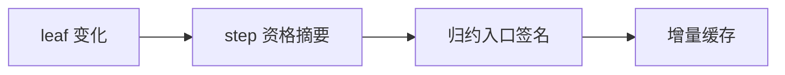
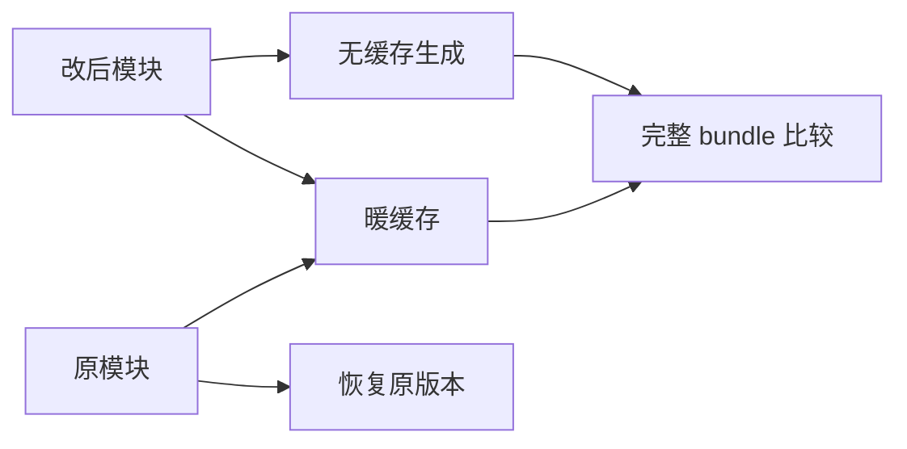

# 缓冲资格变化与增量生成缓存

## Intent

验证 leaf 的追加资格变化会传递至 step 与归约入口，避免缓存复用过期的 callBuffered 签名或上下文。

## Data

3449948a 引入缓冲资格及对应生成指纹。已有 value_eligibility 测试验证纯度变化，本轮复用其完整 bundle 比较与热缓存/恢复框架。

## Edges

只修改测试。三种 leaf 均为真实模块源码，且 Input/Output 不变；push 与 reverse 之间只改变缓冲资格，二者仍为纯对象返回函数。纯 payload 改动仍保留资格。此目标验证生成缓存一致性，不替代相应程序的运行结果测试。

## Answer

push→reverse、reverse→push、push(item)→push(item+1) 三项转换，比较缓存生成与无缓存生成的 types、entry、所有模块源码及 import 列表；确认入口 callBuffered 的存在变化、热重用和恢复原版本。Debug/ReleaseSafe 执行并记录。

## 实施与复核

新增 buffer_eligibility 独立目录与三项测试，接入 test-module-generation。push/reverse 双向转换检查入口 callBuffered 对应出现/消失；payload 修改保持入口源码不变，但至少一个模块源码必须实际变化。每次转换都比较缓存版与 fresh 版完整 bundle，随后检查重复生成只增加重用而不增加生成数，最后恢复初始源码并比较原 bundle。

Debug 与 ReleaseSafe 最终目标均为 15/15 步骤、15/15 测试通过，命令为 `zig build test-module-generation -j2 --summary all`，ReleaseSafe 另加 `-Doptimize=ReleaseSafe`。其中本轮新增三项，其余十二项为既有回归。

本轮只证明增量生成等同于全新生成，不宣称执行了生成模块；运行结果与分配边界已有 object_append 对应专项覆盖。测试运行期间实现会话仍在修改词法前端，因此不将此结果表述为固定提交的全量回归。未发现生产缺陷，未向实现会话发送消息。
