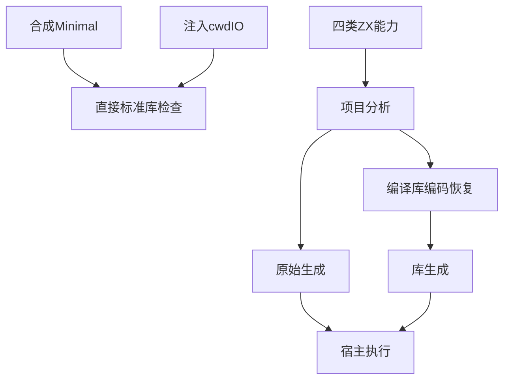
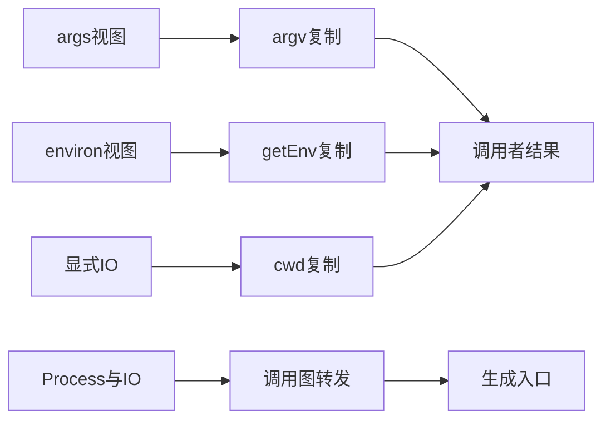

# 进程上下文验证计划

## Intent：最终目标

第 389 部分：验证 argv/getEnv/cwd 的数据归属、验证错误和资源清理，及 Process/IO 四种能力组合沿普通函数与编译库的传播。

## Data：可用证据

依据 8b81d5e1、当前 process.zig、process.d.zx、genz capabilities.zig 与显式进程上下文参考。Process 使用 std.process.Init.Minimal，IO 与 Process 彼此独立，顺序为 arena/input/io?/process?。成熟例子为上一部分 child_process 构建与 ownership/input 的库编码恢复生成链路。

## Edges：边界与限制

测试使用合成 POSIX args/environ 和注入 cwd IO，不读取或记录用户环境。合成上下文仅在支持 POSIX block 的宿主执行，其他平台标记跳过。cwd 另与真实宿主目录 API 对照。本部分不将普通函数/库结果冒充 Store Request 或 CLI 参数入口验证；这些边界继续后续完成。

## Answer：交付格式与成功标准

分 argv、environment、cwd 与生成执行分组，覆盖返回值独立存储、失败清理和上下文切换。四种能力组合经过源码与库编码恢复后实际生成、编译、执行，检查元数据与函数签名。完成 Debug/ReleaseSafe 后提交并 push。





## 执行与自我复核

### 交付与结果

新增 test-process-context，接入标准库资源与总测试。正式测试按 argv、environment、cwd 与 runtime 分组。

- argv 6 项：含第零项的真实宿主向量、空参数、空向量、空白/符号/Unicode 字面值、复制后独立存储、部分复制后非法 UTF-8 以及两种分配失败路径。
- environment 10 项：Unicode 值和其中的等号，空值与缺失区分，空上下文不读取全局 PATH，返回值独立存储，两次显式上下文切换，键格式/UTF-8/值 UTF-8 拒绝及成功、拒绝路径 OOM。
- cwd 6 项：调用方 IO、Unicode 路径复制、IO 的 Canceled 错误、非法 UTF-8、源存储覆盖后结果保持、真实宿主目录对照和 OOM。
- 生成执行 64 项组合：none/io/process/both 四种能力组合，每种经过原始生成与库编码恢复两条路径，每条执行八项检查。包括 requires_io/requires_process 精确标记、不同 execute 参数签名、空/缺失环境值、OOM、能力相关错误、上下文切换后旧结果仍有效。
- none 示例特意导入含 Process 调用的辅助函数而不调用它，验证未调用导入不会给入口增加参数要求；both 示例通过两个辅助模块分别取得环境与 cwd，验证跨函数转发。
- 总计新增 86 项；Debug 与 ReleaseSafe 均为 40/40 构建步骤、86/86 检查通过。构建模式和 OOM 内部迭代不重复计数。

在 packages/test 执行：

```sh
zig build test-process-context -j4 --summary all
zig build test-process-context -Doptimize=ReleaseSafe -j4 --summary all
```

首次标准接口检查有 16 项通过、cwd 组未编译：测试 IO 替身把 Zig 的 Canceled 写成了 Cancelled。修正后完整链路通过；这是测试接入错误，没有修改生产实现。未发现新的生产缺陷，因此未向实现会话发送消息。

### 自我复核与边界

结果来自真实标准库和真实生成代码，预期元数据由测试模式独立指定，没有用生成器自己的标记计算期望。函数调用的参数个数由测试模式选择，因此能力签名变化会直接触发编译失败。库路径重新编码、解码后通过公开 module(0) 提取并重新生成，实际执行宿主参数传递。

测试上下文是显式的合成 POSIX args/environ，避免真实用户环境、argv 和全局环境修改。此构造在不支持对应宿主布局的平台跳过，不声称 Windows/WASI 环境快照行为已经验证。cwd 的注入 IO 只用于确定性验证；另有真实当前目录对照。

此部分没有执行 RX、State.Request 或 CLI 参数解析，也没有穷举所有持久缓存上下文变化，不以普通函数与库恢复通过替代这些边界。后续继续验证 Process 在这些入口的传递及同步标准输入输出。整体 Test262 对齐目标仍未完成。

运行期间实现会话提交了 4f162b50 的显式结果序列化，并继续修改标准库注册；记录时 HEAD、生产状态和关键实现指纹保存在执行结果.json，不将记录时状态倒推为测试全程固定的干净基线。
