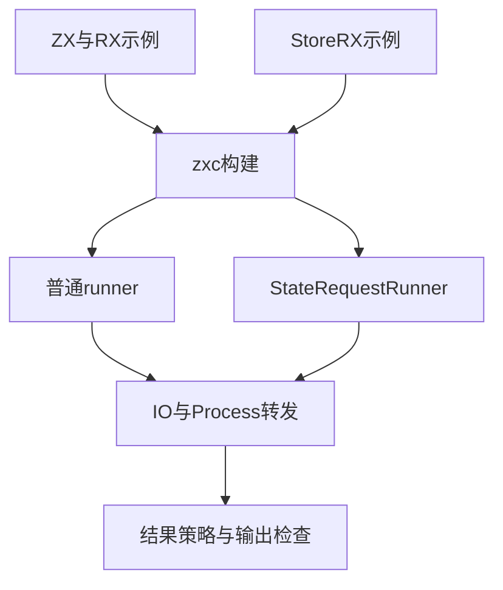
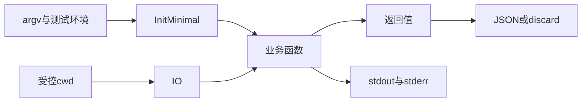

# 进程应用入口验证计划

## Intent：最终目标

第 390 部分：验证真实应用入口将 IO/Process 转发到 ZX、RX 和生成 State.Request，同时核对 --result json|discard 与参数解析、业务输出及缓存重建的组合行为。

## Data：可用证据

依据 8b81d5e1、394687c6、4f162b50 的当前 runner/runner_state/options 与应用返回值输出参考。默认仍为 json，discard 是新增显式策略，因此不批量改旧测试。成熟 Node 宿主参考 tests/build_modes/build_test.ts；使用当前构建的 zxc 产物。

## Edges：边界与限制

只构建临时本地程序、控制专用环境变量和工作目录，不访问网络、不修改用户环境。每次启动的 State 应用创建独立 State，本部分不能替代同一 State 上多 Request 的长期生命周期检查。正式测试只写 packages/test 与 docs。

## Answer：交付格式与成功标准

分 fixture 和执行矩阵文件组织 Node 集成测试，覆盖 default/json/discard、void 任意 argv 的能力条件、非 void JSON 约束、标准输出/错误输出、不吞失败、选项拒绝与同路径策略切换。Debug 与 ReleaseSafe 都运行真实 app 后提交并 push。

## 执行与自我复核

已建立 46 项检查矩阵。初轮修正两项测试夹具问题：编译 cwd 应为临时项目目录，应用 cwd 独立设置；CLI 非法选项输出 usage，不直接打印内部 InvalidArguments 错误名。

发现并由实现会话修复的生产缺口：void Input 的 RX Call.fn 提供必需的 `in="$in"` 后，在模块编译阶段报未知名称。已通知指定实现会话；保留成功断言，修复后 Debug 与 ReleaseSafe 各 46 项全部通过。具体依据为 module_compile 和 program 层跳过 void 输入绑定。省略 fn 的 in 不符合当前 Schema，因此不能把省略作为测试修复。

自我复核：discard 的空输出只能证明接受参数并丢弃结果，不能由此单独证明返回值字段正确；字段传递由 default/json 分支的精确断言检查。当前共 46 项是语义场景数量，两种优化模式不重复计数。最终结果以执行记录为准。

增加 service.rx 的 5 项同矩阵检查：void 单位值修复也需要贯穿 Call.service，避免仅本地 fn 路径通过。
