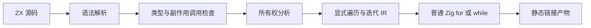
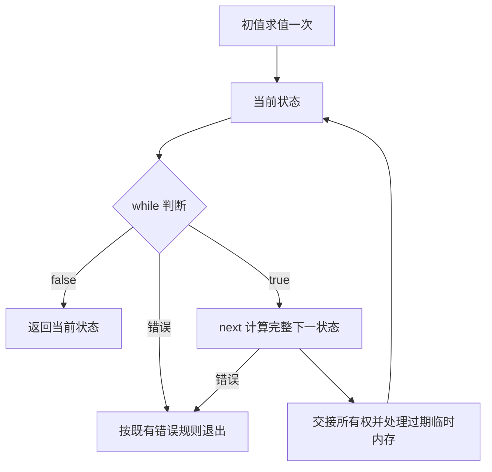

# 遍历与条件迭代设计

## Intent：最终目标

补充顺序副作用遍历 forEach，以及返回最终状态的条件迭代 loop。沿用 ZX 的表达式、不可变数据与静态编译风格，避免用集合大小模拟未知迭代次数。

本文是待审阅的语法提案，示例不代表当前编译器已支持。此次仅交付设计，不修改正式源码。

## Data：可用证据

- 用户要求增加 foreach，并改进 loop 的语法。
- compiler/src/zx/frontend/parser_statements.zig 的语句集合为 const、return、if、switch 和 Store 写入，没有普通表达式语句。
- compiler/src/zx/frontend/parser_expressions.zig 的 lambda 只解析表达式体。
- compiler/src/zx/analysis/transforms.zig 实现 map、filter、reduce，要求内联、不捕获外部局部变量的 lambda。
- 模块依赖无环与局部迭代不冲突；局部迭代无需形成模块调用环。
- 已阅读 rules/文档分工.md；编译器内部设计保存在 docs，不写入应用使用者 skills。

## Edges：边界与限制

- 所有示例中的业务函数和变量均须由应用声明，不新增隐式业务 API。
- 首版不增加闭包捕获、通用函数值、动态回调、惰性序列、并发遍历或运行库。
- 不引入普通局部变量赋值；迭代步骤返回下一状态。
- 不默认保证终止，不增加隐式次数上限。业务预算应显式进入状态与结果。
- 不把 Store 当作迭代局部变量的替代物。共享状态写入仍遵循现有授权与所有权规则。
- 不新增测试用例、不启动浏览器。本次属于设计审阅，没有执行编译或运行验证。

## Answer：推荐语法与成功标准

### 1. forEach：顺序执行，不收集结果

对外拼写推荐 forEach，与方法命名的 camelCase 约定一致，不同时提供 foreach 别名。

```ts
items.forEach(item => processItem(item))
```

接收列表求值一次，按照从前到后的顺序逐项调用。空列表不调用回调。回调必须返回单位值，不隐式丢弃业务返回值；操作整体返回单位值，不产生结果列表。回调错误立即向外传播，后续元素不执行，已完成的外部副作用不回滚。

首版回调只接受一个元素参数，不增加索引、break、continue、异步或并行选项。需要累加状态使用 reduce，需要结果集合使用 map，需要有条件地执行可以调用一个内部含 if 的具名业务函数。

为使示例成立，增加受限制的调用语句：调用结果必须为单位值。forEach 可作为此类语句，已有返回单位值的调用也应按同一规则处理，而不是只对白名单方法开例外。不得顺带开放任意表达式语句和静默丢弃返回值。

继续沿用表达式 lambda。多个动作先封装为具名步骤函数，不为此次功能扩大到块 lambda。

### 2. loop：初值加具名规则

推荐两个参数：初始状态，以及包含 while、next 的规则字面量。

```ts
const result = loop(initial_state, {
    while: state => state.remaining > 0,
    next: state => advance(state)
})

return result
```

初始状态类型为 S。while 接受 S 的借用视图并返回 bool；next 接受当前 S 并返回同一类型 S；整个表达式返回 S。状态所有权如何交接须复用现有消费分析，并在实现前明确借用初值、拥有初值及错误路径的处理。

规则字段属于编译期语法结构，不是包含运行时函数值的普通对象。只接受这两个字段各一次；字段顺序不决定执行顺序。不允许动态传入规则对象、spread、额外字段或把规则存储为普通值。loop 是内建操作名，解析与名称解析需要明确内建命名空间和遮蔽诊断，不依赖某个业务函数恰好同名。

执行顺序固定：

1. 初值求值一次，得到当前状态。
2. 对当前状态调用 while，且每次判断只调用一次。
3. 为 false 时直接返回当前状态。
4. 为 true 时执行 next，完整得到下一状态，再交接为当前状态。
5. 回到第二步。

while 或 next 的错误均立即传播，不重新求值、不隐式重试。不修改传入对象可观察到的内容。条件中若存在现有语言允许的副作用，不得被优化器复制、提前或省略；本次不额外引入一套纯度类型系统。

回调保持不捕获外部局部变量：阈值、预算等参数应作为显式状态字段传递。

```ts
const result = loop(
    { value: input_value, limit: input_limit },
    {
        while: state => state.value < state.limit,
        next: state => ({ ...state, value: state.value + 1 })
    }
)
```

这里只说明语法和类型关系，不据此承诺每轮对象更新已经可以消除分配。

### 3. do while：先执行一次步骤

不增加第二种原语。对于固定步骤函数与状态条件：

```ts
const result = loop(advance(initial_state), {
    while: state => shouldContinue(state),
    next: state => advance(state)
})
```

advance 首次在初值位置执行，因此至少运行一次，再判断更新后的状态。首次执行失败直接传播错误。这里重复的是静态函数引用，不是步骤实现；若步骤本身复杂，提取具名函数即可。

### 4. 候选比较

| 形式                                   | 判断                                                                   |
| -------------------------------------- | ---------------------------------------------------------------------- |
| loop(seed, condition, step)            | 简短，但两个同形 lambda 依赖参数位置，阅读时不易判断角色               |
| loop(seed, { while, next })            | 推荐，角色具名，保留普通调用外形，代价是编译期规则字面量的特殊约束     |
| loop(seed).while(condition).next(step) | 阅读流畅，但增加中间构造形式及未完成链的规则；本次不采用               |
| loop(seed, step) 并返回 continue/done  | 能精确表达步骤内部终止，但为简单条件迭代引入额外结果分支；暂不作为首版 |
| 新增循环块及状态重绑定语法             | 可以减少 lambda，但扩大关键字、作用域和控制转移规则的设计范围          |

所谓优雅以角色清楚、可预测、规则少为标准，不只以字符数量衡量。若用户更偏好链式阅读，可单独调整表层语法，不能同时发布多种等价拼写。

### 5. 编译架构



forEach 不构造结果列表；loop 不构造规则对象或函数分派器。具体业务本身需要的分配、IO 与标准库调用仍具有成本。静态降级不等于内存成本自动为零。

### 6. 状态数据流



### 7. 后续执行计划

1. 审阅确定公共拼写与规则字面量形式。本轮不视为正式源码实施授权。
2. 实施前核对 core 的 AST/IR 契约、单位值调用及消费规则，补充实际文件级实施清单；不凭设计猜测需要修改的文件。
3. 代码草稿与配套资源写入 docs/2026-10-05/遍历与条件迭代/。
4. 获得正式源码实施授权后，按 frontend、analysis、ownership、IR、genz 的既有职责实现，不新增独立执行层。
5. 按授权范围执行既有检查，确认顺序、空输入、零次迭代、错误传播和资源释放；用户未要求时不生成新测试用例。

交付成功标准：forEach 能自然表达顺序单位值调用；loop 能表达前置条件与至少一次迭代；回调和状态具有静态类型；生成产物直接使用 Zig 控制流；不存在专用运行库、动态规则对象或每轮无意义的状态壳分配。

## 执行记录与自我审阅

- 已核对当前语句解析、lambda 解析、集合变换分析和文档分工。
- 发现上一轮示例中的 tolerance 捕获不符合当前集合回调限制，本方案改为显式状态字段。
- forEach 的副作用价值依赖单位值调用语句，不能只增加一个 transform 枚举就宣称功能完成。
- while、next 的语法外形类似对象，但语义是编译期规则。这是可读性与语义统一性的明确取舍，需要用户审阅，不能声称完全没有新概念。
- 不捕获回调会让状态同时携带不变配置。这是复用既有边界的代价，未通过悄悄增加闭包能力掩盖。
- 状态借用、消费和释放尚未完成实现级证明，不承诺所有状态结构都能原地更新或零分配。
- 尚未证明现有后端可直接复用全部归约优化；本轮没有编译器实现和执行结果。
