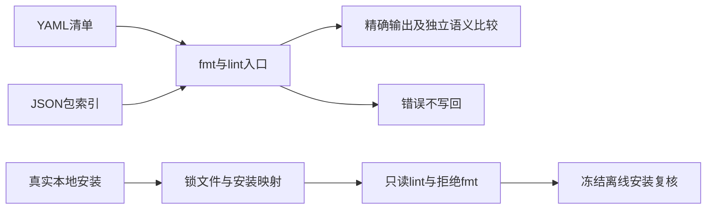
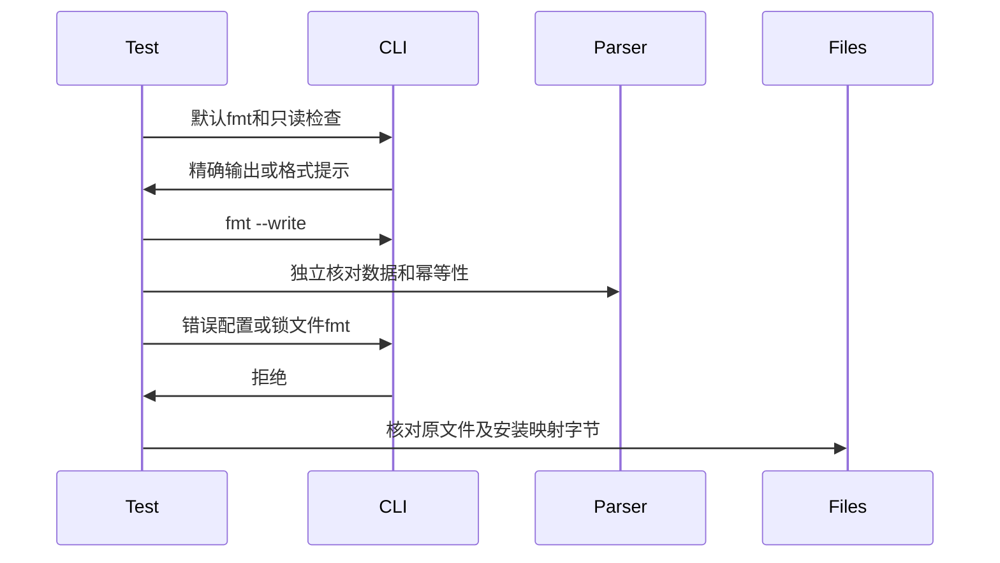

# 配置格式化与只读检查验证

## Intent：最终目标

阶段三百七十三：为8e3ca8bc的配置fmt/lint入口建立回归，验证YAML及索引JSON的语义保留，锁文件只读规则和所有失败路径的写入保护。

## Data：可用证据

配置入口先按manifest/index/lock进行Schema验证。manifest使用libyaml字段位置及UTF-8字节映射整理顶层空行；index保留数组顺序和数字原文。锁文件原始字节参与安装映射摘要，所有fmt模式均拒绝锁文件，lint只读校验。命令不会安装依赖或验证归档存在。

## Edges：边界与限制

只修改测试及构建注册。YAML预期为独立编写的精确字符串，额外以Node yaml解析比较数据；正常场景包括没有实际文件或依赖的配置，不能将lint成功等同于项目可构建。锁文件使用真实本地registry安装产生，不手写替代整个安装流程。JSON数字精度由底层格式器直接验证，不把任意数字JSON伪装成合法包索引。

## Answer：交付与成功标准

覆盖LF/CRLF、注释、锚点、别名、Unicode、BOM、流式映射和块标量；验证stdout/check/write/lint、幂等性、自动与显式kind选择。复用清单错误原文验证每个入口均拒绝且不改文件。索引保持包与版本顺序，错误索引不写回。真实锁文件在lint及所有被拒绝fmt模式下保持字节与安装映射，随后冻结离线安装仍成功。JSON格式器遍历分配失败并保存大整数和数字词法形式。

## 自我复核

fmt成功不能替代依赖解析，数字精度不能用JavaScript Number转换后比较。锁文件测试必须验证原始字节，而非仅比较JSON数据；错误拒绝必须同时确认无stdout和文件未改写。本轮不覆盖ZX/RX lint的全部单文件检查，它们需另行专项。

## 已发现的生产缺陷

首轮专项12/14构建步骤成功，JSON底层2项测试通过；Node中索引15/15、真实锁文件4/4、清单94/96通过。失败仅为UTF-8 BOM清单的LF、CRLF两个正常格式场景。独立最小复现确认：无BOM时默认fmt压紧相邻标量字段，check/lint返回1；只添加EF BB BF后，fmt不整理空行，check/lint错误返回0，输入语义相同。

已按用户授权向实现聊天报告该生产缺陷，并保留失败预期。代码依据：libyaml reader.c识别UTF-8编码时跳过开头3字节，mark字符索引对应去掉编码标记后的流；layout.byteOffsets原先把开头BOM当普通码点计数，造成位置映射错位。原生依赖源码位于当前CLI的zig-pkg/libyaml包，未复制或修改第三方实现。

随后把开头BOM作为正交维度扩展到已有各类合法清单。旧二进制扩展基线为118项中96通过、22失败，所有新增失败均落在需要空行调整的BOM场景。又补充标量内部U+FEFF必须保留、根字段前补充平面Unicode注释两类输入，防止修复变成全局删除字符或只处理ASCII。该输入表仍分别覆盖LF/CRLF。

## 修复与最终验证

实现聊天提交adb794a8，byteOffsets仅在原始数据以EF BB BF开头时将起始字节偏移设为3，UTF-8迭代器从该位置开始，输出仍使用完整原文。修复未匹配任何测试文本、字段名或文件名。BOM位于标量正文时仍计入普通字符，测试确认其原字节保留。最小复现/结果.json保存的是修复前行为；原始复现字节.json记录三个输入的SHA256、字节数及CRLF数量。

最终清单输入共27种原文变体，每种LF与CRLF，共54项正常测试；另复用18种已存在清单错误原文，在fmt、check、write、lint四个入口下形成72项失败保护测试。所有正常格式化均对比精确预期、Node yaml解析结果、输入不变、写回、重复格式化、lint与check，明确独立数据比较不替代完整项目检查。

索引4项正常场景验证包和版本数组顺序、Unicode与转义字符串、显式kind优先于pkg.yaml文件名；10项错误场景分别经过4个模式；另1项覆盖5种缺失或冲突kind/参数。锁文件测试先真实安装7包依赖图，默认文件及非规范空白的自定义锁副本均只读lint成功，6次fmt拒绝保持锁及映射；篡改真实依赖目标后lint和write均报InvalidLockTarget且保持文件。恢复后冻结离线安装通过。

JSON底层测试逐字检查超过JavaScript安全整数范围的9007199254740993、128位上界十进制、-0、1.2300e+04以及数组顺序。释放输入后验证输出和幂等性，对正常及重复字段错误两个路径执行完整分配失败遍历。这是底层JSON格式器证据，不声称任意JSON数字都是合法索引字段。

| 验证                          | 实测结果                             |
| ----------------------------- | ------------------------------------ |
| test-configuration-formatting | 14/14构建步骤通过                    |
| 清单Node测试                  | 126/126通过：54正常组合、72错误模式  |
| 索引Node测试                  | 15/15通过                            |
| 锁文件Node测试                | 4/4通过：1父测试、3子测试            |
| Node合计                      | 145/145通过                          |
| Zig JSON测试                  | 2/2通过，2项分配失败遍历             |
| 真实包安装                    | 初始安装与恢复后的冻结离线安装均成功 |
| @zxc/test typecheck           | 退出码0                              |
| 格式与源码diff                | 新TS/Zig代码检查通过                 |

完成验证日志对应退出码0。生产代码由实现聊天修改，本轮只提交测试、构建注册和文档。已按用户要求在确认缺陷后发送一次消息，没有发送无问题的状态通知。期间21e32116新增RX真实并行实现，本专项不验证其线程语义；也未再次执行根目录全量回归，不能借用阶段372的跨源码结果宣称当前完整版本通过。

## 交付自我复核

完整源码和复用fixture副本、机器可读结果、修复前最小输入均保存在配置格式化测试草稿，原始日志本地忽略。原始YAML复现必须保留BOM、CRLF和故意未格式化的空行，因此本轮提交跳过自动重排这些输入的格式钩子；已单独完成正式新增TS/Zig格式检查、类型检查及专项执行，原始输入按字节摘要核验。

本轮未覆盖全部超大文件边界、libyaml内部C分配失败、所有YAML编码/位置组合或ZX/RX单文件lint规则。JSONL目录用例和Test262审阅数量不变，整体目标仍未完成。
